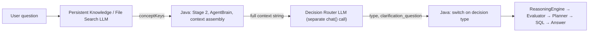
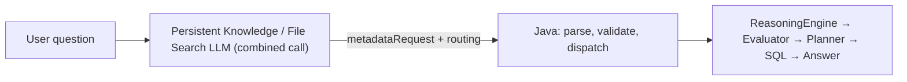

# Decision Router absorption

Zevra's conversational pipeline used to make two separate LLM calls before any data was retrieved: [Persistent Knowledge / Stage 1](persistent-tenant-knowledge.md) (which business concept is this question about) and a separate Decision Router call (which of five answer modes should handle it). This page describes how the second call was absorbed into the first, and exactly what that did and didn't change.

## The old architecture



## The new architecture



No LLM call was added. The same single Stage 1 call now produces both outputs it always could have produced from the same underlying reasoning — Java's role is unchanged in kind: it never decides the route, it only relays what the model returned.

## Why this was possible

An investigation into the Decision Router's actual production behavior (tracing every real code path, not inferring from prompt text) established two things:

1. **Only two of six output fields are ever consumed.** `type` and `clarification_question` drive real, distinct downstream branches. `intentType`, `requiresExecution`, `requiresMemory`, and `requiresClarification` were asked for in the prompt but never read anywhere in `ChatService` — confirmed by exhaustive search. These fields were not carried into the new contract.
2. **Almost all of the Decision Router's Java-assembled context is either unnecessary for routing or already needed downstream anyway.** The full physical schema render, knowledge graph, findings, and anomaly context are things `ReasoningPlanner` needs for SQL generation — they were never routing-specific, and `buildContextSummary` is still called for that purpose after this change. The only fact genuinely specific to routing, and not derivable by the LLM itself, was whether document memory exists for this question.

## The combined contract

```json
{
  "metadataRequest": { "conceptKeys": ["purchase-order"] },
  "routing": { "type": "QUERY_LIVE_DATA", "clarificationQuestion": "" }
}
```

The five `type` values and their meaning are unchanged from the legacy Decision Router: `QUERY_LIVE_DATA`, `ANSWER_FROM_MEMORY`, `HYBRID_DOC_AND_DATA`, `ASK_CLARIFICATION`, `KNOWLEDGE_GAP`.

**Structured output, not prose.** The legacy Decision Router relied entirely on prose instructions inside a plain Chat Completions call — there was no schema-level enforcement of the five allowed values. The combined call instead uses the Responses API's strict JSON Schema mode (`text.format={"type":"json_schema",...,"strict":true}`), with `routing.type` constrained to an explicit `enum` at the API level. This is a genuine reliability improvement over what existed before, not merely a like-for-like port.

## Java's one runtime fact

The combined call cannot retrieve document-memory availability itself — Zevra's document memory (a separate pgvector-backed store) is structurally distinct from the tenant's persistent-knowledge Vector Store, and native `file_search` only searches the latter. Java computes `memoryAvailable` (a plain boolean — was any memory chunk found relevant to this question) before Stage 1 runs, and hands it to the LLM as plain input text appended to the question:

```
Runtime facts (for the routing decision only, never for concept resolution):
- Document memory available for this question: true
```

This is exactly the same kind of thing Java always did for the legacy Decision Router — supplying a fact, never a decision. Java never inspects retrieved File Search content, never infers a route from `conceptKeys`, and never overrides whatever `routing.type` the model returns.

## Reliability note: why routing is a separate field, not folded into `decision`

An earlier design tried asking the combined call to fold "is the result set the correct one" logic and routing into a single holistic judgment via prose alone (a lesson learned from the unrelated but structurally similar [conversational evidence-reuse fix](conversational-evidence-reuse.md)). The same principle applies here in reverse, already proven during the routing prompt's own design: decomposing a judgment into an explicit, separately-answered field is more reliable than trusting one label to encode multiple considerations. The routing prompt keeps concept selection and routing as two clearly separated jobs in its instructions for the same reason.

## Follow-up conversations

`previous_response_id` chaining (already proven for concept selection) carries over unchanged. Live-validated:

- Turn 1 — "Show me all purchase orders" → `conceptKeys:["purchase-order"]`, `routing.type:QUERY_LIVE_DATA`.
- Turn 2 — "I want only submitted", chained via `previous_response_id` → `conceptKeys:["purchase-order"]` (correctly unchanged), `routing.type:QUERY_LIVE_DATA` (correctly still routes to live data — the routing prompt explicitly does not decide whether the existing result set already answers a follow-up; that remains [`ReasoningEvaluator`'s job](conversational-evidence-reuse.md), unaffected by this change).

`file_search` remains fully active on chained turns — chaining does not change whether or how the model searches the tenant's Vector Store.

## What Java still does

- Resolves tenant identity and the tenant's own Vector Store ID from `TenantContext` — never from client input.
- Supplies the one runtime fact (`memoryAvailable`) as plain text.
- Parses the combined JSON response.
- Validates `conceptKeys` against the tenant's actual, current concept usage (deterministic enforcement, identical discipline to the concept-only path).
- Validates `routing.type` against the exact five-value contract — an invalid or missing value is discarded (routing treated as absent), never guessed at or defaulted to a specific type.
- Dispatches to the existing, unchanged `ChatService` switch using whichever `type` the model returned.

## What Java explicitly does not do

- Does not perform File Search itself, inspect retrieved filenames, or parse citations.
- Does not decide `routing.type` from `conceptKeys`, from memory availability, or from any other fact — that decision is the LLM's alone.
- Does not override or second-guess the model's routing decision under any circumstance short of it failing the deterministic five-value validation above.

## Legacy fallback

The per-tenant flag `persistent_knowledge_stage1_enabled` (documented in [Persistent tenant knowledge](persistent-tenant-knowledge.md)) still governs whether the File Search path runs at all. When it does not apply — flag off, no Vector Store yet, or the combined call fails and the legacy catalog-in-prompt path runs — the combined call produces no routing decision, and `ChatService` falls back to calling the legacy Decision Router exactly as it always did. This is the only remaining code path that invokes it; no second (Decision Router) LLM call is ever made when the combined call already succeeded.

`ChatService.getLlmDecision()` and `DECISION_SYSTEM_PROMPT` are marked `@Deprecated`, retained for this legacy fallback while `persistent_knowledge_stage1_enabled` is not universally migrated. They are candidates for retirement only once every tenant is on the Persistent Knowledge Stage 1 path — mirroring the retirement condition already documented for `ConceptScopedMetadataResolver`'s own deprecated legacy concept-selection methods.

## LLM call count

| | Before | After |
|---|---|---|
| Stage 1 (concept selection) | 1 call | — |
| Decision Router | 1 call | — |
| Combined (concept + routing) | — | 1 call |
| **Total for these two responsibilities** | **2** | **1** |

`ReasoningEvaluator`, `ReasoningPlanner`, and `NaturalLanguageComposer` calls are unaffected — this change touches only the two calls above.

## Validation evidence

| Category | What it covers |
|---|---|
| **Unit tested** | Combined-call parsing (concepts + routing together), each of the five routing values, invalid/missing routing discarded without guessing, flag-off and combined-call-failure fallback producing no routing, tenant/conversation isolation, `previous_response_id` chaining for the combined contract, and — the mandatory proof — a `ChatService`-level test asserting the legacy Decision Router's LLM call is never made when combined routing is present, and still made exactly once when it is absent. |
| **Live OpenAI validated** | The real, unmodified production prompt/schema/method, called directly against tenant `persistent-ai-test`'s Vector Store: a 2-turn chain ("Show me all purchase orders" → "I want only submitted") returned both `metadataRequest` and `routing` in every turn, with `file_search_call` present and `status:completed`, correctly chained via `previous_response_id`, reproduced twice independently. Turns 3–5 of the full 5-turn conversation were not completed in this validation run due to the shared test account's own OpenAI rate limit, not a defect in the mechanism. |
| **Not independently validated from this environment** | A real end-to-end `/chat/ask` conversation through the actual Chat UI/backend — this environment has no running Zevra server process or Supabase credentials to start one. |

## Out of scope

This slice covers only concept selection + routing decision absorption. It does not change `ReasoningEngine`, `ReasoningEvaluator`, `ReasoningPlanner`, SQL generation, `GovernedSqlRuntime`, or answer composition — all unchanged and unaware of which Stage 1 path produced the routing decision. Eliminating `ReasoningEvaluator`'s own separate LLM call, or any further consolidation, is separate, future work not undertaken here.

## Relationships

- [Persistent tenant knowledge (Stage 1)](persistent-tenant-knowledge.md) — the concept-selection mechanism this absorption extends; its feature flag, tenant isolation, and legacy fallback discipline apply unchanged here.
- [Conversational evidence reuse](conversational-evidence-reuse.md) — an unrelated, earlier fix in the same reasoning pipeline; not modified by this change.
