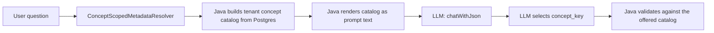
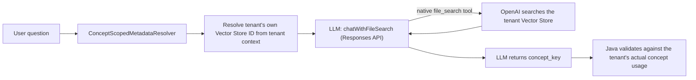

# Persistent tenant knowledge (Stage 1)

Zevra's concept-selection step — deciding which business concept(s) a question is about, before any physical table or column is resolved — can retrieve tenant knowledge from a persistent OpenAI Vector Store instead of having Java build and send a concept catalog on every question. This page describes the proven, narrow first slice of that architecture: concept selection only. It does not cover column knowledge, relationships, or business rules — those are separate, later boundaries (see [Out of scope](#out-of-scope)).

## Background

Before this work, every question that reached concept selection required Zevra to: query Postgres for the tenant's concept catalog (concept key, name, aliases, description, operational meaning, per business concept the tenant actually uses on the relevant connection), render it as prompt text, and send it to the LLM alongside the question. This repeated the same, largely static catalog construction on every single question.

OpenAI's Responses API exposes a native `file_search` tool: given a Vector Store ID, the model can search that store itself, mid-turn, without the caller pre-loading its contents into the prompt. Zevra's tenant-provisioning and knowledge-materialization work (Phase 1 and Phase 2A of the Persistent AI Knowledge initiative) already gives every tenant one Vector Store and populates it with the same concept information the old catalog used to carry. This page documents connecting the two: letting the concept-selection LLM call retrieve that knowledge itself.

## How it works

**Before:**

**After** (when enabled — see [Feature flag](#feature-flag)):

In both cases, everything after concept selection is identical: validated concept keys resolve to physical object keys (Stage 2, `SemanticService.findEntitiesByConnectionAndConcepts`), and the rest of the pipeline — `AgentBrain`, `EnterpriseSemanticAssembler`, the reasoning planner, `GovernedSqlRuntime` — is unchanged and unaware of which Stage 1 path produced the concept keys.

## Boundaries and guarantees

**Java does not perform File Search.** This is the central guarantee of this architecture and should not be described any other way. Concretely, Java never: searches the Vector Store, retrieves or downloads its files, parses a filename or citation to determine a concept, selects a concept from retrieved content, or exposes a custom retrieval function/tool for the model to call back into. There is no multi-turn tool-calling loop here (contrast with Zevra's separate agent function-calling path, which does implement one for a different purpose). This is a single request/response turn: Java sends one request naming the tenant's Vector Store; OpenAI's own infrastructure performs the search server-side within that one turn; the model reads the results and reasons over them itself.

Java's responsibilities at this boundary are exactly:

- Establish/use the authenticated tenant context.
- Resolve the tenant's own Vector Store ID from that context.
- Configure the OpenAI request with that Vector Store and send the question.
- Receive the model's result.
- Deterministically validate the returned concept key(s) against the tenant's actual, current concept usage in Postgres — discarding anything not present. This is enforcement of an existing invariant, not semantic selection: Java never decides which concept is relevant, only whether the model's own answer is one the tenant's real metadata recognizes.
- Continue into the unchanged downstream flow.

**Tenant isolation.** Each tenant has exactly one Vector Store (provisioned at onboarding). The Vector Store ID used for a request is resolved from the authenticated tenant's own context — never supplied by the user, never selected by the LLM, and never derived from a connection or pack key. A tenant can only ever reach its own store through this path.

## Feature flag

The path is controlled by a per-tenant setting, `persistent_knowledge_stage1_enabled`:

| State | Behavior |
|---|---|
| Unset or `false` | The legacy catalog-in-prompt path runs (see [Deprecated legacy methods](#deprecated-legacy-methods)). |
| `true`, and the tenant has a Vector Store | The persistent-knowledge / native File Search path runs. |
| `true`, but the tenant has no Vector Store yet | Falls back to the legacy path for that request — never an error. |
| `true`, but the File Search call fails | Falls back to the legacy path for that request — never an error. |

The fallback exists as a temporary safety mechanism for the migration window, not as a permanent second architecture. It is not itself File Search — it is the same catalog-building code the tenant used before this work existed, retained so a Vector Store outage or an un-migrated tenant never turns into a failed question.

## Validation evidence

What has actually been proven, kept distinct by evidence type — a claim here is never stronger than its category:

| Category | What it covers |
|---|---|
| **Implemented** | The native File Search Stage-1 path exists in production code, behind the flag above, alongside the deprecated legacy path. |
| **Unit tested** | Flag on/off dispatch, correct Vector Store ID resolution and question pass-through, File-Search-failure and missing-Vector-Store fallback, no-relevant-knowledge semantics, multi-concept resolution, invalid-key rejection, tenant isolation, and Stage 2 parity between both paths — all with hand-rolled fakes, no live calls. |
| **Live OpenAI validated** | A real request against the tenant `persistent-ai-test`'s Vector Store returned an OpenAI response containing a `file_search_call` item with `status: completed` and real retrieved tenant knowledge (concept and physical-object documents), and the model correctly returned the matching concept key. |
| **Real Chat validated** | A real `/chat/ask` request ("Show me all purchase orders" against `persistent-ai-test`) produced a `FILE_SEARCH_METRIC` log line — `callType=STAGE1_FILE_SEARCH_CONCEPT_SELECTION`, `fileSearchCallPresent=true`, `status=completed` — confirming the production Chat path itself invoked native File Search, not only a direct test of the OpenAI client. |
| **Not implemented** | See [Out of scope](#out-of-scope). |

## Conversation-aware Stage 1

Concept selection can additionally chain to the tenant's own prior turn in the same conversation, so a follow-up question ("Only the submitted ones") resolves correctly without Zevra resending any prior turn's text.

**Mechanics.** OpenAI's Responses API accepts a `previous_response_id` field: when present, the model has access to that earlier turn's full context (including whatever `file_search` retrieved) without the caller repeating it. `ConceptScopedMetadataResolver` persists the response id returned by each successful File Search call, keyed by `conversationId`, and supplies it back on the next call in the same conversation.

**Ownership split.** OpenAI's infrastructure owns the conversation state itself — what the prior turn said, what `file_search` retrieved for it — Zevra never reconstructs or resends that. Zevra's only responsibility is the pointer: storing and retrieving the response id, and deciding when to use it. `file_search` remains fully active on a chained turn exactly as on a fresh one — chaining does not change whether or how the model searches the tenant's Vector Store, only what conversational context it has when reasoning about the results.

**Persistence.** The response id is stored in the same tenant-scoped key-value store as the feature flag (`nexus_tenant_settings`, via `TenantSettingsRepository`), under the key `stage1_response_id:<conversationId>`. No new table. Because every query against this store already runs inside the current tenant's schema (`TenantAwareDataSource` sets `search_path` per connection), a response id is automatically isolated to the tenant that produced it — there is no code path by which one tenant's stored id could be read while resolving another tenant's request.

**Fallback to fresh.** If a chained call fails for any reason — including OpenAI rejecting an expired or otherwise invalid `previous_response_id` — Zevra retries exactly once with a fresh, non-chained call before giving up. A stale stored id therefore degrades a single turn's chaining, never breaks the request outright; the fresh retry's own new response id is what gets persisted going forward.

**Current limitations.** Chaining is scoped to `ConceptScopedMetadataResolver`'s Stage 1 call only — it does not extend to `DECISION_ROUTER`, `PLANNER`, `EVALUATOR`, or `ANSWER_COMPOSER`, none of which call the Responses API today. A conversation's stored response id has no expiry logic on Zevra's side (OpenAI's own retention governs how long an id remains valid); an id that ages out is handled by the fresh-retry fallback above, not by any proactive cleanup.

**Validation evidence** (in addition to the table above):

| Category | What it covers |
|---|---|
| **Unit tested** | First-turn (no stored id) vs. chained-turn dispatch, response id persisted after success, a 3-turn chain each using the immediately preceding turn's id, a stale/invalid id triggering exactly one fresh retry (and that retry's new id being persisted), both the chained call and its fresh retry failing falling back to the legacy path, tenant isolation and conversation isolation of the stored id, output contract and downstream Stage 2 behavior unchanged by conversation-awareness — all with hand-rolled fakes. |
| **Live OpenAI validated** | The real, unmodified 4-argument `chatWithFileSearch` production method called directly against tenant `persistent-ai-test`'s Vector Store: turn 1 ("Show me all purchase orders") returned a response id and `conceptKeys:["purchase-order"]`; turn 2 ("Only the submitted ones"), chained via that response id, showed `file_search_call` present with `status: completed` and again correctly resolved to `conceptKeys:["purchase-order"]` — proving the follow-up reference resolved through `previous_response_id` alone. |
| **Not independently validated from this environment** | A real end-to-end `/chat/ask` conversation exercising this path (this environment has no running Zevra backend/UI process and no Supabase credentials to boot one — see [Real Chat validated](#validation-evidence) above for how the non-conversational Stage 1 path was previously confirmed against a live server, and note that confirmation predates this environment's current session). |

## Deprecated legacy methods

Three methods on `ConceptScopedMetadataResolver` are marked `@Deprecated`, each with Javadoc stating the same three things: what replaced it, why it's still present, and when it can be reconsidered.

| Method | Previous responsibility | Why retained |
|---|---|---|
| `tenantConceptCatalog()` | Built the in-memory concept catalog from the tenant's Pack entities intersected with its actual concept usage. | Sole source for the legacy fallback path above. |
| `renderCatalog()` | Rendered that catalog into the prompt text sent to the model. | Same — only reachable from the fallback path. |
| `selectConceptsViaLlm()` | Sent the rendered catalog and question to the model, validated the response. | Same — the fallback path's LLM call. |

None are deleted, and none should be. They remain the only implementation for any tenant without persistent knowledge yet, and the rollback path for any tenant where the new path needs to be turned off. They are candidates for eventual retirement only after the native File Search path has been validated in production across a meaningful tenant cohort — a separate, future decision.

## Out of scope

Explicitly not part of this slice, and not implied by anything above:

- Column-level persistent knowledge, sample values, or enum/domain-value representation.
- Business Attribute knowledge.
- Relationship knowledge between business objects.
- Business-rule knowledge (including any formal definition of ambiguous qualifiers such as "open" — no such definition exists yet, and none has been added).
- Metadata synchronization or scheduled/event-driven refresh of persistent knowledge.
- Migration of the legacy `investigation_hints` field — it predates this architecture, is not part of the persistent-knowledge materialization, and is deliberately excluded rather than migrated.
- Any change to `AgentBrain`, `ReasoningEngine`/`ReasoningPlanner`, SQL generation, or `GovernedSqlRuntime` — the pipeline stages after concept selection (`DECISION_ROUTER`, `PLANNER`, `EVALUATOR`, `ANSWER_COMPOSER`) are unaffected and unaware of which Stage 1 path ran.
- Removal of the deprecated legacy methods.

Do not read this page as evidence that persistent knowledge resolves general semantic retrieval, that File Search understands the full range of Zevra's business semantics, or that every tenant has been migrated — only the concept-selection slice described above has been built and proven.

## Relationships

- Concept selection is Stage 1 of `ConceptScopedMetadataResolver`'s two-stage resolution; Stage 2 (resolving validated concept keys to physical object keys) is unchanged by this work.
- The persistent knowledge itself is materialized by the tenant knowledge-provisioning work (Phase 1: Vector Store provisioning; Phase 2A: concept and business-object knowledge materialization) — this page assumes that knowledge already exists and covers only how the concept-selection call retrieves it.
- `EnterpriseSemanticAssembler` and the downstream execution pipeline are separate, unmodified components — see [Architecture](../architecture/index.md) for how they fit together.

## Where to go next

- [Architecture](../architecture/index.md) — how `AgentBrain`, `EnterpriseSemanticAssembler`, and the execution pipeline consume the object keys this step produces.
- [Semantic foundation](../architecture/semantic-foundation.md) — the business-language resolution layer this step sits alongside.
- [Roadmap](../roadmap/index.md) — where column, relationship, and synchronization work for persistent knowledge is expected to land next.
