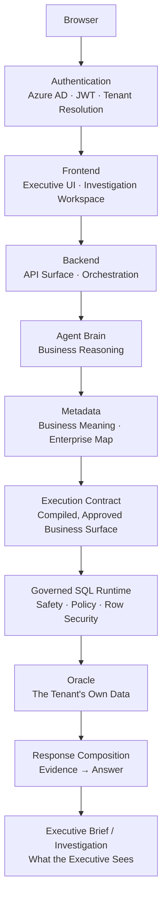

# 02 — System Architecture

[01 — Product Vision](01-product-vision.md) established what Zevra is and why it exists. This document gives the single picture that everything else in this set expands: the layers a request passes through, top to bottom, and the one job each layer is responsible for. Every later document zooms into exactly one box on this diagram.

## Purpose

A reader who understands this one page — the layers, their order, and why each exists — has the mental model needed for every document that follows. Nothing here is implementation detail; every layer is named by its responsibility, not its class names or technology.

## The Layer Stack

## Why Each Layer Exists

| Layer | Why it exists |
|---|---|
| **Browser** | Where the executive actually sits — no installed client, no special access beyond a modern browser. |
| **Authentication** | Establishes *who* is asking and *which tenant's data* they may see, before any other layer runs. Nothing downstream trusts an unauthenticated or unscoped request. |
| **Frontend** | Translates a business question and its answer into the executive experience — the Brief and the Investigation Workspace — without exposing anything about how the answer was produced. |
| **Backend** | The single entry point for every request the frontend makes; owns orchestration and hands work to the layers beneath it in a fixed order. |
| **Agent Brain** | Where business reasoning happens: turning a question into an understanding of *which business concepts* are involved, before anything physical is touched. |
| **Metadata** | The tenant's own business meaning — what a concept is called, what it maps to, what values are legal — so reasoning is grounded in this organization's language, not a generic guess. |
| **Execution Contract** | A compiled, immutable statement of exactly which business objects and physical assets this request is allowed to touch — the boundary between reasoning and execution. |
| **Governed SQL Runtime** | Enforces safety, security, and policy on every query before it reaches real data — nothing generated or reasoned about executes without passing through this gate. |
| **Oracle** | The tenant's own operational data — the ground truth every Zevra answer is checked against. Zevra never substitutes a model's belief for what this layer actually returns. |
| **Response Composition** | Turns validated evidence into a natural-language answer — grounded in what was actually found, never in what sounded plausible. |
| **Executive Brief / Investigation** | The two surfaces the composed answer reaches the executive through — proactive and conversational, as introduced in the Product Vision. |

## Reading the Diagram

Three properties hold across the whole stack, and every later document assumes them:

- **Order is a guarantee, not a convention.** A request cannot skip a layer — in particular, nothing reaches the Oracle without first passing through the Execution Contract and the Governed SQL Runtime. This ordering is what makes Zevra's read-only, governed posture structural rather than a policy someone could forget to apply.
- **Reasoning and execution are separated.** The Agent Brain decides *what* a question is about; only the Execution Contract and Governed SQL Runtime decide *what may actually run*. A model's judgment is never the last word on what touches real data.
- **The stack is symmetric.** The path down (question → data) and the path up (data → answer) mirror each other: Metadata that grounded the question also grounds how the answer is explained, and the Governed SQL Runtime's validated results are what Response Composition is required to use.

## What This Document Does Not Cover

This is the map, not the territory. Each layer above is the subject of its own document later in this set — authentication in [04](04-authentication-layer.md), the frontend in [05](05-frontend-architecture.md), the backend in [08](08-backend-architecture.md), the Agent Brain in [09](09-agent-architecture.md), metadata in [11](11-metadata-architecture.md), the execution contract and governed runtime in [12](12-execution-architecture.md), and response composition in [13](13-response-composition.md). [03 — User Journey](03-user-journey.md) comes next and walks this same stack from the executive's point of view rather than the system's.

## References

- [Semantic Foundation](../architecture/semantic-foundation.md)
- [ExecutionContract — Agent Business-Object Grounding](../architecture/execution-contract.md)
- [Conversational Analytics capability](../capabilities/conversational-analytics.md)
