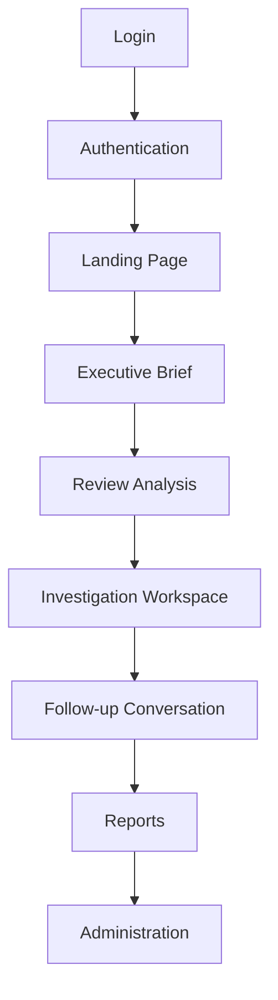

# 03 — User Journey

[02 — System Architecture](02-system-architecture.md) showed the layers a request crosses. This document walks the same territory from the other side — the sequence of moments an executive actually experiences, start to finish, in one working day with Zevra.

## Purpose

Architecture documents describe the system; this one describes the *use* of the system. It exists so that every later, more technical document can be read against a concrete picture of who is doing what, and why, at each point.

## The Journey

## Walking the Journey

**Login.** The executive opens Zevra in a browser — no client to install, no special network. They authenticate with the same corporate identity they use everywhere else in the organization.

**Authentication.** Behind the login screen, Zevra confirms who the person is and which tenant's data they are entitled to see. This step is invisible to the executive when it succeeds; it is the reason nothing later in the journey ever shows the wrong organization's data. See [04 — Authentication Layer](04-authentication-layer.md).

**Landing page.** The executive arrives not at a menu, but at today's state. The landing experience is built around what Zevra already knows is worth their attention, not a dashboard they must first learn to navigate.

**Executive Brief.** The centerpiece of the landing experience: a structured briefing Zevra generated on its own — what needs attention, an operational snapshot, the day's key insight, and what's working. The executive reads this before they have asked a single question. See [07 — Executive Experience](07-executive-experience.md).

**Review analysis.** Reading is not passive. Each item in the Brief carries the evidence behind it — the executive can see why something was flagged, not just that it was, and decide what deserves a closer look.

**Investigation Workspace.** When something in the Brief warrants more than a glance, or when the executive has a question the Brief didn't anticipate, they move into the Investigation Workspace — Zevra's conversational surface. Here the executive asks in their own words, and Zevra investigates the organization's live data to answer.

**Follow-up conversation.** An investigation is rarely one question. The executive asks "why," asks to see the evidence, narrows the question, or pivots to something adjacent — and Zevra keeps the thread, so each follow-up builds on what came before rather than starting over.

**Reports.** Not every question is asked once. The executive (or an administrator on their behalf) can pin a set of recurring questions to a schedule, so the same investigation Zevra would run on demand instead reaches an inbox or a Slack channel automatically, on a rhythm the organization sets.

**Administration.** Behind all of the above sits configuration: which data sources Zevra can see, what the organization's business language means, which agents are active, how briefs and reports are scheduled, and who can see what. Most executives visit this least often, but everything upstream in the journey depends on it having been set up correctly. See [14 — Administration](14-administration.md).

## Two Journeys, One Engine

The path from Executive Brief through follow-up conversation is not two separate products stitched together — it is one continuous use of the same investigative capability, first exercised proactively by Zevra, then conversationally by the executive. This mirrors the "Two Core Experiences" framing in [01 — Product Vision](01-product-vision.md): the journey is what those two experiences look like end to end, in the order an executive actually moves through them.

## What This Document Does Not Cover

This is the experience, not the mechanism. How authentication actually works, how the Brief is generated, how a question becomes an answer, and how administration is structured are each covered in their own later document.

## References

- [Executive Brief capability](../capabilities/executive-brief.md)
- [Conversational Analytics capability](../capabilities/conversational-analytics.md)
- [Scheduled Reports capability](../capabilities/scheduled-reports.md)
