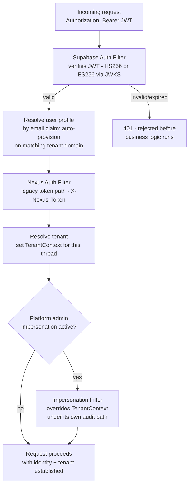

# 04 — Authentication Layer

[02 — System Architecture](02-system-architecture.md) placed Authentication as the first layer a request crosses after the browser. This document explains how that layer actually establishes identity, tenant, and permission.

!!! note "Naming note"
    Earlier planning material for this platform referred to this layer generically as "Azure AD." As implemented, Zevra's identity provider is **Supabase Auth** (JWT-based), described accurately below. The responsibility — external identity, corporate SSO, JWT-based authentication — is the same; the specific provider differs from that early framing.

## Purpose

Every layer below Authentication in the system stack — the frontend, the backend, the Agent Brain, metadata, execution — is written to trust that by the time a request reaches it, two facts are already settled: *who* is asking, and *which tenant's data* they are entitled to see. Authentication exists so that trust is never misplaced. Nothing downstream re-checks identity or tenant; it is established once, at the boundary, and carried forward.

## Responsibilities

- Verify the caller's identity via a signed token issued by the identity provider.
- Resolve that identity to a Zevra user profile, auto-provisioning new users when their email domain matches a known tenant.
- Establish the tenant scope for the remainder of the request and make it available to every downstream component without those components needing to know how it was determined.
- Support platform-administrator impersonation for support scenarios, under its own controlled path.
- Reject anything that cannot be verified, before it reaches business logic.

## Architecture Diagram

## Main Components

| Component | Responsibility |
|---|---|
| **Supabase Auth Filter** | The primary authentication path. Verifies the JWT issued by Supabase Auth — supporting both HMAC-signed (HS256) and asymmetric (ES256, verified against a cached JWKS endpoint) tokens — checks expiry, and extracts the caller's email claim. |
| **User profile resolution** | The verified email is matched to a Zevra user profile. A caller whose email domain matches a tenant's registered domain, but who has no profile yet, is auto-provisioned — the mechanism that lets a new employee at an already-onboarded organization get access without a separate invitation step. |
| **Nexus Auth Filter (legacy)** | A secondary, header-based token path (`X-Nexus-Token`), hashed and matched against a session index. Retained alongside the primary path. |
| **Tenant Context** | A per-request holder that, once set, is the single source every downstream layer reads to know which tenant's schema to operate in. It is cleared at the end of every request without exception, so no tenant scope can leak from one request into the next. |
| **Impersonation Filter** | Lets a platform administrator temporarily operate within a specific tenant's context for support purposes, through its own explicit, audited entry and exit path — never as a side effect of normal authentication. |

## Roles and Permissions

Zevra's authorization model is deliberately simple at the identity layer and precise at the data layer:

- **Roles** are a small set of named roles carried on the user's profile (for example, an administrator role) and mapped to standard authority checks — enough to gate administrative surfaces like tenant management from ordinary users.
- **Fine-grained data permission** is not handled by expanding the role model. Instead, it is handled by the governance layer described in [12 — Execution Architecture](12-execution-architecture.md) and [16 — Security Architecture](16-security-architecture.md) — row-level security and column-level policy, evaluated per query, per user attribute, against the tenant's own governance configuration. Authentication establishes *who and which tenant*; governance decides *what within that tenant*.

## Tenant Isolation

Zevra is multi-tenant with **one Postgres schema per tenant** — not a shared schema distinguished by a tenant column. Once the Tenant Context is set for a request, every database connection used to serve that request is switched to that tenant's schema before any query runs. This means tenant isolation is not a filter that application code must remember to apply on every query — it is a property of which schema the connection is even pointed at. A registry schema, shared across all tenants, holds only what has to be shared: the list of tenants, their domains (for auto-provisioning), and the session index used by the legacy token path.

## Session Model

Zevra's API is stateless. There is no server-held session between requests — every request carries its own bearer token, verified independently. Where the product shows something that looks like a "session" (a chat conversation, an agent investigation run), that is an application-level record, not an authentication session; it has no bearing on how the next request is authenticated.

## Interaction With Other Layers

- **Frontend** ([05](05-frontend-architecture.md)) attaches the bearer token to every API call and never itself decides tenant scope or permissions — it renders what the backend, having already applied authentication, chooses to return.
- **Backend** ([08](08-backend-architecture.md)) trusts the Tenant Context is set before any tenant-scoped repository call runs; a request that somehow reaches business logic without a resolved tenant fails closed rather than falling back to a default.
- **Governance** ([12](12-execution-architecture.md), [16](16-security-architecture.md)) reads the authenticated user's attributes to evaluate row-level security and column masking per query — authentication supplies the identity; governance supplies the enforcement.
- **Administration** ([14](14-administration.md)) is where roles are assigned and tenant domains are registered — the data this layer depends on to auto-provision and authorize.

## Key Design Decisions

- **Fail closed on tenant scope.** A request without a resolvable tenant is rejected rather than served against a default or a guessed schema.
- **Schema-per-tenant isolation.** Isolation is structural (a different database schema entirely), not a discipline every query must remember to apply.
- **Identity is separate from data permission.** Roles gate administrative surfaces; row and column-level access is a governance concern evaluated per query, not baked into the role model.
- **Impersonation is an explicit, separate path.** It never happens as a side effect of ordinary authentication, so every impersonated action remains attributable and auditable.

## Extension Points

The role model and the identity provider are both designed to be replaceable without touching downstream layers: everything below Authentication depends only on "an authenticated identity and a resolved tenant" being present, not on how either was determined. Adding a new identity provider or a finer-grained role is a change contained to this layer.

## References

- [Governance & Audit — Security Architecture](16-security-architecture.md)
- [Administration](14-administration.md)
