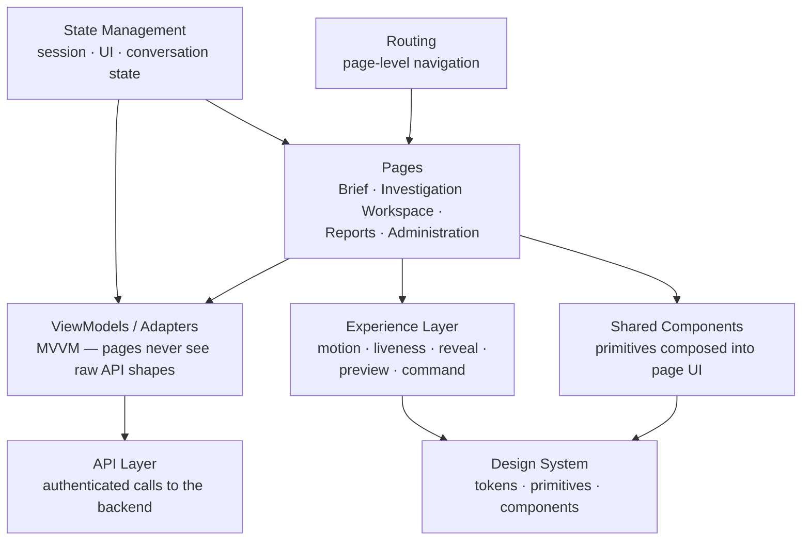

# 05 — Frontend Architecture

[04 — Authentication Layer](04-authentication-layer.md) covered how identity and tenant are established before a request reaches the application. This document covers the application the executive actually sees and uses: a React single-page application, structured so that visual design, motion and "liveness," page logic, and data access are each owned by a distinct layer.

## Purpose

The frontend exists to turn a governed, evidence-backed answer into something an executive can read in seconds and act on immediately — without ever exposing how that answer was produced. Keeping presentation, experience behavior, page logic, and data access in separate layers is what lets the product evolve its look and feel (see [06 — Design System](06-design-system.md)) without destabilizing the pages built on top of it, and lets pages change without destabilizing the components underneath them.

## Responsibilities

The frontend owns rendering, navigation, client-side state for the current session, and every call to the backend API. It owns none of the reasoning, governance, or data access described in earlier documents — it renders what the backend, having already applied authentication and governance, returns.

## Architecture Diagram

## Main Components

| Layer | Responsibility |
|---|---|
| **Routing** | Maps URLs to pages — the Executive Brief landing experience, the Investigation Workspace (chat), Reports, and Administration surfaces described in [03 — User Journey](03-user-journey.md). |
| **Pages** | Compose shared components and the design system into a complete screen for one part of the journey. A page contains layout and orchestration; it does not itself talk to the API or hold business logic. |
| **ViewModels / Adapters (MVVM)** | The seam between a page and the API: a ViewModel shapes backend data into exactly what a page needs to render, and an Adapter is the only place that touches the raw API response. A page never sees a raw API shape directly — this is what lets the backend's response shape evolve without every page needing to change. |
| **Shared components** | Reusable UI built on the design system's primitives (cards, tables, badges, status indicators) — used across pages rather than rebuilt per page. |
| **Design System** | The visual and interaction foundation described in full in [06 — Design System](06-design-system.md) — tokens, primitives, and the rule that no page hard-codes a color, space, radius, or shadow. |
| **Experience Layer** | A separate, dependency-light runtime that gives the product its sense of "liveness" — coordinated motion, staged reveal of content, hover previews, and a command interface — built so that removing it leaves every page fully functional and complete, just static. Described further in [07 — Executive Experience](07-executive-experience.md). |
| **State management** | Session-scoped state: the current conversation, in-flight investigation progress, UI state like open panels — kept separate from the durable state the backend owns. |
| **API layer** | The sole path from the frontend to the backend. Every call carries the authenticated bearer token established in [04 — Authentication Layer](04-authentication-layer.md); nothing in the frontend talks to the backend outside this layer. |

## Request Flow

A page's data need starts with a ViewModel, which calls the API layer, which makes an authenticated request to the backend. The response is shaped by the Adapter into the ViewModel's data contract before the page ever sees it. The page renders that data through shared components built on the design system, and the Experience Layer governs how that content appears — staged, animated, previewable — without the page itself containing any of that timing or motion logic. Where a page shows something live (an investigation in progress, a metric that updates), the Experience Layer's dedicated primitives own that behavior; the page only declares *what* is live, not *how* liveness is achieved.

## Interaction With Other Layers

- **Authentication** ([04](04-authentication-layer.md)) supplies the token every API call in this layer carries; the frontend has no independent notion of identity or tenant.
- **Design System** ([06](06-design-system.md)) is the visual and token foundation this document's Shared Components and Experience Layer are both built on.
- **Executive Experience** ([07](07-executive-experience.md)) is the product-level description of what the Experience Layer's motion and liveness behaviors are *for* — this document covers how they're structured; that one covers why.
- **Backend** ([08](08-backend-architecture.md)) is the sole target of the API layer — the frontend never accesses metadata, execution, or persistence directly.

## Key Design Decisions

- **Pages never see raw API responses.** The ViewModel/Adapter seam is the enforced boundary — it means a backend response shape can change without every page that (indirectly) depends on it needing to change too.
- **Experience is a separate, removable runtime, not scattered animation code.** Motion, reveal, and liveness behaviors live in one place with their own primitives and a kill-switch; a page with the Experience Layer disabled is still fully functional, just without motion — proof that no business logic lives inside it.
- **Design tokens, never hard-coded values.** No page or component hard-codes a color, spacing value, radius, or shadow — everything is consumed from the design system, which is what lets the whole product's look evolve from one place.
- **Reduced-motion and accessibility are runtime properties, not per-component afterthoughts.** The Experience Layer's primitives all honor a reduced-motion signal centrally, rather than requiring every component to remember to check it.

## Extension Points

New pages compose existing shared components and design-system primitives rather than introducing new visual primitives per page. New "living" behaviors (a new kind of preview, a new reveal pattern) extend the Experience Layer's primitive set, which every page can then opt into without page-level motion code.

## References

- [Design System](06-design-system.md)
- [Executive Experience](07-executive-experience.md)
