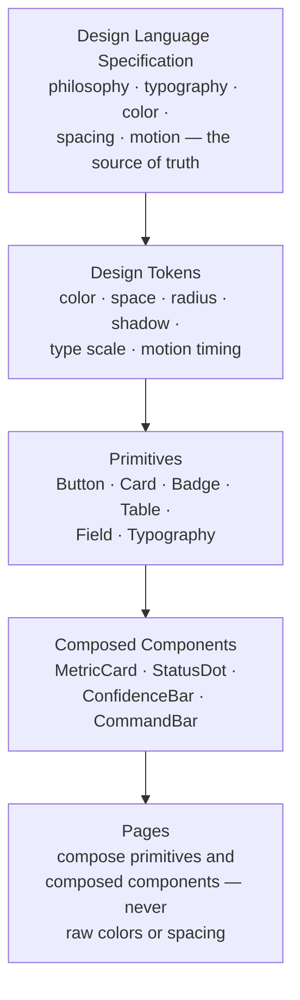

# 06 — Design System

[05 — Frontend Architecture](05-frontend-architecture.md) named the Design System as the foundation every page and shared component is built on. This document explains what that foundation actually contains and how it is organized.

## Purpose

An executive product lives or dies on whether it feels considered — consistent spacing, consistent color meaning, consistent motion. That consistency cannot be achieved by convention alone across many pages built over time; it has to be structural. The Design System exists so that "what does urgent look like" or "how much space goes here" has exactly one answer, defined once, and every page inherits it rather than re-deciding it.

## Responsibilities

The Design System owns the platform's visual language end to end: color, type, spacing, elevation, motion timing, and the base interactive primitives (buttons, cards, tables, badges, status indicators, form controls) built from them. It does not own page layout or business logic — those belong to the pages and shared components described in [05 — Frontend Architecture](05-frontend-architecture.md).

## Architecture Diagram

## Main Components

| Layer | Responsibility |
|---|---|
| **Design Language specification** | The frozen source-of-truth document set — philosophy, typography, color, spacing, motion, and a navigable reference of both the light and dark themes — that the implemented token system is derived from. Product philosophy and information architecture are settled here before any token is written. |
| **Design tokens** | Every color, spacing value, corner radius, shadow, type size, and motion duration used anywhere in the product, defined once and referenced everywhere else by name — never by literal value. Both a light and a dark theme are defined; light is the canonical reference theme, and dark is designed independently rather than mechanically inverted. |
| **Primitives** | The smallest reusable interactive and layout building blocks: buttons, cards, badges and status indicators (the product's shared "status language" — how urgency and state are always represented), form fields, tables, and the type scale as reusable text components. |
| **Composed components** | Primitives assembled into slightly higher-level, still-generic pieces — a metric card, a confidence indicator, a command interface — that pages then use directly rather than reassembling primitives from scratch on every page. |
| **Theme provider** | The single mechanism that resolves which theme (light or dark) is active and makes it available to every token consumer; it is not duplicated per page or per app entry point. |

## Primitive Hierarchy

The system is strictly layered, and nothing is allowed to skip a layer:

1. **Tokens** are pure values — no visual opinion beyond "this is what 'critical red' or 'the standard card radius' means."
2. **Primitives** consume tokens and add structure and behavior, but stay generic — a `Card` has no opinion about what content goes inside it.
3. **Composed components** consume primitives and add product-specific shape — a metric card knows it shows a number and a trend, but not which metric.
4. **Pages** consume composed components and primitives, and add only layout and data — a page should never contain a hard-coded color, spacing value, or shadow.

## How Pages Compose Primitives

A page is, structurally, an arrangement of composed components and primitives with real data and layout — nothing more. If a page needs a visual treatment the current primitive set doesn't offer, the correct fix is a new or extended primitive at the design-system layer, not a one-off style on the page. This rule is what keeps the product visually coherent as it grows: coherence is enforced by what's available to compose, not by design review catching drift after the fact.

## Interaction With Other Layers

- **Frontend Architecture** ([05](05-frontend-architecture.md)) is where this system is consumed — shared components and pages are built exclusively from these tokens and primitives.
- **Executive Experience** ([07](07-executive-experience.md)) governs *how* these primitives come alive on screen (motion, reveal, emphasis) without owning their visual definition — the Design System defines what a card looks like; the Experience Layer defines how it enters and updates.

## Key Design Decisions

- **Light is canonical; dark is independently designed.** Dark mode is not an automatic inversion of light — it is designed on its own terms, because a naive inversion produces a theme that looks unintentional.
- **No hard-coded values, anywhere.** Every visual property a component uses is a token reference. This is the single rule that makes a future visual refresh a token-file change rather than a page-by-page rewrite.
- **Status and urgency have one shared visual language.** Badges and status indicators are defined once, centrally, so "urgent" or "needs attention" looks and means the same thing everywhere in the product, consistent with the Executive Brief's severity-marked findings described in [07 — Executive Experience](07-executive-experience.md).
- **The specification precedes the implementation.** Design philosophy, typography, and color are settled as a written, frozen reference before tokens are implemented — the code follows the design language, not the other way around.

## Extension Points

A new visual need is met by extending the token set or adding a new primitive, reviewed against the Design Language specification, rather than by a page opting out of the system for a one-off treatment.

## References

- [Frontend Architecture](05-frontend-architecture.md)
- [Executive Experience](07-executive-experience.md)
