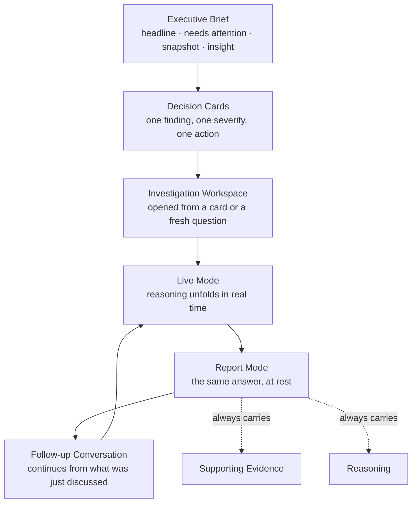

# 07 — Executive Experience

[03 — User Journey](03-user-journey.md) walked the sequence of moments an executive moves through. This document stays at that same altitude and goes deeper into each moment — what it looks and feels like, not how it is built. Consistent with the rest of this set's product-first framing, this page describes experience only; implementation is covered in [05 — Frontend Architecture](05-frontend-architecture.md) and [06 — Design System](06-design-system.md).

## Purpose

Executives do not read the way analysts read. They scan for what needs a decision, they trust a claim only as far as they can see what it's based on, and they abandon a tool the moment it makes them work to extract the point. The Executive Experience exists to meet that reading pattern directly — leading with what matters, backing every claim with evidence, and never asking the executive to dig.

## Executive Brief

The Brief is the first thing an executive sees. It reads top to bottom in a fixed, deliberate order: a headline capturing the single most important thing to know today, what needs attention, a snapshot of key operational metrics, one key insight, and what's working. Nothing in the Brief requires the executive to have asked a question first — it is Zevra's own synthesis of the day's investigation, arriving already prioritized.

## Decision Cards

Within the Brief, individual findings are presented as self-contained cards — each one a complete unit an executive can act on without opening anything else: what was found, why it matters, and how severe it is. Severity is marked visually and consistently (the shared status language described in [06 — Design System](06-design-system.md)), so scanning the Brief for "what's actually urgent" takes seconds, not careful reading.

## Investigation Workspace

Where the Brief is read, the Investigation Workspace is used. It's Zevra's conversational surface — an executive types a question in their own words, and watches Zevra investigate. This is not a search box that returns a static result: the workspace stays open through the investigation and through everything the executive asks next.

## Live Mode

When an investigation is actively running, the workspace shows it happening — the reasoning unfolding step by step, visible as it happens rather than revealed only once complete. An executive watching Live Mode sees the same kind of transparency a good analyst would offer if asked "how are you figuring this out" mid-investigation, without having to ask.

## Report Mode

Once an investigation is complete, the same content settles into Report Mode: a finished answer, its supporting evidence, and its reasoning trace, all still present but no longer moving. Report Mode is what a follow-up conversation, a shared finding, or a returning executive sees — the same substance as Live Mode, at rest.

## Follow-Up Conversation

An executive's first question is rarely their last. The workspace treats every subsequent question as a continuation, not a restart: "why," "show me the underlying data," "what about last month" are understood in the context of what was just discussed. This is what makes investigation feel like a conversation with a colleague rather than a series of unrelated searches.

## Supporting Evidence

Every answer Zevra gives carries the evidence it was built from — not just a sentence, but the actual data behind it. An executive can always see the numbers, not just trust the narrative describing them. This is the experiential expression of a principle that runs through this entire documentation set: nothing is ever asserted without something real behind it.

## Reasoning

Alongside the evidence, an executive can see *how* Zevra got there — which steps it took, what each one found, and why the investigation concluded when it did. This reasoning trace is not a debugging tool exposed by accident; it is a deliberate part of the experience, because trust in an executive tool is built by visible rigor, not by a confident tone.

## How the Pieces Fit Together

## What Makes This an Executive Experience, Specifically

- **Priority is decided before the executive reads, not while.** The Brief's fixed reading order and each card's severity marking mean an executive never has to infer what matters most.
- **Nothing is asked of the executive that a colleague wouldn't ask of themselves.** Follow-up conversation works the way asking a person a follow-up works — no new syntax, no re-explaining context.
- **Trust is earned by visibility, not by tone.** Evidence and reasoning are always one glance away, so confidence in an answer never has to be taken on faith.

## What This Document Does Not Cover

How the Brief is generated, how an investigation actually reasons and executes, and how the interface is built and rendered are covered in [09 — Agent Architecture](09-agent-architecture.md), [10 — Request Lifecycle](10-request-lifecycle.md), [13 — Response Composition](13-response-composition.md), and [05 — Frontend Architecture](05-frontend-architecture.md).

## References

- [Executive Brief capability](../capabilities/executive-brief.md)
- [Conversational Analytics capability](../capabilities/conversational-analytics.md)
