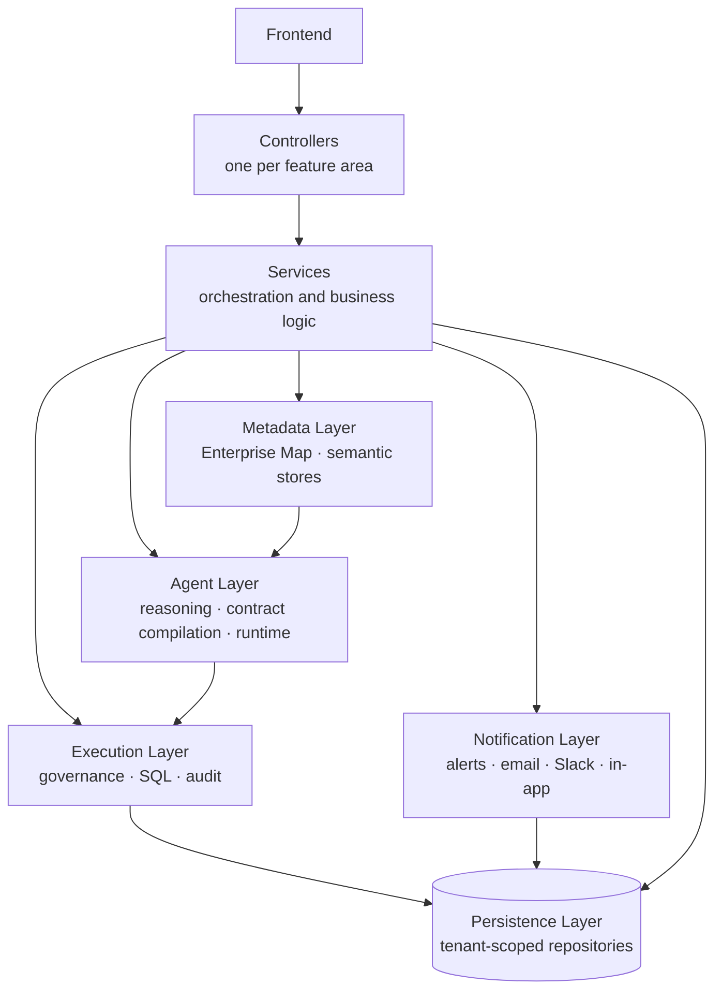

# 08 — Backend Architecture

[05 — Frontend Architecture](05-frontend-architecture.md) covered what the executive-facing application looks like; this document covers what serves it. It describes how the backend is organized into layers with distinct responsibilities, so that the sequence described in [09 — Agent Architecture](09-agent-architecture.md) and [10 — Request Lifecycle](10-request-lifecycle.md) has a concrete home in the codebase.

## Purpose

A platform that reasons about business questions, compiles execution permissions, and touches real operational data cannot afford a backend where any layer can reach into any other. The backend exists to give each responsibility — receiving a request, orchestrating a response, reasoning about business meaning, enforcing what may execute, persisting state, and notifying people — exactly one owner, so the guarantees described earlier in this set (governed-by-construction, evidence-only answers) hold in practice, not just on a diagram.

## Responsibilities

The backend is the single entry point for every request the frontend makes, and the sole component with database access. It owns orchestration — deciding which layers a given request needs to pass through — without owning business reasoning, metadata, or execution enforcement itself; those are delegated to their own layers.

## Architecture Diagram

## Main Components

| Layer | Responsibility | Representative components |
|---|---|---|
| **Controllers** | The API surface — one controller per feature area, translating HTTP requests into service calls and nothing more. | Connections, agents, chat, governance, tenant administration, reports, alerts, knowledge gaps, onboarding — around two dozen feature-scoped controllers. |
| **Services** | Orchestration and business logic beneath each controller — the layer controllers call into, and the layer that calls into everything below. | The chat/conversation service, agent configuration service, enterprise-map service, tenant provisioning service. |
| **Agent layer** | Split into three concerns: business reasoning (the Agent Brain and contract compilation described in [09](09-agent-architecture.md)), agent configuration (playbooks, versions, KPIs), and agent runtime execution (the ReAct-style tool-calling loop that drives an investigation). | The reasoning/compilation components, the agent-configuration CRUD components, and the runtime/tool-registry components. |
| **Metadata layer** | The Enterprise Map and semantic stores — schema discovery, business entities, vocabulary, value domains, knowledge gaps. Read by the agent layer, never by the execution layer directly. | Enterprise map service, semantic model components, knowledge-gap handling. |
| **Execution layer** | Query execution, SQL generation and guardrails, and the full governance chain — safety, data contracts, row-level security, masking, audit. | Query execution, SQL guardrail components, the governance chain, reasoning-session tracking. |
| **Persistence layer** | Tenant-scoped data access. Every repository operates against whichever tenant schema the current request's Tenant Context resolved to. | One repository class per feature area, following the same per-feature organization as controllers and services. |
| **Notification layer** | Proactive delivery — alerts triggered by anomaly detection, delivered across Slack, email, and in-app channels, with every delivery recorded regardless of channel. | The alert service, the message-composition component, the multi-channel delivery component. |

## Request Flow

A typical request enters through a feature-scoped controller, which does no more than validate the shape of the call and hand it to its service. The service is where orchestration happens: for anything touching business meaning or live data, the service calls into the agent layer, which in turn draws on the metadata layer for meaning and the execution layer for governed access to real data. Persistence is used throughout — not just at the end — since agent configuration, conversation state, governance audit records, and metadata all need to be read and written along the way. Notification is triggered independently, off the back of events like detected anomalies, rather than sitting inline in the main request path.

## Interaction With Other Layers

- **Authentication** ([04](04-authentication-layer.md)) runs before any controller executes, establishing the identity and tenant every service and repository call assumes is already in place.
- **Agent Architecture** ([09](09-agent-architecture.md)) is the detailed view of what this document's "Agent layer" row actually does — the reasoning, compilation, and enforcement sequence.
- **Metadata Architecture** ([11](11-metadata-architecture.md)) and **Execution Architecture** ([12](12-execution-architecture.md)) are the detailed views of this document's metadata and execution rows.
- **Administration** ([14](14-administration.md)) is served by the same controller/service pattern described here, applied to configuration surfaces rather than question-answering.
- **Database Architecture** ([15](15-database-architecture.md)) is the detailed view of what the persistence layer actually stores.

## Key Design Decisions

- **One feature, one controller, one service, one repository.** The backend is organized by feature area consistently across every layer, so a reader who understands the pattern in one area can navigate any other.
- **Concrete classes over speculative interfaces.** Services and repositories are implemented directly rather than hidden behind interfaces built for a hypothetical future swap — consistent with this documentation set's broader principle of building for what is needed, not for what might someday be needed.
- **Reasoning, metadata, and execution are separate layers, not separate concerns inside one service.** This is what makes the Agent Architecture's separation of business reasoning from physical execution ([09](09-agent-architecture.md)) real in the code, not just in a diagram.
- **Notification is decoupled from the request path.** Alerts are triggered by events (like anomaly detection), not by the synchronous flow of answering a question — so a slow or failed notification never blocks or degrades the answer a user is waiting on.

## Extension Points

New feature areas follow the established controller/service/repository pattern rather than introducing a new one. New execution surfaces (new connection types, new governance rules) extend the execution layer without the agent or metadata layers needing to change, because those layers depend only on the Execution Contract's shape, not on how governance is implemented underneath it.

## References

- [ExecutionContract — Agent Business-Object Grounding](../architecture/execution-contract.md)
- [Alerts capability](../capabilities/alerts.md)
