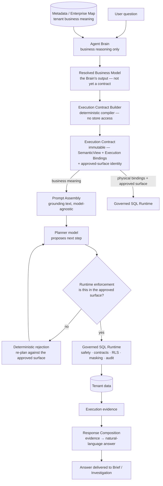

# 09 — Agent Architecture

This is one of the most important documents in this set. [02 — System Architecture](02-system-architecture.md) named the Agent Brain, Metadata, Execution Contract, and Governed SQL Runtime as layers; this document explains how they actually work together, in the sequence a question moves through them. It describes the current, unified architecture only — no superseded design is documented here.

## Purpose

The single hardest problem in an AI system that touches real operational data is keeping the model's judgment from becoming the last word on what executes against that data. Zevra's answer is architectural, not procedural: business reasoning and physical execution are performed by different components, connected by a single compiled, immutable artifact that neither side can bypass. This document explains that separation and the sequence it enforces.

## Responsibilities

| Component | Responsible for | Never does |
|---|---|---|
| **Agent Brain** | Resolving a question into business objects and relationships, using the tenant's own metadata | Execute SQL, enforce anything, compile the contract |
| **Metadata (Enterprise Map)** | Supplying the business meaning the Brain reasons over — objects, attributes, relationships | Decide anything on its own; it is read, not run |
| **Execution Contract Builder** | Deterministically compiling the Brain's resolved business model into an immutable, approved execution surface | Reason about business meaning, query any store itself |
| **Prompt Assembly** | Deriving what the model sees — grounding text drawn only from the compiled contract | Access metadata or any store directly |
| **The model (planning)** | Proposing a plan — which questions to ask of the data, step by step | Decide what is *allowed* to execute — that is never the model's call |
| **Governed SQL Runtime** | Enforcing the approved surface, applying safety and security policy, executing | Interpret business meaning or exercise judgment |
| **Response Composition** | Turning validated execution evidence into a natural-language answer | Answer from anything other than what execution actually returned |

## The Sequence

## Agent Brain

The Agent Brain is the platform's sole owner of business reasoning. Given a question, it looks the question up against the tenant's Enterprise Map — the discovered and steward-curated map of what business objects exist, what they mean, and how they relate — and resolves the question into a **Resolved Business Model**: which business objects and attributes the question concerns, before anything physical has been touched.

The Brain never executes anything and never enforces anything. Its output is a proposal about business meaning, not a permission — that distinction is what the next stage exists to formalize.

## From Reasoning to Contract

The Resolved Business Model is not itself trusted as an execution boundary — a model's output, even a well-reasoned one, is not treated as authorization. It is handed to the **Execution Contract Builder**, a deterministic compiler with no access to metadata stores or any other repository. The builder's only job is compilation: it produces the **Execution Contract**, an immutable artifact carrying two planes:

- A **business plane** (business objects, their attributes, and relationships) — meaning only, no physical detail.
- An **execution plane** (which physical tables and columns each business object and attribute actually bind to, plus a precomputed set of everything this request is approved to touch).

Because the contract is immutable and fully compiled, enforcement downstream never has to re-derive or re-interpret anything — it checks simple set membership against a surface that was fixed the moment the contract was built.

## Metadata's Role

Metadata — covered in full in [11 — Metadata Architecture](11-metadata-architecture.md) — is what the Agent Brain reasons over and what the Execution Contract's business plane describes. It is never queried by the Contract Builder or the runtime directly; by the time execution happens, everything metadata contributed has already been compiled into the contract. This is why the runtime can enforce a request without holding any reference back to the metadata layer — the boundary between reasoning and execution is structural, not a matter of discipline.

## Reasoning: Planning and Evaluation

With the contract compiled, a planning model proposes the next step toward answering the question — typically, a data query. The planner works from grounding text derived exclusively from the contract, so it can only refer to business objects and physical assets the contract has already approved; it has no path to metadata or any other source of truth.

Each proposed step is checked against the contract's approved surface before it is allowed anywhere near real data. A step that falls outside the approved surface is not silently corrected or executed anyway — it is rejected deterministically, and the planner is given the chance to re-plan within what is actually approved. This loop (plan → check → execute or reject) continues, bounded, until the evidence gathered is judged sufficient to answer the question or the investigation reaches a dead end.

## Governed Execution

Every approved step still passes through the full governed runtime — the same safety, data-contract, row-level-security, masking, and audit chain regardless of whether the request originated from a conversational question, an autonomous agent, or a scheduled brief. The Execution Contract determines *what may be asked*; the Governed SQL Runtime determines *how it is safely asked*. Neither layer substitutes for the other. This runtime is the subject of [12 — Execution Architecture](12-execution-architecture.md).

## Response Composition

Once execution produces evidence — real rows, real counts, or a real absence of either — that evidence, and nothing else, is what gets composed into the answer. The composition step is deliberately downstream of everything above: it cannot see a question the Brain never reasoned about, and it cannot describe data the Governed SQL Runtime never actually returned. This is covered fully in [13 — Response Composition](13-response-composition.md).

## Conversation and Memory

A question rarely arrives without context. Recent turns in the same conversation, and relevant prior findings the platform has already produced, are made available to the reasoning stages as additional grounding — informing what the Brain and planner consider, without ever substituting for what the Execution Contract approves or what governed execution returns. Memory *informs* reasoning; it never authorizes execution on its own.

## Why This Sequence, Specifically

Three properties are non-negotiable across the whole architecture, and this document's sequence exists to guarantee them:

- **Reasoning proposes; it never approves.** Only the deterministic Contract Builder produces something the runtime will enforce against. A model's output is always one step removed from anything executing.
- **The contract is immutable and compiled once.** Nothing downstream re-derives the approved surface from scratch — enforcement is fast, deterministic, and cannot drift from what was originally approved.
- **Every path converges on the same governed runtime.** Whether a question comes from an executive's conversation, an autonomous agent's own investigation, or a scheduled brief, it is checked and executed the same way. There is no faster, less-governed path to real data.

## References

- [ExecutionContract — Agent Business-Object Grounding](../architecture/execution-contract.md)
- [Semantic Foundation](../architecture/semantic-foundation.md)
- [Conversational Analytics capability](../capabilities/conversational-analytics.md)
