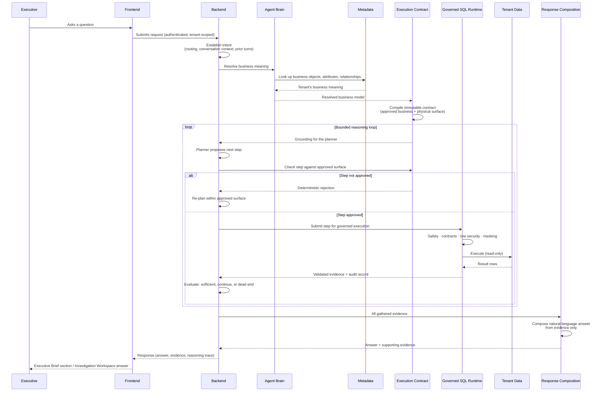

# 10 — Request Lifecycle

[09 — Agent Architecture](09-agent-architecture.md) explained why reasoning and execution are separated and what each component owns. This document traces one question end to end, in the exact order stages run, as a single sequence.

## Purpose

Every architectural guarantee described so far — governed-by-construction, business reasoning before physical execution, evidence-only answers — is only real if it holds in the literal order operations happen. This document exists to make that order explicit and checkable, stage by stage.

## Responsibilities

This lifecycle applies uniformly to a conversational question, a scheduled report question, and a proactive brief investigation — they are the same pipeline entered from different surfaces. It is the single execution path referenced by every capability-level document later in this set.

## Sequence Diagram

## Stage by Stage

| Stage | What happens | Why it happens here and not elsewhere |
|---|---|---|
| **Intent** | The request is authenticated, tenant-scoped, and understood in the context of the surface it came from (a fresh question, a follow-up, a scheduled report question, or a proactive agent investigation) and any relevant conversation history. | Nothing downstream can be trusted to run without first knowing who is asking, for which tenant, and in what context. |
| **Metadata retrieval** | The Agent Brain resolves the question against the tenant's own business meaning. | Business meaning must be established before anything physical is considered — this is what lets Zevra understand "SBD" or "overdue" the way this organization means it. |
| **Execution Contract** | The resolved business model is deterministically compiled into an immutable, approved surface. | This is the one-time boundary where reasoning output becomes something enforceable. Nothing after this point can expand what is approved. |
| **Planning within the loop** | A model proposes the next investigative step; the runtime checks it against the compiled contract before anything executes. | Keeps the model's judgment confined to *what to ask*, never to *what is allowed to run*. |
| **Governed SQL** | Every approved step passes through safety validation, data-contract checks, row-level security, and column masking. | The same gate applies no matter which surface or which reasoning path produced the step — governance is never optional or bypassable. |
| **Execution** | The step actually runs, read-only, against the tenant's own data. | This is the only place real data is touched in the entire lifecycle. |
| **Reasoning (evaluation)** | Each result is judged: is the evidence gathered so far sufficient, should the loop continue, or has it reached a dead end? | Keeps investigations bounded and evidence-driven rather than open-ended. |
| **Response** | Composition turns the accumulated, validated evidence into a natural-language answer. | Composition is deliberately the last stage — it can only describe what was actually found, never what a model expected to find. |
| **Executive Brief / Investigation** | The composed answer reaches the executive through whichever surface originated the request. | Closes the loop back to the experience described in [03 — User Journey](03-user-journey.md). |

## Failure Is a First-Class Outcome

Not every question resolves into a data investigation. A question may be answered from memory of a prior finding, may be answered from a result already gathered earlier in the same conversation, may need a clarifying question back to the executive, or may surface a genuine gap in what the tenant's metadata currently covers. Each of these is a legitimate, honestly reported outcome — never masked by inventing an answer the evidence doesn't support. A write-shaped request (anything that would modify data) is refused outright, consistent with the read-only boundary established in [01 — Product Vision](01-product-vision.md).

## What This Document Does Not Cover

This is the sequence, not the design rationale behind each stage — those are covered in [09 — Agent Architecture](09-agent-architecture.md), [11 — Metadata Architecture](11-metadata-architecture.md), [12 — Execution Architecture](12-execution-architecture.md), and [13 — Response Composition](13-response-composition.md).

## References

- [Conversational Analytics capability — Request Lifecycle](../capabilities/conversational-analytics.md#request-lifecycle)
- [Semantic Foundation — Resolution Pipeline](../architecture/semantic-foundation.md#resolution-pipeline)
