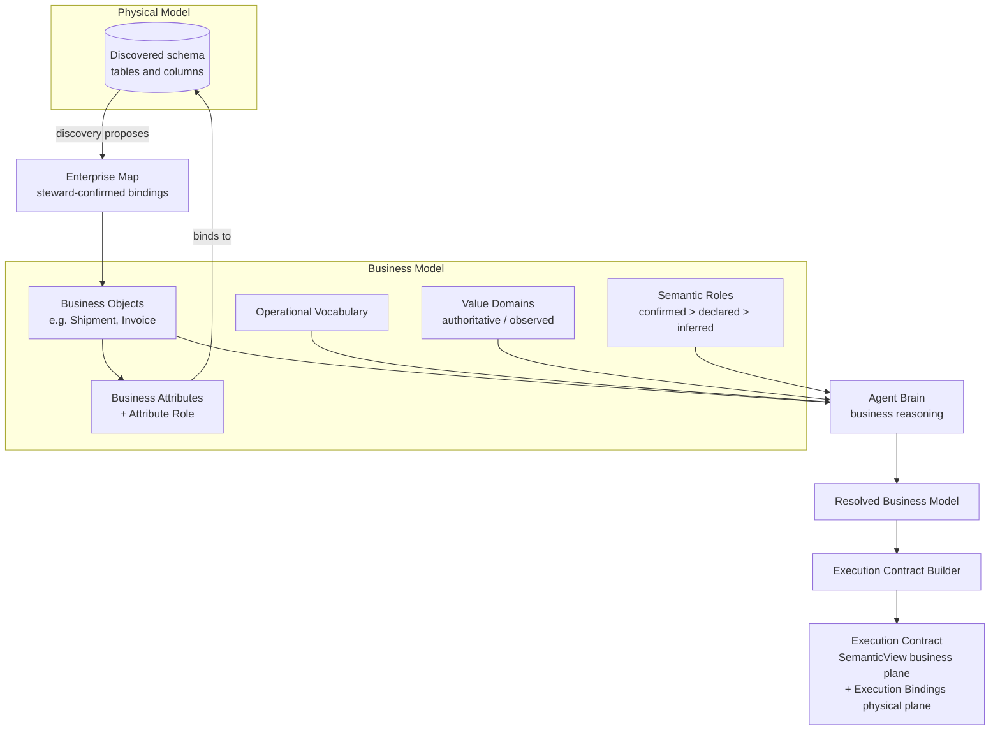

# 11 — Metadata Architecture

[09 — Agent Architecture](09-agent-architecture.md) described the Agent Brain reasoning over "the tenant's own metadata" and compiling a resolved business model into an Execution Contract. This document is that layer in full: what it actually stores, how business meaning is separated from physical structure, and how the two are bound together.

## Purpose

A model reasoning freely over a raw database schema will guess at meaning — and a wrong guess about what "overdue" means, or which table holds "shipments," produces a wrong answer with total confidence. Zevra's metadata layer exists to remove that guesswork: business meaning is captured once, owned by the tenant, and stored as data — not re-derived by a model on every question, and never invented by one.

## Responsibilities

The metadata layer is Zevra's business-understanding layer. It owns the tenant-scoped stores that hold what data *means*, and the deterministic machinery that resolves a question's words against those stores before any model reasoning happens. It does not own physical data (the tenant's own database is authoritative for that) and it does not own query execution — those belong to the Oracle and the Governed SQL Runtime described in [12 — Execution Architecture](12-execution-architecture.md).

## Architecture Diagram

## Main Components

| Component | Responsibility |
|---|---|
| **Enterprise Map** | The discovered and steward-curated map of what physically exists (schema objects and columns) and what it has been confirmed to mean. It is the ground both the business model and the physical model connect to. |
| **Business objects** | Steward-confirmed business concepts — a *Shipment*, an *Invoice* — each bound to a primary physical table, carrying operational meaning and hints that guide how an investigation approaches it. |
| **Business attributes** | The properties of a business object, each with an attribute role (identifier, status, filterable, sensitive, and so on), bound to a physical column. |
| **Operational vocabulary** | The tenant's own curated language layer — a term, its definition, and optionally a reusable filter pattern — editable directly by the business, distinct from code. |
| **Value domains** | The persisted set of legal (or observed) values a column may hold, carrying an authority level: declared domains gate hard; sampled ones advise. This is what stops a filter from silently running against a value that doesn't exist. |
| **Semantic roles** | A column's classification, with provenance: a human confirmation always outranks a system declaration, which always outranks a machine inference. |
| **Business model** | The collective business-meaning layer — objects, attributes, vocabulary, roles — meaning only, no physical detail. |
| **Physical model** | The discovered schema itself — real tables, real columns — the ground truth of structure, never of meaning. |
| **Execution Contract** | The compiled, immutable artifact that binds the business model to the physical model for one specific request, described fully in [09 — Agent Architecture](09-agent-architecture.md) and [12 — Execution Architecture](12-execution-architecture.md). |

## Business Model vs. Physical Model

These are deliberately two different things, owned two different ways:

- The **physical model** is discovered — scanned from the tenant's actual connected data source. It is never edited by hand; it is re-discovered when the source changes.
- The **business model** is curated — proposed by discovery, but only made authoritative by a steward's confirmation. A business object without a confirmed binding is not something the Agent Brain will reason over as fact.

The Execution Contract is what binds the two for a single request: its business plane describes what a business object *means*, and its execution plane records exactly which physical table and columns that meaning is grounded in right now. Neither plane is trusted without the other — meaning without a physical binding cannot execute, and physical structure without confirmed meaning cannot be reasoned about safely.

## Request Flow

Meaning moves through this layer in one direction, evidence up and authority down: discovery proposes what physically exists and what it might mean; stewards confirm business objects, bindings, vocabulary, and roles; a question, once routed to a domain, is resolved deterministically against these confirmed stores; the Agent Brain reasons over the resolved result; and the Execution Contract Builder compiles that reasoning, together with the physical bindings, into the immutable contract the runtime enforces. Validated use of the system feeds back into the vocabulary through a governed learning lifecycle, but that feedback loop writes only to the vocabulary tier — it never touches confirmed entities, bindings, or roles.

## Governance Within Metadata

Governance appears twice at this layer, in two different senses. First, **discovery is gated**: value scanning respects cardinality and content-safety limits, so nothing unsafe or unbounded ever becomes a stored value domain in the first place. Second, **authority is provenance-ranked**: a human confirmation always wins over a declaration, which always wins over an inference, so the system never lets a lower-confidence source silently override a steward's decision. Execution-time governance — row-level security, masking, audit — is a separate concern, covered in [12 — Execution Architecture](12-execution-architecture.md); metadata governance is about what is allowed to *become* meaning in the first place.

## Interaction With Other Layers

- **Agent Architecture** ([09](09-agent-architecture.md)) is the primary consumer: the Agent Brain reads this layer to resolve a question, and the Execution Contract Builder reads it once more to compile the physical bindings.
- **Administration** ([14](14-administration.md)) is where the Enterprise Map is populated and business objects, vocabulary, and roles are confirmed by stewards.
- **Execution Architecture** ([12](12-execution-architecture.md)) is the layer that enforces the physical plane of the Execution Contract this layer's business model feeds into.

## Key Design Decisions

- **Meaning is data, not code.** It changes on the business's own clock and is stored, edited, and audited like any other tenant asset — never hard-coded into the platform.
- **A referent-only guarantee.** Every piece of resolved meaning points at something that actually exists in the stores; nothing is invented to fill a gap.
- **Stewards remain the final authority.** Every editable store can be corrected or archived by the tenant's own people, and no automated process — including learning from usage — can silently override a steward's confirmed decision.
- **Deterministic before probabilistic.** Resolving a question's terms against these stores is exact, repeatable matching machinery, run before any model reasoning — so the same question always resolves the same way.

## Extension Points

New business domains are added by confirming new business objects and their bindings within the existing Enterprise Map structure — no change to the resolution machinery or the Execution Contract's shape is required. Industry-specific vocabulary can be introduced as a separate, lower-precedence tier that a tenant later overrides by cloning into their own curated tier, never by editing the shared tier directly.

## References

- [Semantic Foundation](../architecture/semantic-foundation.md)
- [ExecutionContract — Agent Business-Object Grounding](../architecture/execution-contract.md)
