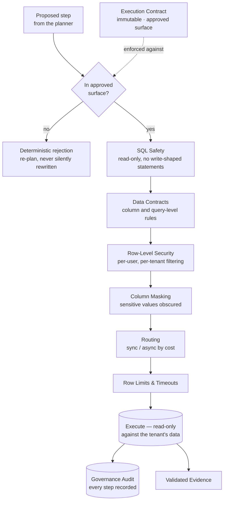

# 12 — Execution Architecture

[09 — Agent Architecture](09-agent-architecture.md) introduced the Execution Contract and the Governed SQL Runtime as the boundary between reasoning and physical data. This document is that boundary in full: exactly what may execute, how it is validated, and what is recorded.

## Purpose

Everything upstream of this layer — business reasoning, metadata resolution, planning — produces a *proposal*. This layer exists because a proposal is not a permission: nothing touches a tenant's real data until it has been checked against an immutable, compiled contract and passed through a fixed chain of safety and security enforcement. This is what makes Zevra's read-only, governed posture (introduced in [01 — Product Vision](01-product-vision.md)) a structural guarantee rather than a matter of trusting good behavior upstream.

## Responsibilities

The execution layer owns validation, enforcement of the approved surface, safety checks, security policy, real execution, and the audit record of what happened. It does not own business reasoning or business meaning — those are supplied to it, already compiled, by the layer described in [11 — Metadata Architecture](11-metadata-architecture.md).

## Architecture Diagram

## Main Components

| Component | Responsibility |
|---|---|
| **Execution Contract** | The immutable, compiled artifact from [09 — Agent Architecture](09-agent-architecture.md) — the precomputed set of business objects and physical assets this specific request may touch. |
| **Approved-surface enforcement** | The first and non-negotiable gate: a proposed step referencing anything outside the contract's approved surface is rejected before it goes anywhere near governance or the database — deterministically, as a plain membership check, never as a judgment call. |
| **SQL safety** | Guarantees every executed statement is read-only. Nothing shaped like a write — an insert, update, delete, or schema change — is permitted to reach the database, regardless of what a model proposed. |
| **Data contracts** | Column- and query-level rules a tenant's governance configuration establishes, checked before execution. |
| **Row-level security** | Filters results to what the specific requesting user is entitled to see, evaluated per query against the user's attributes established at authentication. |
| **Column masking** | Obscures sensitive values in results the user is not entitled to see in full, even within rows they are otherwise allowed to read. |
| **Routing** | Decides whether a query runs synchronously (fast path) or asynchronously (for heavier queries), based on estimated cost — invisible to the requester beyond response timing. |
| **Row limits and timeouts** | Bounds every query's cost and duration, so no single request can degrade the platform for others. |
| **Governance audit** | A durable record of every governed query — what ran, under what contract, for whom, with what outcome — written regardless of whether the query succeeded, was rejected, or was blocked. |

## Request Flow

A proposed step arrives from the planning stage in [10 — Request Lifecycle](10-request-lifecycle.md) already scoped to what the Execution Contract approved for this request. It is checked against that approved surface first — an unapproved reference is rejected immediately, before any governance machinery even runs, and the reasoning loop is given the chance to re-plan within what is actually approved. A step that passes this first gate proceeds through the fixed governance chain in order: safety, then data contracts, then row-level security, then masking, then routing and limits. Only after every stage passes does the statement actually execute, read-only, against the tenant's connected data. The result — whether rows, an empty result, a rejection, or a block — is recorded in the governance audit and returned upstream as evidence.

## Enforcement, Not Advice

Two properties make this chain a genuine boundary rather than a best-effort check:

- **Rejection, never silent rewriting.** An unapproved or invalid step is never corrected on the platform's own initiative and executed anyway — it is refused, with the refusal itself becoming information the reasoning loop can act on.
- **The same chain, every time, regardless of origin.** A step proposed during a conversational investigation, an autonomous agent's own inquiry, or a scheduled report question passes through exactly this chain — there is no faster or less-governed path to real data anywhere in the platform.

## Interaction With Other Layers

- **Agent Architecture** ([09](09-agent-architecture.md)) is the layer that produces both the Execution Contract this layer enforces and the proposed steps this layer checks.
- **Metadata Architecture** ([11](11-metadata-architecture.md)) supplies the business and physical bindings the Execution Contract compiles from — never queried directly by this layer.
- **Response Composition** ([13](13-response-composition.md)) consumes exactly the evidence this layer produces, and nothing else — it cannot describe data this layer never actually returned.
- **Security Architecture** ([16](16-security-architecture.md)) is the platform-wide view of the same governance chain described here, extended to authentication, tenant isolation, and audit as a whole.
- **Administration** ([14](14-administration.md)) is where the data contracts and row-level security policies enforced here are authored and tested.

## Key Design Decisions

- **Compilation happens once; enforcement is cheap and deterministic afterward.** Because the Execution Contract is immutable and fully compiled, checking a step against it is plain set membership — no re-interpretation, no ambiguity, no drift between what was approved and what is enforced.
- **Governance is a fixed chain, not a configurable pipeline per surface.** Every experience inherits the same safety, contract, RLS, masking, routing, and audit sequence — this is what lets a new proactive surface (like the Executive Brief) gain full governance automatically, simply by routing its queries through this layer.
- **Rejection is informative, not silent.** A rejected step returns enough information for the reasoning loop to try again correctly, rather than failing opaquely or being quietly patched.
- **Audit is unconditional.** Every governed query is recorded whether it succeeds, is rejected, or is blocked — the audit trail is not just a log of successes.

## Extension Points

New governance rules (a new kind of data contract, a new masking policy) extend the fixed chain without requiring the Agent Architecture or Metadata layers to change — those layers depend only on the chain's existence and its all-or-nothing enforcement, not on its internal rule set. New connection types extend what the runtime can execute against without altering the approved-surface enforcement that gates every step first.

## References

- [ExecutionContract — Agent Business-Object Grounding](../architecture/execution-contract.md)
- [Executive Brief capability — Security & Governance](../capabilities/executive-brief.md#security-governance)
