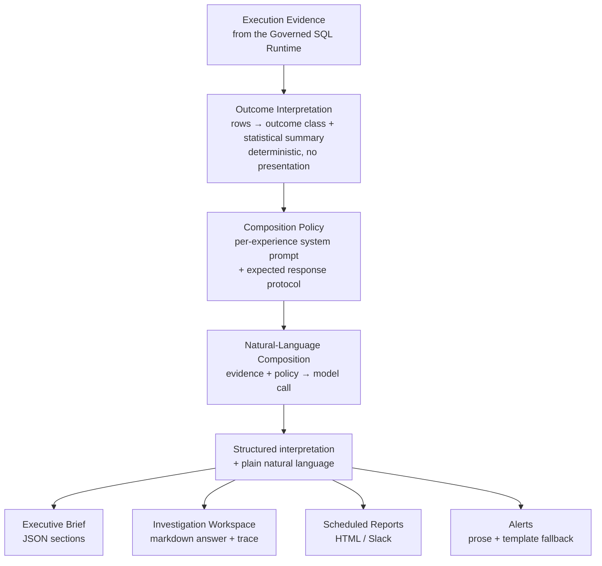

# 13 — Response Composition

[12 — Execution Architecture](12-execution-architecture.md) ends with validated evidence. This document covers what happens to that evidence next: how it becomes the natural-language answer an executive actually reads, in whichever surface they're reading it from.

## Purpose

Zevra answers the same kind of question through several different surfaces — a conversational answer, a Brief section, a scheduled report, an alert — and each surface needs to present that answer differently. Response Composition exists to solve one problem without solving the other: the *mechanics* of turning evidence into language are shared and consistent, while *how the result looks* stays entirely owned by the experience presenting it. Neither is allowed to leak into the other.

## Responsibilities

This layer owns exactly two things, and nothing else: turning execution results into a compact, deterministic summary of what happened, and turning that summary (with the original question and context) into a natural-language answer via a model call. It does not own markdown formatting, HTML email layout, JSON report shape, or any other presentation concern — those stay with the experience that requested the composition.

## Architecture Diagram

## Main Components

| Component | Responsibility |
|---|---|
| **Outcome interpretation** | The deterministic, presentation-free step: raw execution results become an outcome class (rows found, empty, blocked, error, deferred) plus a compact statistical summary — totals, distributions, sums — rather than raw rows. The same interpreter serves every experience that has execution results to summarize. |
| **Composition policy** | What makes each experience's answer sound like itself: a system prompt and an expected response protocol (plain text or structured), supplied *into* the shared composition step as an input — never hard-coded inside it. |
| **Natural-language composition** | The shared mechanics of the evidence→answer model call: assembling the message, calling the model, and handling failure — identical machinery regardless of which experience is asking. |
| **Presentation (per experience)** | What each experience does with the composed result: the Investigation Workspace renders markdown with a reasoning trace and suggested follow-ups; the Executive Brief assembles strict JSON sections; Scheduled Reports build an HTML email or a Slack digest; Alerts produce a prose string with a deterministic template as a fallback if composition fails. |

## Request Flow

Execution evidence arrives from the Governed SQL Runtime exactly as described in [12 — Execution Architecture](12-execution-architecture.md). It is first interpreted — deterministically, with no model involved — into an outcome class and a statistical summary. That interpretation, together with the original question, relevant context, and the requesting experience's own composition policy (its system prompt and expected response protocol), is handed to the shared natural-language composition step, which makes one model call and returns structured interpretation plus plain natural language. From there, each experience takes over entirely: the Investigation Workspace wraps the result in markdown with its reasoning trace and quick-refinement suggestions; the Executive Brief assembles it into its fixed JSON section shape; Scheduled Reports render it into an HTML document or Slack text; Alerts wrap it in prose, falling back to a fixed template if the model call itself fails.

## What Is Shared, and Why

Only two responsibilities are shared across experiences, and both were shared because the duplication was real and measured, not assumed:

- **Outcome interpretation** is shared because turning rows into a statistical summary is deterministic and identical work no matter which experience needs it.
- **Natural-language composition mechanics** are shared because every experience that generates an answer was independently reproducing the same message-assembly-and-model-call pattern, with only the prompt differing.

## What Is Deliberately Not Shared

Presentation is never allowed to enter the shared core, and several things that look like candidates for sharing were deliberately left alone:

- **Formatting is always experience-owned.** Markdown, HTML, JSON shape, and Slack text are never produced by the shared composition step — only structured interpretation and plain language are. A model response's protocol (whether it's expected as plain text or structured data) is a technical detail of the call, never a presentation format in disguise.
- **Follow-up suggestions and reasoning-trace rendering stay with the Investigation Workspace** — they are UX policy specific to that experience, not a general composition concern.
- **An autonomous agent's in-the-moment answer stays inline to its own reasoning loop**, rather than being forced through a post-hoc composition step — it is a different mechanic (the model's own live response) doing a genuinely different job, not a duplicate of evidence-then-compose.

## Interaction With Other Layers

- **Execution Architecture** ([12](12-execution-architecture.md)) is the sole upstream source of what this layer interprets and composes from — evidence not produced through the governed runtime is never composed into an answer.
- **Executive Experience** ([07](07-executive-experience.md)) describes what an executive actually experiences as a result of this layer's output — the Brief's sections, the Workspace's answer and evidence, Live and Report Mode.
- **Frontend Architecture** ([05](05-frontend-architecture.md)) renders whatever shape each experience's presentation step produces; the frontend never composes language itself.

## Key Design Decisions

- **Two small collaborators, not one monolith.** Response composition is deliberately not a single all-purpose "response composer" — only the two responsibilities with genuine, measured duplication across experiences were pulled into shared components; everything else stayed where it already made sense.
- **Presentation never leaks into the shared core.** The shared step is checked, structurally, to guarantee it emits interpretation and plain language only — never markdown, HTML, or any experience-specific shape.
- **Policy is an input, not a constant.** Every experience supplies its own system prompt and response protocol into the shared step; the shared step has no experience-specific knowledge baked into it.
- **Failure handling matches the stakes of each experience.** Some experiences (Alerts) fall back to a deterministic template if composition fails; others (the Executive Brief) propagate the failure so the surface can be marked failed rather than shown incomplete — the correct behavior differs by experience, and each experience decides its own.

## Extension Points

A new proactive or conversational surface gains full composition capability by supplying its own composition policy (a system prompt and expected protocol) to the shared step — no change to the interpreter or the composition mechanics is required. A future shared capability like citations, if ever built, would be added as a third genuinely-shared responsibility only once real duplication across experiences justifies it, following the same evidence-based standard used for the two that exist today.

## References

- [Phase 4 — Unified Response Composition Plan](../architecture/phase-4-response-composition-plan.md)
- [Executive Brief capability](../capabilities/executive-brief.md)
