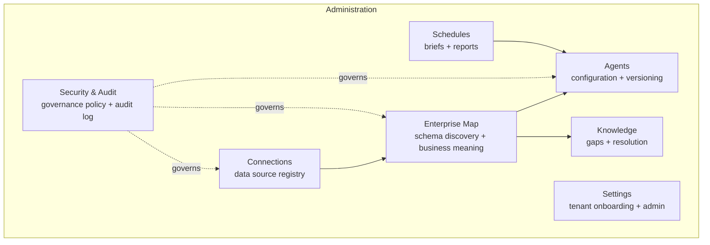

# 14 — Administration

[03 — User Journey](03-user-journey.md) placed Administration last in the executive's journey — visited least often, but load-bearing for everything upstream. This document covers what that surface actually configures.

## Purpose

Everything earlier in this set — grounded reasoning, governed execution, trustworthy briefs — depends on the tenant's own configuration being correct: which data sources Zevra may see, what the organization's business language means, which agents are active, and who is allowed to see what. Administration exists so that configuration is a deliberate, auditable act by the tenant's own people, never something Zevra infers silently on their behalf.

## Responsibilities

Administration owns the tenant's standing configuration — the state that persists between requests and that every other layer reads but does not itself decide. It does not own question-answering, reasoning, or execution; those consume what administration configures.

## Architecture Diagram

## Main Components

| Area | What it configures | Notes |
|---|---|---|
| **Connections** | The registry of data sources Zevra is permitted to see — creating, testing, browsing the catalog of, and removing a connection. | Nothing downstream can query a source that isn't registered here first. |
| **Enterprise Map** | Discovered schema (tables, columns) and the business meaning layered onto it — objects, notes, versioned changes with rollback, and the onboarding flow that analyzes and proposes an initial map from a newly connected source. | The producer side of the Metadata layer described in [11 — Metadata Architecture](11-metadata-architecture.md). |
| **Knowledge** | Knowledge gaps — places where Zevra's reasoning found it lacked enough business context to answer confidently — surfaced for a steward to resolve, dismiss, or point at a data source. | The steward-facing side of the learning lifecycle referenced throughout the Metadata and Agent documents. |
| **Agents** | Two related but distinct configuration surfaces: the Zevra Agents that investigate on a goal (create, update, chat with, review session history) and a separate versioned agent construct carrying playbooks and KPIs, with explicit version rollback. | Agent goals and connection allow-lists configured here directly determine what an autonomous investigation, and by extension the Executive Brief, can cover. |
| **Schedules** | Recurring configuration for Scheduled Reports (question lists, cadence, channel, recipients) and the Morning Brief (schedule time, timezone, contributing agents). | Both follow the same underlying pattern: a standing configuration replayed on a clock, described in [03 — User Journey](03-user-journey.md). |
| **Settings** | Tenant onboarding state and progress (scan, analyze, recommend, apply, complete) and platform-level tenant administration — creating, suspending, and reinviting tenants, and managing the domains used for auto-provisioning at authentication. | Tenant domain configuration here is what [04 — Authentication Layer](04-authentication-layer.md) reads to auto-provision new users. |
| **Security & Audit** | Governance policy configuration — column-level policies, row-level security policies, data contracts — plus the governance audit log and an export/simulation capability for verifying a policy's effect before relying on it. | The administrative face of the governance chain detailed in [12](12-execution-architecture.md) and [16](16-security-architecture.md). |

## Request Flow

Administration follows the same controller → service → repository pattern as the rest of the backend ([08 — Backend Architecture](08-backend-architecture.md)), scoped to configuration rather than question-answering. A typical change — registering a connection, confirming a business entity, activating an agent, adjusting a governance policy — is written once, through its owning controller, into the tenant's schema, and is then simply *read* by every downstream layer the next time it runs. Administration never pushes configuration into a running request; every consumer reads current state fresh.

## Interaction With Other Layers

- **Metadata** ([11](11-metadata-architecture.md)) is written by stewards through the Enterprise Map and Knowledge surfaces here, and read (never written) by the Agent Brain at question time.
- **Agent Architecture** ([09](09-agent-architecture.md)) depends entirely on agent configuration created here — an agent that doesn't exist, or isn't active, contributes nothing to a brief or an investigation.
- **Authentication** ([04](04-authentication-layer.md)) reads tenant domain configuration set here for auto-provisioning, and enforces the role checks that gate this surface from ordinary users in the first place.
- **Security Architecture** ([16](16-security-architecture.md)) is enforced using the policies configured here — administration is where governance rules are authored; execution is where they are applied.

## Key Design Decisions

- **Configuration is explicit, never inferred.** Zevra proposes (an onboarding scan, a suggested business entity) but a steward confirms — consistent with the "stewards confirm" principle in the Metadata architecture.
- **Versioning and rollback where change carries risk.** Both the Enterprise Map and the versioned agent construct support rollback, because a bad configuration change (a mis-mapped column, a bad agent version) has consequences for every subsequent question, not just the next one.
- **Policy simulation before commitment.** Governance policy changes can be simulated against real conditions before being relied upon, so a steward can see a policy's effect before it starts silently shaping every governed query.
- **One configuration surface per responsibility.** Connections, metadata, knowledge, agents, schedules, and security are separate surfaces rather than a single settings page, mirroring the one-owner-per-responsibility principle used throughout the backend.

## Extension Points

New data source types extend the Connections surface without requiring changes to how the Enterprise Map, agents, or governance consume a connection — each of those layers depends on the connection abstraction, not on any particular source technology.

## References

- [Semantic Foundation](../architecture/semantic-foundation.md)
- [Executive Brief capability](../capabilities/executive-brief.md)
- [Scheduled Reports capability](../capabilities/scheduled-reports.md)
