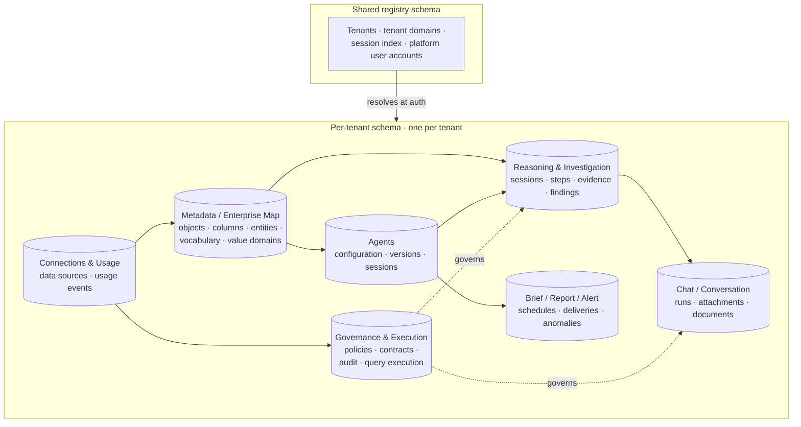

# 15 — Database Architecture

[04 — Authentication Layer](04-authentication-layer.md) introduced schema-per-tenant isolation as an authentication-layer guarantee; this document describes the database structure that guarantee rests on, and the major groupings of data behind every capability described earlier in this set.

## Purpose

A reader does not need every column of every table to understand Zevra's data architecture — they need to know how isolation is enforced structurally, and which groups of tables back which architectural layer, so that a claim like "the Execution Contract is immutable" or "governance decisions are audited" can be traced to something concrete. This document provides that map, not an inventory.

## Responsibilities

The database is Zevra's persistence layer, described architecturally in [08 — Backend Architecture](08-backend-architecture.md). It owns durable state only — every table here is written and read through the backend's repository layer; nothing outside the backend accesses it directly.

## Schema-Per-Tenant Isolation

Zevra runs on Postgres with **one schema per tenant**, not a shared schema distinguished by a tenant identifier column. A small, shared **registry schema** holds only what genuinely must be shared across tenants: the list of tenants, the email domains used to auto-provision new users at authentication, and the session index used by the legacy authentication path. Everything else — every table described below — is replicated per tenant, inside that tenant's own schema.

This has a direct architectural consequence already introduced in [04 — Authentication Layer](04-authentication-layer.md): a request that has not resolved a tenant cannot accidentally read another tenant's data, because the database connection itself is not pointed at any tenant schema until one is resolved. Isolation is a property of *which schema a connection is even using*, not a filter application code must remember to add to every query.

## Architecture Diagram

## Major Table Groupings

| Grouping | Backs | What it holds |
|---|---|---|
| **Tenant / platform registry** | [04 — Authentication Layer](04-authentication-layer.md) | Tenants, their registered email domains, the session index, and platform-level user accounts — the shared state authentication resolves before anything becomes tenant-scoped. |
| **Metadata / Enterprise Map** | [11 — Metadata Architecture](11-metadata-architecture.md) | Discovered schema objects and columns (with version history), business entities and their physical bindings, operational vocabulary, value domains, entity relationships, and learned mappings — the tenant's own business meaning. |
| **Governance / execution / audit** | [12 — Execution Architecture](12-execution-architecture.md), [16 — Security Architecture](16-security-architecture.md) | Column and row-level security policies, data contracts, the governance audit log, and query-execution records — the enforcement and evidence trail for every governed query. |
| **Reasoning / investigation** | [09 — Agent Architecture](09-agent-architecture.md), [10 — Request Lifecycle](10-request-lifecycle.md) | Reasoning sessions and their steps, hypotheses and evidence, investigation recipes, and the operational findings and notes an investigation produces. |
| **Chat / conversation** | [13 — Response Composition](13-response-composition.md) | Conversation runs, attachments, and documents — the record of what was asked and answered. |
| **Agent configuration and sessions** | [14 — Administration](14-administration.md) | Agent definitions, versions, playbooks and KPIs, and the session records of autonomous agent runs. |
| **Proactive surfaces** | [07 — Executive Experience](07-executive-experience.md) | Morning brief records and their per-tenant schedule configuration, scheduled report definitions and run history, alert rules and delivery records, and detected anomaly events. |
| **Connections and usage** | [14 — Administration](14-administration.md) | The registered data source connections and platform usage/token-attribution events. |

## Interaction With Other Layers

- **Backend** ([08](08-backend-architecture.md)) is the sole consumer of every table here, through its per-feature repository layer.
- **Execution Architecture** ([12](12-execution-architecture.md)) writes its audit trail into the governance grouping on every governed query — this is what makes the platform's "governed by construction" claim checkable after the fact, not just asserted.
- **Metadata Architecture** ([11](11-metadata-architecture.md)) is the detailed view of what the metadata grouping actually models and how it is written.

## Key Design Decisions

- **Isolation by schema, not by filter.** The single biggest structural decision in the database: tenant separation cannot be forgotten in a query, because it is enforced by which schema the connection is using.
- **One store per fact, one writer per lifecycle.** Consistent with the Metadata architecture's governing principle — a table is written by exactly one owning process (stewardship, discovery, learning, governance) even where several processes read it.
- **Audit is a first-class table group, not a log file.** Governance decisions and query executions are persisted relationally, so an audit question ("what did this policy actually do") is itself an ordinary, governed query.
- **Schema evolution keeps every tenant current.** New tenant schemas and existing ones are brought forward through the same migration path at startup, so no tenant's schema is allowed to silently drift behind the platform's current shape.

## Extension Points

New capabilities add their own table grouping within the existing per-tenant schema pattern rather than requiring a new isolation mechanism — the schema-per-tenant boundary is the platform's one durable extension point for data isolation.

## References

- [Semantic Foundation](../architecture/semantic-foundation.md)
- [ExecutionContract — Agent Business-Object Grounding](../architecture/execution-contract.md)
