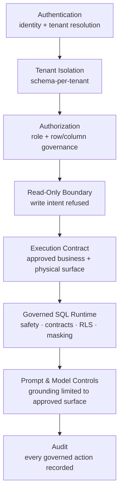

# 16 — Security Architecture

Security has appeared piece by piece throughout this set: authentication in [04](04-authentication-layer.md), enforcement in [12 — Execution Architecture](12-execution-architecture.md), configuration in [14 — Administration](14-administration.md). This document pulls those pieces together into one platform-wide security view — the question an architecture review most wants answered directly: what actually stops this system from doing something it shouldn't.

## Purpose

A platform that reasons about business questions and touches real operational data carries real risk if any single layer can be bypassed. Zevra's security posture is deliberately not "one big security layer" — it is several independent guarantees, each enforced at a different point, so that no single failure exposes the whole system. This document names each guarantee and where it lives.

## Responsibilities

Security architecture, as a cross-cutting concern, is responsible for: establishing identity and tenant scope, isolating tenant data structurally, constraining what any request — human or AI-originated — may ever execute, protecting sensitive values within permitted results, and recording enough evidence that every governed action can be reconstructed and justified after the fact.

## Architecture Diagram

## Main Guarantees

| Guarantee | Enforced at | Detail |
|---|---|---|
| **Authentication** | Every request, first | Identity is verified via a signed token before any business logic runs; an unverifiable request is rejected outright. Covered in [04 — Authentication Layer](04-authentication-layer.md). |
| **Tenant isolation** | The database connection itself | Zevra runs one Postgres schema per tenant. A request's database connection is not usable against tenant data until a tenant has been resolved — isolation is structural, not a filter that must be remembered on every query. |
| **Authorization** | Per query | Coarse role checks gate administrative surfaces; fine-grained access — which rows, which columns — is enforced per query by row-level security and column masking, evaluated against the authenticated user's own attributes, not hard-coded per role. |
| **Read-only boundary** | Before reasoning proceeds | A write-shaped request is refused outright, consistent with the read-only-by-design product boundary from [01 — Product Vision](01-product-vision.md) — Zevra investigates and reports; it never modifies. |
| **Execution Contract enforcement** | Before any generated step reaches governance | An AI-proposed step referencing anything outside the compiled, approved surface is rejected deterministically — never executed, never silently rewritten. Covered in [09](09-agent-architecture.md) and [12](12-execution-architecture.md). |
| **Governed SQL Runtime** | Every approved step | SQL safety (no write-shaped statements can reach the database regardless of what a model proposed), data contracts, row-level security, column masking, routing, and row/time limits — the same fixed chain for every request, from every surface. |
| **Prompt and model controls** | What a model is ever allowed to see or claim | A planning model is grounded only in what the compiled Execution Contract exposes — it cannot reference a business object or physical asset that was never approved, and it never has direct access to metadata stores, raw schema catalogs, or any repository. |
| **Audit** | Continuously | Every governed query is recorded — what ran, under which contract, for which user, with what outcome — whether it succeeded, was rejected, or was blocked, giving every answer a reconstructable trail. |

## Defense in Depth, by Layer

No single guarantee above is asked to carry the whole security posture on its own:

- If authentication somehow let through an unresolved request, the database connection itself would still have no tenant schema to operate against.
- If a planning model somehow proposed a step referencing an unapproved object, the Execution Contract's enforcement would reject it before governance even evaluates it.
- If a proposed step somehow passed contract enforcement, the Governed SQL Runtime's safety check would still block anything write-shaped, and row-level security and masking would still constrain what comes back.
- If every prior layer somehow passed something it shouldn't have, the audit record would still make the event visible and attributable after the fact.

This layered structure is deliberate: security is a property of the whole stack in [02 — System Architecture](02-system-architecture.md), not a single gate near the front door.

## AI-Specific Controls

Two controls exist specifically because an AI model, not just a human user, is a source of requests in this system:

- **Grounding, not access.** A model is given grounding text derived from an already-compiled, already-approved contract — never a live connection to metadata or data stores. It cannot request something the contract didn't already approve, because it has no channel to ask for anything else.
- **Rejection over correction.** When a model proposes something outside what's approved, the platform never attempts to interpret intent and quietly substitute something safe — it rejects the step outright and lets the bounded reasoning loop try again within what is actually permitted. Silent correction is treated as its own risk, not a convenience.

## Interaction With Other Layers

- **Authentication** ([04](04-authentication-layer.md)) is the entry point every guarantee here assumes has already run.
- **Metadata Architecture** ([11](11-metadata-architecture.md)) is where the Execution Contract's approved surface is ultimately derived from — governed metadata in, governed execution out.
- **Execution Architecture** ([12](12-execution-architecture.md)) is the detailed view of the Governed SQL Runtime referenced throughout this document.
- **Administration** ([14](14-administration.md)) is where the governance policies enforced here are authored, tested, and reviewed.

## Key Design Decisions

- **Isolation is structural, not conventional.** Schema-per-tenant means there is no query a developer could accidentally write that leaks across tenants — the connection itself cannot reach another tenant's schema.
- **Read-only is architectural, not a feature flag.** There is no configuration that grants Zevra write access to a tenant's systems — the boundary is a product decision reflected structurally throughout the stack.
- **Every AI-originated action still passes human-grade governance.** An autonomous agent's query, a scheduled brief's query, and a conversational query all pass through the identical governance chain — none of them are treated as more trusted because they originated from AI reasoning rather than a typed question.
- **Audit is unconditional and complete.** Recording happens regardless of outcome, so the audit trail answers "what did the system do" honestly, including its refusals.

## Extension Points

New governance rules, new connection types, and new identity providers each extend one guarantee in this stack without requiring the others to change — the layered structure is what makes each guarantee independently evolvable.

## References

- [ExecutionContract — Agent Business-Object Grounding](../architecture/execution-contract.md)
- [Semantic Foundation — Security & Governance](../architecture/semantic-foundation.md#security-governance)
- [Executive Brief capability — Security & Governance](../capabilities/executive-brief.md#security-governance)
