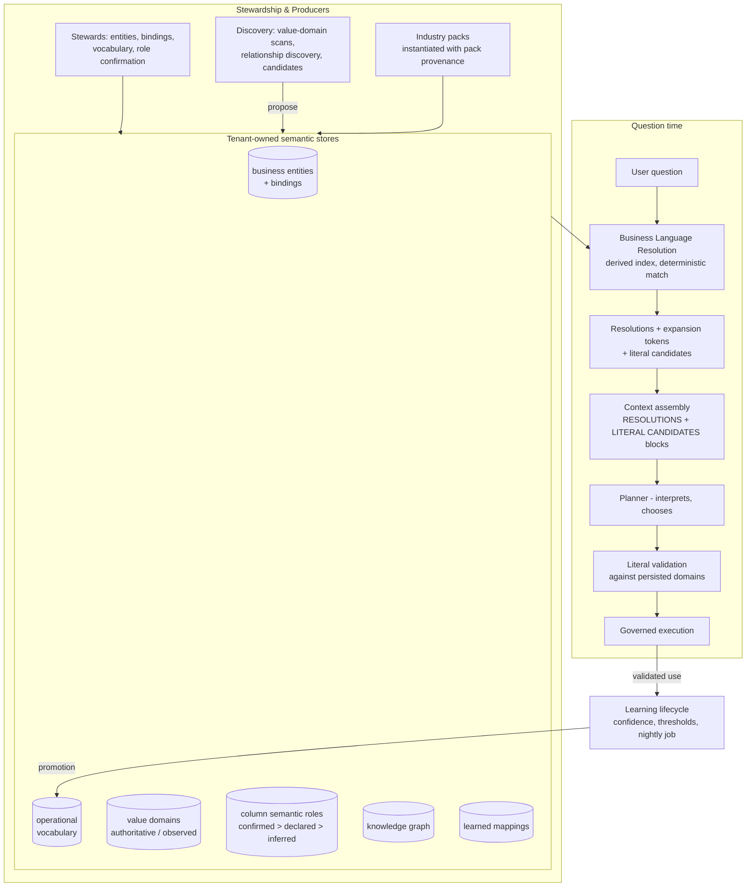

# Semantic Foundation

The Semantic Foundation is Zevra's business-understanding layer: the tenant-owned stores that hold what data *means* — entities, vocabulary, value domains, semantic roles, learned language — and the deterministic machinery that resolves a user's words against them before any model reasons. It is not a user-facing capability; it is the architecture underneath one, and the reason [Conversational Analytics](../capabilities/conversational-analytics.md) can answer questions asked in a company's own jargon against tables the company never renamed.

This page documents the Foundation **as implemented**. Its governing principles are ratified separately as the Semantic Foundation constitution (v1.0); where implementation diverges from a ratified contract, the divergence is stated here plainly.

## Platform Position

The Semantic Foundation sits between the tenant's people and the platform's reasoning: **stewards write meaning into it; the runtime reads meaning out of it; models reason over what it offers — and never around it.**

**It owns:**

- The **semantic stores**: business entities and their physical bindings, operational vocabulary, value domains, column semantic roles, the knowledge graph, and learned mappings
- **Business Language Resolution** — the deterministic mapping of question terms to existing referents, with trust-tier provenance
- **Deterministic Literal Resolution** — offering persisted candidate values for unfamiliar literals and validating the planner's choices before execution
- The **learning lifecycle** — capturing validated usage as provisional mappings and governing their path toward curated vocabulary

**It consumes:**

- The **enterprise map** (discovered physical schema: objects, columns, and their metadata) — the ground the semantic stores bind to
- The **discovery pipeline's** outputs (value-domain scans, relationship discovery, entity candidates) — producers proposing into its stores

**What depends on it:**

- **Conversational Analytics** — the Foundation's primary (and reference) consumer: resolution runs first in every question's pipeline, and literal validation gates every planned step
- **Scheduled Reports** — inherit everything through the pipeline
- **Autonomous Agents** — a partial consumer: they read operational vocabulary directly but bypass resolution and value domains (a documented gap, not a contract)

**It explicitly does NOT own:**

- **Physical data** (the customer's database is ground truth of *data*, never of *meaning*), **query execution and governance** (the SQL chain is governance's), **interpretation** (the model's — the Foundation constrains and verifies it), and **universal language** — common abbreviations and general English deliberately live in the model and are never encoded or shipped as dictionaries.

## Purpose

Users speak in abbreviations, house jargon, industry codes, and half-remembered column names; databases speak in schemas, literals, and enums. Between them sits everything that makes an answer *right*: which table a concept lives in, what a status code means, which values a column may legally hold, what "overdue" means to this company. The Foundation exists because that knowledge is **data, not code** — it changes on the business's clock, belongs to the tenant, and must survive model swaps — and because the alternative (letting a model guess meaning per question) cannot be trusted, audited, or corrected.

## Business Value

- **The tenant's language is an asset, not a prompt.** Meaning lives in inspectable, editable, tenant-owned stores — portable across model generations, correctable by stewards, never forked into the product.
- **Deterministic before probabilistic.** Term resolution, candidate retrieval, and value validation are exact-match machinery that runs before, and constrains, AI reasoning — so identical questions resolve identically, and resolutions are explainable, not vibes.
- **Wrong literals cannot execute.** A filter against a value-governed column must use a value that actually exists; the model chooses from offered sets and the runtime verifies the choice.
- **The platform learns language safely.** Successful validated use accumulates confidence; corrections penalize; only threshold-crossing mappings reach the curated tier — and everything advisory fails open to the baseline pipeline.

## Key Concepts

| Concept | Meaning |
|---|---|
| **Business entity** | A steward-confirmed business concept (e.g. *Shipment*) bound to a primary physical object, with operational meaning and investigation hints. |
| **Operational vocabulary** | The curated, editable language tier: a term, its definition, and optionally its SQL equivalent (a reusable filter pattern). |
| **Value domain** | The persisted set of values a column may hold, with an **authority level**: `ENUM`-declared domains are *authoritative* (complete, gate hard); sampled ones are *observed* (advisory). |
| **Semantic role** | A column's persisted classification (identifier, status, filterable, sensitive, …) with a provenance-ranked source: human confirmation outranks declaration outranks inference. The single source of truth for discovery decisions. |
| **Resolution** | A deterministic mapping of a question term (*surface*) to an existing referent (*target*): a `value`, `column`, or `entity` — annotated onto the question with its trust tier, never substituted into it. |
| **Resolution Index** | The per-question, **derived-never-stored** matchable index: ACTIVE entities and vocabulary in domain scope, plus the columns and persisted value domains of entity-bound tables. |
| **Trust tier** | Where a claim's authority comes from: `company` (curated tenant metadata) outranks `pack:<id>` (vendor industry packs) outranks *universal* (the model's own knowledge — never emitted as a resolution). |
| **Literal candidate** | A domain-bearing column offered to the planner for an unresolved literal-shaped term, carrying its persisted legal/observed values. |
| **Learned mapping** | A provisional term → SQL-pattern association earned from validated use, carrying confidence and use count on its way toward (or away from) vocabulary. |

## Semantic Lifecycle

Meaning moves through the Foundation in one direction — evidence up, authority down:

1. **Discovery proposes.** Onboarding and scanning produce physical metadata: schema objects and columns, value-domain scans (gated by cardinality and content safety), relationship discovery, entity candidates. Producers *advise into* owned stores; they never write records of authority.
2. **Stewardship confirms.** Humans create and confirm entities, bind them to physical objects, curate vocabulary, and confirm semantic roles. Confirmation outranks declaration outranks inference, permanently.
3. **Resolution serves.** At question time, the derived index maps the user's words to these stores deterministically, with provenance.
4. **Validation enforces.** Literal choices are checked against persisted domains before execution; enforcement strength follows metadata honesty (authoritative gates hard, observed advises).
5. **Learning accumulates.** Successful validated use writes provisional mappings; reinforcement and corrections move confidence; nightly thresholds promote to vocabulary or purge.
6. **Stewards remain final.** Every editable store can be overridden or archived by the tenant's people; packs are overridden by cloning into the company tier, never edited.

## Architecture Overview



The load-bearing shape: **stores are written only through their owning lifecycles; question-time machinery only reads; the model only chooses from what it was offered; and validated outcomes are the only path back into the stores.**

## Resolution Pipeline

Resolution runs **once, first** — at the top of context assembly, after agent routing establishes the domain scope and before every keyword-dependent stage — so that downstream selection (graph filtering, schema-block ranking) behaves as if the user had spoken canonically.

1. **Index derivation.** For the domain scope, the resolver builds the Resolution Index fresh from existing stores: ACTIVE entities with valid bindings, ACTIVE vocabulary, and the columns plus persisted value domains of the entity-bound tables (column and value matching is confined to bound tables to bound cost). Nothing is persisted — the index is *derived, not stored*.
2. **Deterministic matching.** Question tokens (and n-grams up to 3 words) match index entries by the exact-match family only: exact, singular/plural, separator-insensitive. No fuzzy matching, no embeddings — by contract.
3. **Precedence and ambiguity.** Within a tier, first match wins; across tiers, `company` silently beats `pack`. But when one surface plausibly means two different *kinds* of thing, **both are listed** — offered-set ambiguity: the model chooses (or asks), no code path breaks a semantic tie by fiat.
4. **Outputs.** At most 8 resolutions (configurable cap — cost bounded by configuration, never tenant size) become: the **RESOLUTIONS prompt block** (exact grammar: `"surface" = kind: target [tier]`), **expansion tokens** that join keyword sets for retrieval stages (never rendered), and **trace entries** with human-readable provenance.
5. **Fail-open.** Any resolver failure, or zero matches, yields the empty result — and every consumer behaves **byte-identically** to a resolution-free pipeline. This is the zero-cost guarantee: semantics may only add signal, never reduce availability.

**Annotation, never substitution:** the user's question string is immutable through the entire pipeline. Resolutions sit *beside* the question in the prompt; the planner reads the user's words verbatim, always.

## Metadata Model

All stores are **schema-resident per tenant** — no semantic signal crosses tenants, ever:

- **Business entities** — name, description, domain, the primary physical object binding, operational meaning, investigation hints, status, and `created_by` (the tier-provenance seam: pack-instantiated entities resolve with `pack:<id>` provenance).
- **Operational vocabulary** — term, definition, SQL equivalent, examples, status, domain/entity scoping. *Implementation note:* the vocabulary table does not yet carry creator provenance, so every vocabulary row currently resolves as `company` tier — the code seam exists; the column does not.
- **Value domains** — per connection and schema: the qualified column, the ordered value list, the source (`ENUM` today; `CHECK`/`DOMAIN`/`OBSERVED`/`MANUAL` reserved), and the authoritative flag. Values enter only through the discovery gates — a cardinality cap (≤ 25 values) and content-safety classification; what the gates refuse is invisible to every downstream consumer, always.
- **Column semantic roles** — the persisted classification with its provenance-ranked source; discovery decisions read roles, not heuristics.
- **Learned mappings** — term, SQL pattern, source signal, confidence, use count, promoted flag (see Semantic Learning).
- **Corrections** — detected user corrections linked to the mappings they penalize.

One store per fact, one owner per store, one writer per lifecycle; derived structures (the Resolution Index, candidate sets) are recomputed, never persisted as parallel truth.

## Knowledge Graph

The knowledge graph holds business entities and their relationships (discovered by the relationship-discovery service and steward-curated) as a navigable structure. At question time it is a **context supplier, not a decider**: the graph is rendered per domain and then filtered to entities matching the question's keywords — joined by resolution expansion tokens, so canonical names select graph entries even when the user used jargon. Entity *descriptions* contribute business meaning to prompts; table-name references are deliberately stripped from graph context, because the schema section is the single authority for physical names.

## Value Domains

Value domains are the Foundation's answer to the most dangerous class of wrong answer: a filter on a value that doesn't exist, silently returning zero rows or wrong rows.

- **Provenance determines power.** `ENUM`-declared domains are *authoritative*: complete by construction, they gate hard. Sampled/observed domains are honest about incompleteness: they advise, never veto. Enforcement strength follows metadata honesty.
- **Gated at discovery, immutable at question time.** Values enter through the cardinality and content-safety gates; the runtime may never resurrect what the gates refused, and never samples values at question time on this path.
- **Never rendered raw.** Domains reach prompts only through the literal-candidates block (top-ranked columns, values capped for rendering) and reach execution only through the validator.
- **User-supplied values are ground truth.** Literals the user actually typed are never vetoed — reality answers them honestly.

## Business Language Resolution

BLR is the Foundation's front door — everything in [Resolution Pipeline](#resolution-pipeline) above, with three properties worth naming as contracts:

- **Referents only.** Every resolution target is something that exists: a vocabulary row's verbatim SQL equivalent, a persisted domain value composed into a predicate, an entity with its bound table, a real qualified column. The resolver never invents a target.
- **Trust-tier provenance on every claim.** Resolutions carry their tier into prompts (`[company]`, `[pack:<id>]`) and into the reasoning trace ("Company vocabulary", "Industry pack (…)") — nothing is trusted anonymously.
- **The universal tier is the model.** Common knowledge ("Q4", "YTD") is deliberately unstored: it never appears as a resolution, is never shipped as a dictionary, and enters tenant metadata only through evidenced, validated use via learning. This is what makes the architecture model-independent: swapping models changes how much the learning loop must compensate, never the contracts.

## Deterministic Literal Resolution

DLR handles the term BLR could not resolve but which looks like a data value ("TX", "SBD"):

1. **Detection.** Unresolved literal-shaped tokens (up to 3 per question) are identified after resolution, with short function words excluded so "am"/"it" never masquerade as codes.
2. **Offering.** The domain-bearing columns of in-scope entity-bound tables are ranked (authoritative first, then status-role, then confirmed-filterable) and the **LITERAL CANDIDATES block** offers each unresolved term the top columns *with their persisted values* — plus the standing instruction: choose the exact spelling, ask for clarification if none fits, never invent a literal.
3. **Declaration and validation.** The planner declares its literal choices per step; the validator checks each against the persisted domain **before execution**. An invalid literal is *rejected, never rewritten*: the exact legal list returns through the existing plan-evaluate loop for one bounded replan. A repeat violation hard-blocks — but only on authoritative domains; observed domains stay advisory. The validator itself fails open on its own errors.
4. **Provenance and learning.** Validated choices join the reasoning trace ("AI choice, validated: legal values") and are captured into the learning lifecycle — a model's validated choice is evidence, never directly truth.

The zero-cost guarantee holds throughout: no unresolved terms or no candidates means empty blocks and a byte-identical pipeline.

## Semantic Learning

The governed path from usage to curated language — three signals, one lifecycle:

- **Query success** — after every successful live-data run (fire-and-forget, async), business terms are extracted from the question/SQL pair and upserted as learned mappings at confidence 0.5.
- **Correction** — a question detected as correcting the prior answer penalizes the related mapping (−0.20, floor 0).
- **Positive feedback** — a thumbs-up reinforces the mappings that contributed (+0.05, cap 1.0). Validated literal bindings enter as their own captured signal.

A nightly job (02:45) applies the thresholds: **use count ≥ 10 and confidence ≥ 0.8 promotes** the mapping into formal operational vocabulary; **use count ≥ 5 and confidence < 0.2 purges** it. Unpromoted mappings still contribute: the learning context builder injects relevant learned vocabulary into planner context as an advisory tier, and applied terms are reported on the answer.

**Honest divergence from the constitution:** the ratified contract requires threshold crossing *plus human review* before learned language becomes curated truth ("nothing promotes itself"). The implementation promotes automatically at the thresholds; stewardship is post-hoc — promoted vocabulary is fully editable and archivable, but no review gate stands before promotion. This is the Foundation's most significant contract gap and is tracked in the stabilization checklist.

Learning never blocks a user-facing response: every entry point swallows its own failures.

## AI Responsibilities

The Foundation's design premise is that the model is trusted to **interpret, choose, and compose — never to assert stored truth**:

1. **Choosing among offered resolutions** when ambiguity is presented — the genuinely linguistic judgment.
2. **Choosing a literal** from offered candidate values (or asking) — constrained choice, validated afterward.
3. **Using resolution annotations** in planning — resolutions inform interpretation; they are advice with provenance, not commands.

What the AI categorically does not do: it never writes to a semantic store, never resolves a term (resolution is exact-match machinery), never sees a value the discovery gates refused, and never has its knowledge *stored* — a model's contribution becomes tenant metadata only by surviving validation, accumulating evidence, and crossing the learning thresholds. **AI never invents metadata** because every path from model output to a store passes through a deterministic gate that only admits references to things that already exist.

## Runtime Responsibilities

The deterministic runtime owns everything with a right answer: index derivation and its scope rules; the matching family and precedence; the resolution and unresolved-term caps; candidate ranking and render caps; prompt-block grammar; literal existence validation with its reject-once/hard-block/advisory ladder; the fail-open posture of every advisory layer; provenance propagation into prompts, traces, and audit; learning-signal capture, confidence arithmetic, thresholds, and the nightly job. The runtime is meaning-blind throughout — it knows *that* "SBD" resolved to an entity, never *why* that entity matters.

## Integration with Other Capabilities

- **[Conversational Analytics](../capabilities/conversational-analytics.md) — the reference consumer.** Resolution first, expansion into keyword stages, both prompt blocks in context assembly, literal validation inside the reasoning loop, learning from completed runs and feedback. The pipeline page documents the Foundation in action.
- **[Scheduled Reports](../capabilities/scheduled-reports.md)** — full inheritance through the pipeline.
- **[Autonomous Agents](../capabilities/autonomous-agents.md) — partial, read-only, and divergent.** The agent runtime reads operational vocabulary directly (keyword-filtered, WHERE-logic extraction) but engages neither resolution, nor bindings, nor value domains — it live-samples status values instead, bypassing the discovery gates. A documented gap on that page.
- **[Executive Brief](../capabilities/executive-brief.md) / [Alerts](../capabilities/alerts.md) / [Workflow Automation](../capabilities/workflow-automation.md)** — no semantic engagement; alerts and workflows operate on steward-authored SQL, the brief on agent runs.
- **Industry packs** — vendor-owned vertical vocabulary instantiated into tenant stores with pack provenance; tenants override by cloning into the company tier, never by editing packs.
- **Onboarding & discovery** — the producer side: schema scanning, value-domain discovery with its gates, relationship discovery, and entity candidate proposals all feed the stewardship surfaces.

## Security & Governance

- **Tenant isolation is absolute.** Every semantic store is schema-resident; the Resolution Index is derived per tenant per question; no vocabulary, domain, learned mapping, or resolution ever crosses tenants.
- **Meaning cannot execute.** Semantic stores contribute annotations, candidates, and legal values into context assembly; no metadata row triggers behavior by itself, and everything that executes still passes the governance chain downstream.
- **Provenance everywhere.** Every resolution carries its tier in prompts and traces; every validated literal carries its validation source; the audit record of a run includes its resolution provenance.
- **Discovery gates are one-way.** Cardinality- or content-refused values are invisible to every consumer; nothing at question time can resurrect them (on the governed path).
- **Stewardship is the top of the trust ladder.** Every editable store can be corrected or archived by the tenant's people; the runtime never overrides a steward, and learning never bypasses its lifecycle — with the promotion-review divergence noted above as the exception to close.

## Configuration

| Property | Default | Effect |
|---|---|---|
| `nexus.blr.max-resolutions` | `8` | Resolutions per question — the prompt-cost cap for the RESOLUTIONS block |
| `nexus.dlr.max-unresolved-terms` | `3` | Unresolved literal-shaped terms offered candidates per question |

Code-level bounds: n-grams up to 3 words in matching; 3 candidate columns rendered per unresolved term; 25 values rendered per candidate list (domains are already ≤ 25 by the discovery cardinality gate); learning constants (0.5 start, +0.05/−0.20 adjustments, 10/0.8 promotion, 5/0.2 purge, 02:45 nightly); resolution runs only when a domain scope exists.

## Operational Flow

```mermaid
sequenceDiagram
    participant Q as Question (verbatim, immutable)
    participant BLR as Resolver
    participant ST as Semantic stores
    participant CTX as Context assembly
    participant PL as Planner model
    participant LV as Literal validator
    participant EX as Governed execution
    participant LRN as Learning lifecycle

    Q->>BLR: resolve(question, domain scope)
    BLR->>ST: derive index (entities, vocabulary,<br/>bound columns + value domains)
    BLR-->>CTX: resolutions [tier] + expansion tokens<br/>+ unresolved terms + candidates
    Note over BLR,CTX: failure or zero matches → empty →<br/>byte-identical pipeline (fail-open)
    CTX->>PL: question + RESOLUTIONS + LITERAL CANDIDATES blocks
    PL-->>LV: planned SQL + declared literal bindings
    alt literal not in persisted domain
        LV-->>PL: reject with exact legal list (once)
        Note over LV: repeat violation hard-blocks<br/>authoritative domains only
    else valid
        LV->>EX: proceed to governance chain
    end
    EX-->>LRN: successful run + validated bindings (async)
    LRN->>LRN: confidence arithmetic; nightly thresholds
    LRN->>ST: promote to vocabulary / purge
```

Failure posture, layer by layer: resolution fails open to empty; literal validation fails open on its own errors (while its *verdicts* fail closed on authoritative domains); learning swallows every exception; the discovery gates fail closed permanently. A tenant with no semantic metadata gets the byte-identical baseline pipeline — absence costs nothing.

## Current Limitations

- **Promotion lacks its review gate.** Learned mappings auto-promote to vocabulary at thresholds; the constitution's "thresholds plus human review" is implemented as post-hoc editability only.
- **Vocabulary tier provenance is unfinished.** The vocabulary store carries no creator/tier column, so every vocabulary row resolves as `company` — pack-provenance flows only through entities today. The code seam exists; the data doesn't.
- **The agent runtime bypasses the Foundation.** Zevra Agents read vocabulary directly and live-sample status values, sidestepping resolution, bindings, and the value-domain gates — semantics' guarantees do not extend to that runtime or its consumers (the brief, routed chat).
- **Matching is exact-family only — by design, with real costs.** Synonyms, misspellings, and phrasings the stores don't literally contain resolve to nothing; the compensation is the learning loop, which needs usage volume to work.
- **Value-domain sources are mostly reserved.** Only `ENUM` discovery is live; `CHECK`/`DOMAIN`/`OBSERVED`/`MANUAL` sources exist in the model but not the pipeline — so observed (advisory) domains are rarer in practice than the design allows for.
- **Resolution requires a domain scope.** Questions handled without an agent (no domain keys) skip resolution entirely — the tenants least configured get the least semantic help, compounding.
- **`metric` resolution kind is reserved, not emitted.** The contract's fourth kind exists in the grammar only.
- **Learning extraction is heuristic.** Term extraction from question/SQL pairs and correction detection are pattern-based; noisy extractions rely on the confidence lifecycle to wash out rather than being prevented.
- **The knowledge graph is advisory context only** — it informs prompts but participates in neither resolution nor validation.

## Ownership

Following the Zevra ownership model — one owner per responsibility (this table is the implementation view of the constitution's ownership model):

| Responsibility | Owner | Notes |
|---|---|---|
| **Business Owner** | Tenant stewards | Own every meaning: entities and bindings, vocabulary, confirmed roles, domain curation, pack adoption. Meaning is their asset; the platform is its custodian. |
| **AI** | Choice within offered sets | Picks among offered resolutions and candidate literals; uses annotations in interpretation. Writes nothing; asserts nothing; its knowledge is exercised, never stored. |
| **Runtime** | Zevra engineering (resolver + validator + learning machinery) | Owns derivation, matching, caps, grammar, validation ladders, fail-open posture, provenance propagation, and threshold arithmetic. Meaning-blind machinery. |
| **Governance** | The discovery gates + the downstream chain | Cardinality and content gates govern what may become a domain value; the SQL governance chain governs what executes. Semantic correctness is validated here; execution safety is validated there. |
| **Metadata** | The semantic stores themselves | One store per fact, one writer per lifecycle: stewardship writes curated stores, discovery proposes, learning writes only its own tier and promotes only through its thresholds. |
| **Human Stewardship** | The tenant's people | Final authority over everything editable: confirm, override, archive; review learned language (today post-hoc — see Current Limitations); clone-and-override packs. |

## Stabilization Checklist

What must be validated before further capabilities lean on the Foundation's guarantees. Validation work only.

**Resolution correctness**

- [ ] The matching family behaves as specified: exact, singular/plural, separator-insensitive, n-grams ≤ 3 — and nothing fuzzier ever matches.
- [ ] Precedence: company beats pack silently; first-match-wins within tier; one-surface-two-kinds yields both (offered-set ambiguity) — verified with constructed collisions.
- [ ] Referents only: every emitted target exists in its store at resolution time; stale bindings (archived entity, dropped column) resolve to nothing rather than to ghosts.
- [ ] The resolution cap holds under vocabulary-rich tenants; prompt cost does not scale with store size.

**Fail-open / zero-cost guarantees**

- [ ] Byte-identity: a tenant with no semantic metadata, a resolver exception, and a zero-match question each produce a pipeline output identical to the baseline — verified at the prompt level, not just the answer level.
- [ ] Domain-scope absence (agentless questions) skips resolution cleanly and visibly in the trace.

**Literal resolution & validation**

- [ ] Detection: literal-shaped term identification against real question corpora — false positives (function words, fragments) and false negatives (real codes missed).
- [ ] Candidate ranking spends the render budget on the right columns (authoritative > status role > filterable), verified against tenants with many domains.
- [ ] The validation ladder end-to-end: reject-once with the exact legal list, planner replan behavior, hard-block only on authoritative repeat, advisory-only on observed, validator-error fail-open.
- [ ] User-typed literals are never vetoed — the ground-truth exemption holds on every path.

**Value domains & gates**

- [ ] The cardinality and content gates refuse what they claim; refused values are unreachable from resolution, candidates, and validation.
- [ ] Authoritative vs observed flags flow correctly from discovery source to enforcement strength.
- [ ] Domain staleness: schema value changes after a scan — measure the window where the persisted domain diverges from reality and how each consumer behaves.

**Learning lifecycle**

- [ ] Signal capture: term extraction quality on real runs (noise rate), correction detection precision, feedback reinforcement targeting the right mappings.
- [ ] Threshold arithmetic: promotion and purge fire exactly at the documented bounds; promoted vocabulary is well-formed and immediately resolvable.
- [ ] **The promotion-review divergence:** decide and record — implement the review gate the constitution requires, or amend the constitution with evidence. Until then, audit what auto-promotion has admitted.
- [ ] Learning never blocks or fails a user response, under storage and extraction failures.

**Provenance & trust tiers**

- [ ] Tier labels are correct end-to-end: prompts, traces, audit records; pack-instantiated entities carry `pack:<id>`; the vocabulary-provenance gap is documented to consumers until closed.
- [ ] Nothing anonymous: every semantic influence on an answer is traceable to a store row and a tier.

**Isolation & security**

- [ ] Cross-tenant: no store, index, or learning signal leaks across schemas — including under the nightly job's tenant iteration.
- [ ] Steward surfaces are authenticated and tenant-scoped; discovery producers cannot write curated records.

**Consumer conformance**

- [ ] Conversational Analytics consumes every contract correctly (the reference path) — resolution-first ordering, block grammar, expansion-token joins.
- [ ] The agent runtime's bypass is formally dispositioned: brought into the Foundation's interfaces, or recorded as a bounded exception with its consumers named.

## Related Documentation

Pages that reference, or should reference, this architecture (unwritten pages are marked *planned*):

- [Conversational Analytics](../capabilities/conversational-analytics.md) — the reference consumer; the Foundation in action
- [Autonomous Agents](../capabilities/autonomous-agents.md) — the partial consumer whose bypass this page names
- [Scheduled Reports](../capabilities/scheduled-reports.md) — full inheritance through the pipeline
- [AI Memory](../capabilities/ai-memory.md) / [Alerts](../capabilities/alerts.md) / [Workflow Automation](../capabilities/workflow-automation.md) / [Executive Brief](../capabilities/executive-brief.md) — capability pages that cite the Foundation's contracts and fail-open posture
- *Business Language Resolution* (planned, `architecture/`) — the resolution layer's own design record
- *Deterministic Literal Resolution* (planned, `architecture/`) — the literal layer's own design record
- *SQL Governance* (planned, `architecture/`) — the execution chain downstream of semantic validation
- *Tenant Metadata Lifecycle* (planned, `architecture/`) — discovery, stewardship, and the producer/owner split in depth
- *Industry Packs* (planned, `platform/` or `architecture/`) — the vendor tier and its override-by-cloning contract
- *Tenancy & Isolation* (planned, `platform/`) — the schema-resident store model
