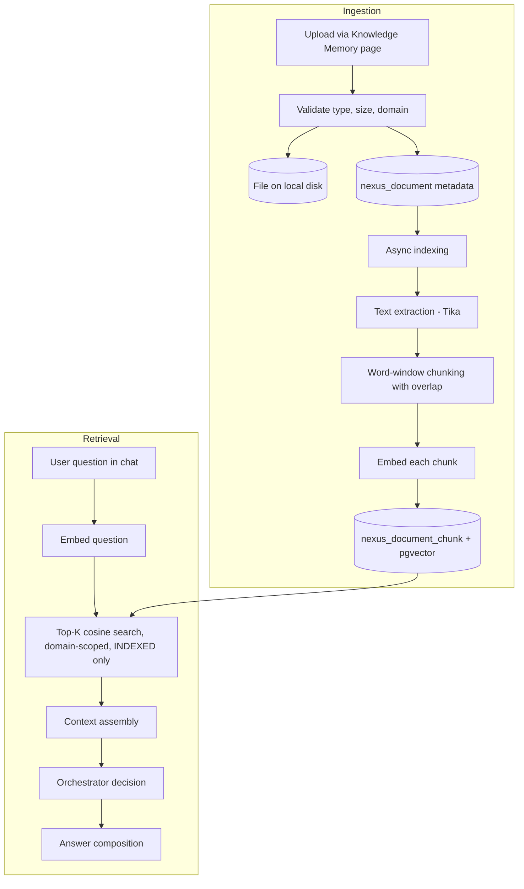

# AI Memory

AI Memory (shown in the product as **Knowledge Memory**) is Zevra's tenant-owned document knowledge base. Users upload business documents — policies, procedures, contracts, reference material — and Zevra indexes them for semantic retrieval, so questions asked in chat can be answered from the tenant's own written knowledge, not only from live data or the model's general knowledge.

## Purpose

Zevra answers business questions against two kinds of truth: **live operational data** (reached through governed SQL) and **written business knowledge** that exists only in documents. AI Memory covers the second. It gives every tenant a private, domain-scoped store of indexed documents that the conversational pipeline searches on every question, and that the AI is instructed to treat as its source of record when composing document-grounded answers.

## Business Value

- **Answers reflect the company's own documents.** Definitions, policies, and procedures come from what the tenant uploaded, with the AI constrained to answer from that provided knowledge rather than improvising.
- **Institutional knowledge becomes queryable.** Documents that previously required knowing where to look are reachable through the same conversational interface as operational data.
- **Knowledge stays a tenant asset.** Documents, chunks, and embeddings live in the tenant's own schema; stewards curate the store by uploading, retagging, and archiving.
- **Gaps become visible.** When a question cannot be answered from memory or data, the orchestrator records a knowledge gap rather than fabricating an answer — telling the tenant what its knowledge base is missing.

## User Experience

**Managing memory.** The **Knowledge Memory** page (`/memory`) lists documents per business domain with their indexing status. Users upload a file (PDF, DOCX, TXT, Markdown, or HTML, up to 50 MB) with a title, a target domain, and optional tags. Indexing runs in the background; the list shows the document move through its statuses. Users can edit a document's title, domain, and tags, or archive it, which removes it from all future retrieval.

**Experiencing memory.** In chat, memory is invisible machinery: every question triggers a semantic search over the indexed documents in scope, and the retrieved passages inform both the orchestrator's routing decision and the composed answer. The per-answer evidence trail records how many memory chunks were available to the decision.

## Key Concepts

| Concept | Meaning |
|---|---|
| **Knowledge document** | An uploaded file plus its metadata (title, domain, tags, status, uploader). The unit users manage. |
| **Domain scoping** | Every document belongs to exactly one business domain. Retrieval is scoped to the domains of the agent handling the question; questions handled without an agent search all of the tenant's indexed documents. |
| **Chunk** | A retrieval unit: an overlapping window of the document's text, prefixed with its domain and title, stored with its embedding vector. |
| **Embedding** | A 1536-dimension vector produced by the configured embedding model, for both chunks (at indexing) and questions (at retrieval). |
| **Semantic retrieval** | Cosine-similarity search (pgvector) returning the top-K most similar chunks across in-scope, fully indexed documents. |
| **Status lifecycle** | `UPLOADED → INDEXING → INDEXED` (retrievable) or `FAILED`; `ARCHIVED` is the soft-delete terminal state. Only `INDEXED` documents are ever searched. |

## Architecture Overview



Ingestion and retrieval are decoupled: uploads return immediately while indexing proceeds asynchronously, and retrieval only ever sees documents whose indexing completed.

## Core Components

| Component | Responsibility |
|---|---|
| `MemoryController` | REST surface: list, upload (multipart), update metadata, archive (`/memory/documents`) |
| `DocumentMemoryService` | Validation, disk persistence, async indexing (extract → chunk → embed → store), and question-time retrieval |
| `MemoryRepository` | All persistence: document metadata CRUD and pgvector similarity queries (`<=>` cosine operator) |
| `AzureOpenAiClient` | Produces embeddings for chunks and questions via the configured embedding deployment |
| `ChatService` | Consumes retrieval as a pipeline step; feeds chunks to the orchestrator decision and answer composition |
| `Memory.jsx` | The Knowledge Memory management page |

## Data & Metadata

All memory state is **schema-resident per tenant**:

- **`nexus_document`** — one row per document: key, domain (foreign key to the tenant's domains), title, file name/path/size, content type, tags, status (constrained to the five lifecycle values), chunk count, indexing timestamp, uploader, timestamps.
- **`nexus_document_chunk`** — one row per chunk: ordered index within its document, chunk text (prefixed `{domain} | {title} |`), `vector(1536)` embedding with an IVFFlat cosine index, and an estimated token count. Chunks cascade-delete with their document and are replaced wholesale on re-indexing.
- **File storage** — original files are kept on local disk under `{storage-path}/{domainKey}/{documentKey}/`, outside the database.

Chunking is word-based: documents are normalized to single-spaced text and split into windows of a target word count with a fixed overlap between consecutive chunks (defaults: 850 words, 100 overlap).

## AI Responsibilities

The AI's role in this capability is deliberately narrow:

- **Embedding** — the embedding model converts chunk text and questions into vectors. This is the only AI involvement at indexing time.
- **Routing** — the orchestrator LLM sees how many memory chunks matched (alongside enterprise, semantic, and anomaly context) and decides whether the question is answered from memory, from live data, from prior results, by clarification, or recorded as a knowledge gap.
- **Composition** — for memory-grounded answers, the model receives the retrieved chunk text and is instructed to answer **using only the provided knowledge**.

The AI never writes to memory: it does not create, modify, promote, or delete documents or chunks. Memory content changes only through user upload, metadata edits, and archival.

## Integration with Other Capabilities

- **Conversational analytics (chat).** Memory retrieval is a fixed step of every question's pipeline, running after agent routing (which supplies the domain scope) and before the orchestrator decision. Retrieval searches on the user's question text — never on attached file content.
- **Attachments are not memory.** Files attached to a chat message are per-conversation context, injected directly into that conversation; memory documents are persistent, indexed, and shared across all users and conversations in the tenant.
- **Agents and domains.** Agents carry domain scopes; the memory a question can see follows the agent that handles it.
- **Knowledge gaps.** When the orchestrator concludes neither memory nor approved data can answer, it records a knowledge gap — the curation signal for what to upload next.
- **Evidence trail.** Each run's routing evidence records the memory chunk count that informed the decision, alongside the decision type and language resolutions.

## Security & Governance

- **Tenant isolation.** Documents, chunks, and embeddings live in the tenant's own database schema; retrieval runs on the tenant-scoped connection, so no memory signal can cross tenants.
- **Authentication and attribution.** All memory endpoints require an authenticated user; the uploader's identity is recorded on every document.
- **Validation at the boundary.** Uploads are rejected unless the file type is on the allow-list (PDF, DOCX, TXT, MD, HTML), the size is within 50 MB, and a target domain is supplied.
- **Soft deletion.** Archiving is a status change that removes the document from every future retrieval; nothing downstream can resurrect an archived document into context.
- **Read-only stance preserved.** Memory adds knowledge to answers; it grants no write path to any business system.

## Configuration

| Property | Default | Effect |
|---|---|---|
| `nexus.memory.chunk-target-words` | `850` | Words per chunk window |
| `nexus.memory.chunk-overlap-words` | `100` | Words shared between consecutive chunks |
| `nexus.memory.retrieval-top-k` | `6` | Chunks returned per question |
| `nexus.storage.local-path` | `./data/documents` | Root directory for uploaded files |
| `nexus.openai.embedding-model` | `text-embedding-ada-002` | Embedding deployment (must produce 1536-dimension vectors, matching the schema) |

Fixed limits (code-level, not configuration): 50 MB per file; allowed types PDF/DOCX/TXT/MD/HTML; text extraction capped at 10 million characters.

## Operational Flow

```mermaid
sequenceDiagram
    actor User
    participant UI as Knowledge Memory page
    participant API as MemoryController
    participant SVC as DocumentMemoryService
    participant DB as Tenant schema (pgvector)
    participant EMB as Embedding model

    User->>UI: Upload file + title + domain + tags
    UI->>API: POST /memory/documents (multipart)
    API->>SVC: uploadDocument
    SVC->>SVC: Validate; write file to disk
    SVC->>DB: Insert document (UPLOADED)
    API-->>UI: 201 Created
    SVC--)SVC: Async: indexDocument
    SVC->>DB: Status → INDEXING
    SVC->>SVC: Extract text (Tika); chunk with overlap
    loop each chunk
        SVC->>EMB: embed(chunk)
        SVC->>DB: Insert chunk + vector
    end
    SVC->>DB: Status → INDEXED (or FAILED)

    Note over User,EMB: Later, on every chat question
    User->>API: Question (chat)
    API->>SVC: retrieveContext(question, agent domains)
    SVC->>EMB: embed(question)
    SVC->>DB: Top-K cosine search (INDEXED, in-scope)
    DB-->>SVC: Matching chunks
    SVC-->>API: Chunks → orchestrator decision → answer
```

Indexing failures mark the document `FAILED` and are logged; the document remains listed with its failed status.

## Current Limitations

Documented so consumers build on what is true, not what is assumed:

- **Local-disk file storage.** Original files live on the application host's filesystem. There is no object storage, replication, or multi-node file sharing.
- **No re-index or retry surface.** `FAILED` is terminal through the API; recovering requires uploading the document again. There is also no way to re-embed after changing the embedding model.
- **Embedding model is structurally fixed.** The chunk table's vector dimension (1536) binds the tenant to models with that output size; switching models invalidates existing embeddings with no migration tooling.
- **No relevance floor.** Retrieval always returns the top-K nearest chunks, however weak the similarity — irrelevant context can reach the prompt on out-of-scope questions.
- **Structure-blind chunking.** Word windows ignore headings, tables, and sentence boundaries; tabular or highly formatted content degrades in extraction and chunking.
- **Retrieval is not fail-open.** An embedding-service failure during question processing fails the whole run rather than degrading to a memory-less answer. (This predates, and does not yet honor, the fail-open posture mandated for advisory layers by the Semantic Foundation.)
- **Archival retains data.** Archived documents' files stay on disk and chunks stay in the table; they are excluded from retrieval by status filtering only.
- **No intra-tenant access control.** Any authenticated tenant user's questions can retrieve from any domain's documents when no agent scope applies; domains scope routing, not permissions.
- **Metadata-only updates.** Editing a document's domain re-scopes retrieval but does not re-prefix or re-embed its existing chunks, which retain the original domain/title prefix text.
- **Token counts are estimates** (word-count heuristic), not tokenizer output.

## Stabilization Checklist

What should be verified before further functionality is built on top of AI Memory. These are validation items, not feature proposals.

**Functional scenarios**

- [ ] Upload → index → retrieve round-trip for every allowed file type (PDF, DOCX, TXT, MD, HTML), confirming extracted text fidelity per format.
- [ ] Domain-scoped retrieval returns only in-scope chunks when an agent applies, and all-tenant chunks when none does.
- [ ] Archived documents never appear in retrieval, in any decision path.
- [ ] Metadata edits (title, domain, tags) take effect in listings and in future retrieval scope.
- [ ] `ANSWER_FROM_MEMORY` answers are actually grounded in retrieved chunks (spot-check against source documents).

**Edge cases**

- [ ] Empty, whitespace-only, and image-only (no extractable text) documents: indexing outcome and retrieval behavior.
- [ ] Documents at the 50 MB and 10-million-character extraction boundaries.
- [ ] Documents shorter than one chunk window; documents producing exactly one chunk.
- [ ] Duplicate uploads of the same file; same title in multiple domains.
- [ ] Questions with no meaningful similarity to any document — what reaches the prompt and how the orchestrator behaves.
- [ ] Filenames with non-ASCII characters and path-hostile characters, given filenames become disk paths.

**Performance**

- [ ] Indexing latency versus document size (embedding calls are sequential per chunk) and behavior under concurrent uploads.
- [ ] Retrieval latency as chunk volume grows; IVFFlat index recall/latency at realistic scale (the index was created with `lists = 100`).
- [ ] Retrieval added latency per chat question, since it runs on every question.

**Security**

- [ ] Endpoint authorization: which roles can upload, edit, and archive; verify no unauthenticated path.
- [ ] Path handling for stored files (traversal-hostile document keys, domain keys, filenames).
- [ ] Content-type spoofing: file whose extension and actual content disagree.
- [ ] Confirm no memory content leaks into logs or error messages.

**AI behavior**

- [ ] The "answer only from provided knowledge" constraint holds under adversarial questions (asks that go beyond the documents).
- [ ] Orchestrator routing quality with zero, weak, and strong memory matches — including the boundary between `ANSWER_FROM_MEMORY` and `KNOWLEDGE_GAP`.
- [ ] Behavior when retrieved chunks contradict live data in mixed-evidence answers.

**Failure recovery**

- [ ] Embedding-service outage during indexing (document lands `FAILED`, no partial chunks retrievable) and during retrieval (currently fails the run — confirm and decide whether this posture is acceptable before dependents assume it).
- [ ] Application restart mid-indexing: document stuck in `INDEXING` — how it is detected and recovered.
- [ ] Disk-full and file-missing-on-disk conditions at upload and at re-index.

**Multi-tenant behavior**

- [ ] Retrieval isolation under concurrent cross-tenant load (tenant-scoped connection always resolves to the correct schema).
- [ ] Per-tenant storage growth on disk and in the chunk table; no shared-path collisions between tenants.

**Auditability**

- [ ] Uploads, metadata edits, and archivals are attributable (who, when) and surfaced somewhere reviewable.
- [ ] The run evidence trail records memory's influence on each answer (chunk counts today — verify this is sufficient to explain an answer after the fact).

## Related Documentation

Documents in zevra-docs that should eventually reference this page (those not yet written are marked *planned*):

- [Capabilities overview](index.md) — section landing
- [Conversational Analytics](conversational-analytics.md) — the chat capability whose pipeline consumes memory
- *Context Assembly* (planned, `ai/`) — memory chunks as one governed input to what the model sees
- *Model Integration* (planned, `ai/`) — embedding model configuration and exchange
- *Request Lifecycle* (planned, `runtime/`) — memory retrieval as a pipeline step
- *Memory API* (planned, `api/`) — endpoint reference for `/memory/documents`
- *Configuration Reference* and *Storage & Deployment* (planned, `operations/`) — the `nexus.memory.*` keys and local-disk requirement
- *Tenancy & Isolation* (planned, `platform/`) — schema-per-tenant isolation, of which memory is a concrete case
- [Semantic Foundation](../architecture/semantic-foundation.md) — the trust and fail-open contracts this capability must be measured against
