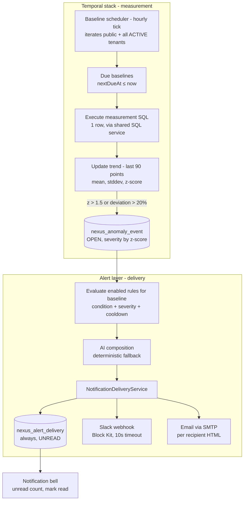

# Alerts

Alerts (shown in the product as **Proactive Intelligence**) are Zevra's notification layer over operational anomaly detection. Tenants define baselines — a metric measured by a SQL statement on a daily, weekly, or monthly cadence — and Zevra learns each metric's normal range from its own history. When a measurement deviates significantly, matching alert rules fire: an AI-composed plain-English message is delivered to the in-app notification bell, a Slack channel, an email inbox, or all three, with cooldowns preventing repetition.

## Platform Position

Alerts are the **delivery half of the temporal intelligence stack**. Upstream, the baseline scheduler and anomaly detector decide *that* something is abnormal; the alert layer decides *whether anyone should be told, and how*.

**It owns:**

- Alert rules — which anomalies matter, at what severity, on which channel, how often
- Rule evaluation: condition matching, severity thresholds, cooldown enforcement
- Message composition (AI with a deterministic fallback) and channel delivery (in-app, Slack, email)
- The in-app notification history: the bell, unread counts, read state

**It consumes:**

- **Anomaly events** from the temporal stack (baselines, trend statistics, z-score detection) — the sole trigger for alert evaluation
- The **shared SQL execution service** (indirectly: baseline measurements run through it)
- The **AI client** for message composition
- **SMTP configuration** and tenant-supplied Slack webhooks for outbound channels

**What depends on it:**

- **The notification bell** — every page's unread badge is alert-delivery data
- Nothing else today: no capability reads alert history programmatically. (The *anomaly* context feeds the chat pipeline, but that is the temporal stack's surface, not the alert layer's.)

**It explicitly does NOT own:**

- **Measurement.** Baselines, their SQL, cadence, trend data, and anomaly detection belong to the temporal stack; alerts begin where an anomaly ends.
- **Scheduling.** The baseline scheduler drives everything; the alert layer has no clock of its own.
- **Anomaly lifecycle.** Anomalies are opened, updated, and linked to findings through the temporal API, independent of whether an alert fired.
- **Email infrastructure.** SMTP identity is platform configuration; the alert layer only uses it.

## Purpose

Zevra's other surfaces answer when asked (chat, agents) or on a fixed clock (the Executive Brief). Alerts exist for the third case: *the data itself decides when to speak*. A metric that quietly drifted three standard deviations from its norm should not wait for someone to ask about it or for tomorrow's brief — it should interrupt, once, with the numbers, on the channel where the responsible person already works.

## Business Value

- **The normal range is learned, not configured.** Stewards define *what* to measure; the baseline's own history defines *normal*. No thresholds to hand-tune or keep current as the business changes.
- **Signal, not noise.** Severity conditions, per-rule cooldowns, and one-anomaly-per-measurement-cadence mean a firing rule is worth reading; the same incident does not page twice.
- **Numbers with narrative.** Every alert carries the exact observed value, baseline average, and deviation — wrapped in a 2–3 sentence AI-composed explanation of what changed and what to do, with a deterministic fallback so delivery never depends on the model.
- **Meets people where they are.** The same alert lands in the product's bell, a Slack channel with an "Investigate in Zevra" button, and a formatted email — per rule, per audience.

## User Experience

**Defining baselines** (Temporal page). A baseline is a metric name, a measurement SQL statement (validated for safety at creation), a connection, a domain, and a cadence (daily / weekly / monthly). Creation runs an immediate first measurement so the metric shows a value right away.

**Defining rules** (Alert Rules tab on the same page). A rule targets a baseline and sets: a condition (`ANY_ANOMALY`, `ABOVE_WARNING`, `ABOVE_CRITICAL`, `BELOW_WARNING`, `BELOW_CRITICAL`), a severity threshold, a channel (`IN_APP`, `SLACK`, `EMAIL`, `ALL`), the Slack webhook and/or email recipients, a cooldown (default 60 minutes), and an enabled flag. A **Test** action sends a real delivery through the rule's channels immediately, confirming the wiring.

**Receiving alerts.** The notification bell shows unread alerts with severity, metric, values, and the composed message; alerts can be marked read individually or all at once. Slack alerts arrive as color-coded Block Kit cards with a metric/severity/value/deviation grid and an investigate button; emails are branded HTML with the same facts.

## Key Concepts

| Concept | Meaning |
|---|---|
| **Baseline** | A measured metric: name, measurement SQL (single value), connection, domain, cadence, and its accumulated trend history (last 90 measurements). Owned by the temporal stack. |
| **Anomaly** | A measurement that broke pattern: observed value, baseline average, deviation %, z-score, severity, status (`OPEN`, updatable, linkable to a finding). Persisted whether or not any alert fires. |
| **Severity** | Derived from z-score alone: `CRITICAL` (z > 3), `HIGH` (z > 2), `MEDIUM` (z > 1.5), else `LOW`. An anomaly is raised when stddev > 0 **and** (z > 1.5 **or** deviation > 20%). |
| **Alert rule** | The tenant's statement of interest in a baseline's anomalies: condition + severity threshold + channel(s) + cooldown + enabled flag. |
| **Cooldown** | Minimum minutes between deliveries for one rule, measured from the rule's most recent delivery row of any kind — including test alerts. |
| **Delivery** | One persisted alert record (`UNREAD` → `READ`), always written for the in-app channel; the unit of the bell and of alert history. |
| **Composition** | The AI-written 2–3 sentence message (metric, change, operational meaning, recommended action); falls back to a deterministic template if the model call fails. |

## Architecture Overview



The design is **polling, not event-driven**: the hourly scheduler is the only clock, each baseline is measured at most once per its cadence, and rule evaluation runs synchronously in the scheduler thread immediately after an anomaly is persisted — keeping delivery inside the same tenant context so in-app rows land in the correct schema.

## Lifecycle / Execution Flow

**Rule lifecycle.** Rules are created enabled by default, edited in place (no versioning), disabled by flag, and hard-deleted. The creator is recorded; there is no draft or approval state.

**Anomaly-to-alert flow**, per scheduler tick:

1. Collect schemas: the public workspace plus every `ACTIVE` tenant. For each, set the tenant context.
2. Find baselines with `nextDueAt <= now`; for each, execute its measurement SQL (single row; first column is the value), append to the 90-point trend, recompute mean/stddev, advance `nextDueAt` by the cadence.
3. If the measurement is anomalous, persist the anomaly (`OPEN`) and synchronously evaluate every enabled rule targeting that baseline:
   - **Condition** — `ANY_ANOMALY` always matches; `ABOVE_WARNING` requires `MEDIUM+`; `ABOVE_CRITICAL` requires `CRITICAL`; the `BELOW_*` variants invert; unknown conditions fall back to comparing severity against the rule's threshold.
   - **Cooldown** — skipped if the rule delivered anything within its cooldown window.
   - **Compose** — one AI call (2–3 sentences, exact numbers, one recommended action); on any failure, a deterministic template message.
   - **Deliver** — an in-app delivery row is always written (`UNREAD`); Slack and/or email are additionally attempted per the rule's channel.
4. Failures at every level are contained: a failing baseline skips to the next baseline, a failing rule to the next rule; the tick always completes.

Two other paths reach this flow: **baseline creation** runs an immediate first measurement *with* alert evaluation (a brand-new baseline can fire alerts instantly), while the **manual refresh endpoint** measures and persists anomalies but never calls alert evaluation — a detected anomaly via manual refresh notifies no one.

## Core Components

| Component | Responsibility |
|---|---|
| `BaselineService` | The hourly scheduler: tenant iteration, due-baseline refresh, baseline creation (with SQL safety validation), the anomaly-context string for chat prompts |
| `AnomalyDetector` | Measurement execution, trend maintenance (90 points), mean/stddev/z-score, severity assignment, anomaly persistence |
| `AlertService` | Rule CRUD, rule evaluation (condition, severity ordinal, cooldown), test alerts, delivery history and read-state API |
| `AlertComposerService` | The AI message (strict 2–3 sentence brief with numbers and one action) and its deterministic fallback |
| `NotificationDeliveryService` | Channel fan-out: in-app persistence (always), Slack Block Kit webhook, per-recipient HTML email; severity colors and emoji |
| `AlertController` / `TemporalController` | REST surfaces: `/alert-rules` (CRUD + test), `/alerts` (history, unread count, read state); `/temporal/baselines` and `/temporal/anomalies` |
| `Temporal.jsx` (Alert Rules tab) / `NotificationPanel.jsx` | Rule management UI; the bell |

## Data & Metadata

All four tables are **schema-resident per tenant** (no `tenant_schema` column — isolation is entirely the per-request/per-tick schema context; a startup migrator keeps every tenant schema's tables current):

- **`nexus_operational_baseline`** — the measured metric: keys (domain, agent, KPI), metric name, measurement SQL, connection, current/average/stddev values, the trend history as JSON (capped at 90 entries), cadence, `lastComputedAt`/`nextDueAt`, status.
- **`nexus_anomaly_event`** — one row per detected anomaly: baseline and domain keys, detection time, metric, baseline vs observed values, deviation %, z-score, severity, status (default `OPEN`, free-form updates via PATCH), optional finding link.
- **`nexus_alert_rule`** — the rule: name, baseline key (no foreign key), condition / severity threshold / channel (all CHECK-constrained), Slack webhook (plain text), email recipients (comma-separated), cooldown minutes, enabled flag, creator, timestamps.
- **`nexus_alert_delivery`** — the history: rule and anomaly keys, channel, the metric numbers, severity, the composed message, status (`UNREAD`/`READ`/`FAILED` by constraint — though `FAILED` is never written), sent/read timestamps.

Only the in-app row is persisted per firing; Slack and email attempts leave no delivery record — the `channel` column is always `IN_APP` in practice, and outbound outcomes exist only in server logs.

## AI Responsibilities

**Deterministic runtime** — everything that decides whether and where an alert fires: scheduling, measurement, trend statistics, z-score thresholds, severity assignment, rule matching, cooldown arithmetic, channel fan-out, persistence, and read-state.

**AI reasoning** — exactly one, deliberately replaceable role: **composing the message**. The model receives the anomaly's numbers (metric, observed, baseline, deviation, z-score, severity, window, rule name) and returns 2–3 plain-English sentences: what changed, why it matters, one recommended action. On any model failure the deterministic template produces the same facts in fixed phrasing — **this is the platform's one genuinely fail-open AI usage**: no alert is ever lost or delayed because the model was unavailable. The AI cannot influence *whether* an alert fires, its severity, or its channels.

One gap: composition calls are not tagged with a usage context, so alert-driven token spend is not attributed the way chat, agent, and brief calls are.

## Integration with Other Capabilities

- **Temporal stack — the trigger.** Alerts fire exclusively from anomaly events; there is no other input path. Anomaly records live on regardless of alert outcomes and can be linked to operational findings.
- **Conversational platform — indirect.** The chat pipeline injects recent-anomaly context into its prompts (via the temporal stack), so anomalies inform answers — but chat neither reads alert deliveries nor creates rules. Email and Slack "investigate" links point at the app's chat surface.
- **SQL execution — shared, with a difference.** Baseline measurement SQL runs through the shared execution service like agent and workflow SQL — but uniquely among the proactive surfaces, it is validated at creation by the platform's SQL safety service (SELECT-only, no semicolons, DML/DDL keyword blacklist, no `SELECT *`).
- **Executive Brief, Autonomous Agents, Workflow Automation, AI Memory — no integration.** The brief does not read anomalies or alert history; agents cannot raise alerts; workflows cannot trigger or be triggered by them. Alert email delivery is the platform's only email path — the brief's stored recipients do not use it.

## Security & Governance

- **Authenticated management.** Rule CRUD, test, history, and read-state endpoints require an authenticated user and operate in the caller's tenant context; rule creators are recorded.
- **Tenant isolation by schema.** All alert and temporal tables are per-tenant-schema; the scheduler sets and clears tenant context per schema, so measurements, anomalies, and in-app deliveries land in the correct tenant. There is no cross-tenant read path.
- **Creation-time SQL safety — the strongest posture among the proactive surfaces.** Baseline SQL must pass the safety validator before persisting. However, validation happens **only at creation**: execution re-runs the stored SQL verbatim, and the statement never passes the *full* governance chain (contracts, row security, masking, governance audit). Compared with [Autonomous Agents](autonomous-agents.md#security-governance) and [Workflow Automation](workflow-automation.md#security-governance), this path has real safety validation but the same absent governance.
- **Outbound data flow.** Alert messages — containing metric names and business values — are sent to tenant-configured Slack webhooks and email recipients. Webhook URLs are stored in plain text on the rule; nothing validates that a webhook or recipient is appropriate for the data.
- **No governance audit.** Rule changes, firings, and outbound deliveries appear in application logs and the delivery table, not in the platform's governance audit surfaces.

## Configuration

| Property | Default | Effect |
|---|---|---|
| `nexus.alerts.app-url` | `https://zevra-ui.vercel.app` | Base URL for "Investigate in Zevra" links and the email logo — note the environment-specific default is baked into code |
| `spring.mail.username` (SMTP_USERNAME) | — | The From identity; when unset, email delivery is silently skipped with a log warning |

Rule-level configuration (per rule): condition, severity threshold, channel, Slack webhook, email recipients, cooldown minutes (default 60), enabled. Baseline-level: cadence (`DAILY` default, `WEEKLY`, `MONTHLY`).

Code-level constants: hourly scheduler tick; 90-point trend window; z-score thresholds (1.5 / 2 / 3) and the 20% deviation trigger; single-row measurement; 10-second Slack timeouts; default 50-row history listing.

## Operational Flow

```mermaid
sequenceDiagram
    participant SCH as Baseline scheduler (hourly)
    participant DET as AnomalyDetector
    participant DB as Tenant data (via connection)
    participant ALS as AlertService
    participant AI as Composer model
    participant OUT as Channels

    SCH->>SCH: For each schema (public + ACTIVE tenants): set tenant context
    SCH->>DET: checkBaseline(each due baseline)
    DET->>DB: measurement SQL (1 row)
    DET->>DET: trend += value; mean, stddev, z-score
    alt anomalous (stddev > 0, z > 1.5 or deviation > 20%)
        DET->>DET: persist anomaly (OPEN, severity by z)
        SCH->>ALS: evaluateAndDeliver(baseline, anomaly)
        loop each enabled rule for baseline
            ALS->>ALS: condition met? outside cooldown?
            ALS->>AI: compose message
            AI-->>ALS: 2–3 sentences (or fallback template)
            ALS->>OUT: in-app row (always, UNREAD)
            ALS->>OUT: Slack webhook / email per channel
        end
    end
    SCH->>SCH: clear tenant context, next schema
```

Failure semantics: a failed measurement skips that baseline until its next due time (no retry, no backoff); a failed rule evaluation is logged and the remaining rules still run; a failed AI composition falls back to the template; failed Slack or email sends are logged and lost — the in-app row exists either way, but no record distinguishes a delivered Slack message from a dropped one. Everything runs synchronously in the single scheduler thread: composition latency and channel timeouts directly extend the tick.

## Current Limitations

- **Outbound delivery is unverifiable after the fact.** Only the in-app row is persisted; Slack and email attempts (and their failures) exist solely in logs. The delivery table's `FAILED` status is never written by any code path.
- **Test alerts poison the cooldown.** Cooldown reads the rule's most recent delivery row of any kind — a test alert therefore suppresses real alerts for the full cooldown window.
- **Manual refresh bypasses alerting.** The refresh endpoint persists detected anomalies but never evaluates rules; the only paths that notify are the scheduler and baseline creation.
- **One bad recipient aborts the rest.** Email recipients are sent sequentially inside one try-block; the first failing address skips all subsequent recipients for that alert.
- **No retry anywhere.** Measurements, compositions, Slack posts, and emails each get exactly one attempt per firing.
- **Creation-time-only SQL validation.** Baseline SQL is safety-checked when created, then executed verbatim forever; there is no re-validation, no update endpoint (and thus no re-check path), and execution bypasses the full governance chain.
- **Cold-start blindness.** With fewer than two trend points (or a constant metric), stddev is zero and no anomaly can ever fire — a new baseline is silent until history accumulates, and nothing surfaces this state.
- **Trend statistics are naive.** Mean/stddev over the raw 90-point window: seasonality, trends, and day-of-week patterns all register as anomalies or mask them; a sustained shift permanently drags the baseline toward the new level.
- **Severity ignores direction and magnitude semantics.** Severity is |z| only — a metric collapsing to zero and one spiking 10× at the same z-score alert identically, and the `BELOW_*` conditions compare severity ordinals, not metric direction.
- **Synchronous single-thread delivery.** One scheduler thread measures every tenant's baselines and performs AI composition plus 10-second-timeout channel calls inline; tenant count and slow webhooks directly delay other tenants' measurements.
- **Alert rules float free of baselines.** `baseline_key` has no foreign key; deleting a baseline strands its rules silently, and rules with no baseline key can never fire.
- **Hardcoded environment default.** The investigate-link base URL defaults to a specific deployment's public URL in code.
- **No usage attribution for composition calls.**

## Ownership

Following the Zevra ownership model — one owner per responsibility:

| Responsibility | Owner | Notes |
|---|---|---|
| **Business Owner** | Tenant stewards | Own what is measured (baseline SQL, cadence), what matters (rules, severities, cooldowns), and where alerts go (channels, webhooks, recipients). All of it is tenant data. |
| **AI** | Message composition only | Phrases the anomaly's facts; cannot affect firing, severity, channels, or timing. Fully fail-open to a deterministic template. |
| **Runtime** | Zevra engineering (scheduler + detector + delivery) | Owns the tick, measurement, statistics, thresholds, condition/cooldown logic, fan-out, and failure containment. Meaning-blind: no metric or business rule lives in code. |
| **Governance** | The governance chain — **partially engaged** | Creation-time SQL safety validation exists (unique among proactive surfaces); execution-time governance (contracts, row security, masking, audit) does not. The gap is narrower here but still a documented gap, not a design intent. |
| **Metadata** | Tenant-scoped temporal + alert stores | Baselines, anomalies, rules, deliveries — schema-resident, written only through their owning lifecycles. |
| **Human Stewardship** | The tenant's people | Create and tune baselines and rules, test channels, disable or delete rules, triage anomalies (status updates, finding links), and read/clear the bell. |

## Stabilization Checklist

What must be validated before future capabilities depend on Alerts. Implementation-driven validation only — no enhancements.

**Functional behavior**

- [ ] Baseline create → scheduled measure → anomaly → rule fire → all three channels deliver, end-to-end per cadence (daily/weekly/monthly).
- [ ] Every rule condition (`ANY_ANOMALY`, `ABOVE_*`, `BELOW_*`, unknown-condition fallback) against every severity — the full matrix behaves as documented.
- [ ] Rule CRUD round-trip; disabled rules never fire; deletion is immediate.
- [ ] Read-state: unread count, mark-one, mark-all; history limit and ordering.
- [ ] Test alerts deliver on the configured channels and report channel misconfiguration usefully.

**Rule evaluation & deduplication**

- [ ] Cooldown suppresses within the window and releases after it, per rule independently when several rules watch one baseline.
- [ ] Confirm and decide on the test-alert-starts-cooldown behavior before operators rely on Test during incidents.
- [ ] Rules with null or dangling `baseline_key`: verify they are inert and that their existence is discoverable.

**Threshold & severity model**

- [ ] Anomaly firing boundary: z exactly 1.5, deviation exactly 20%, stddev exactly 0 — verify edges match documentation.
- [ ] Cold start: how many measurements until first possible anomaly, per cadence; verify nothing misfires on the second data point.
- [ ] Severity assignment at z boundaries (1.5/2/3) and the `LOW` + `ANY_ANOMALY` combination.
- [ ] Baseline drift: a sustained step-change — measure how quickly the anomaly stops firing as the new level absorbs into the mean.

**SQL execution**

- [ ] Safety validator coverage at creation: verify the keyword blacklist, semicolon, and `SELECT *` rules reject what they claim, and what still passes (e.g. expensive queries, cross-schema reads the connection permits).
- [ ] Measurement of multi-row/multi-column results (first column of first row wins) and non-numeric first columns.
- [ ] Measurement SQL failures: baseline skipped, next-due still advances or not — verify the retry-at-next-cadence story.

**Notification channels & email**

- [ ] Slack: payload renders for every severity; special characters in rule names and composed messages survive the manual JSON escaping; non-200 webhook responses and timeouts are contained.
- [ ] Email: multi-recipient behavior including the first-failure-aborts-rest flaw; SMTP unset (silent skip) and SMTP wrong (failure containment); HTML rendering with hostile metric names (escaping).
- [ ] Verify the investigate links and logo resolve correctly per environment given the hardcoded default URL.

**Retry & failure recovery**

- [ ] Confirm no retry at any level and document operational expectations for each loss mode (measurement, composition, Slack, email).
- [ ] AI composer failure → fallback template delivers with correct facts.
- [ ] Scheduler tick survives: a failing tenant schema, a failing baseline, a failing rule — each contained without stopping the loop.
- [ ] App restart mid-tick: verify no partial state (trend updated but anomaly lost, anomaly persisted but rules unevaluated).

**Scheduling & performance**

- [ ] Tick duration as baselines × tenants grows; measure worst-case with slow measurement SQL plus AI composition plus 10-second channel timeouts, all on one thread.
- [ ] `nextDueAt` advancement: no drift, no double-measurement, behavior when the app was down past a due time.
- [ ] Delivery-table growth: no pruning exists — project volume at production rule counts.

**Multi-tenant behavior**

- [ ] Isolation: baselines, anomalies, rules, and deliveries never cross schemas; the bell shows only the caller's tenant.
- [ ] Tenant context is set and cleared correctly around each schema in the tick; a mid-schema failure cannot leak context into the next tenant.
- [ ] New tenants' schemas have the alert tables (startup migrator) before their first baseline.

**Security**

- [ ] Endpoint authorization on all rule and history routes; cross-tenant access attempts fail closed.
- [ ] Data egress review: what business values reach Slack/email, and confirm webhook URLs and recipients are treated as tenant-trusted configuration knowingly.
- [ ] No connection credentials or internal identifiers leak into composed messages, Slack payloads, or emails.

**Governance**

- [ ] Formal disposition of execution-time governance for baseline SQL — the creation-time validator narrows but does not close the platform's proactive-surface gap; decide and record.
- [ ] Confirm what a governance reviewer can reconstruct today (rule changes, firings, egress) and what they cannot (outbound outcomes, composition inputs).

**Auditability**

- [ ] A delivered alert is traceable end-to-end: delivery → anomaly → baseline → measurement values and time.
- [ ] Rule lifecycle attribution: creator is recorded — verify edits, disables, and deletions are attributable or document that they are not.
- [ ] Establish whether logs are sufficient evidence for outbound (Slack/email) delivery disputes, given nothing else records them.

## Related Documentation

Pages that should reference this capability (unwritten pages are marked *planned*):

- [Capabilities overview](index.md) — section landing
- [Executive Brief](executive-brief.md) — the platform's other proactive surface; explicitly does *not* use this capability's delivery channels today
- [Autonomous Agents](autonomous-agents.md) — sibling proactive surface; contrast in SQL validation posture
- [Workflow Automation](workflow-automation.md) — sibling capability; same execution service, no creation-time validation
- *Temporal Intelligence / Baselines & Anomalies* (planned, `capabilities/` or `platform/`) — the measurement half this capability delivers for
- [Conversational Analytics](conversational-analytics.md) — consumes anomaly context in prompts; the target of investigate links
- *SQL Governance* (planned, `architecture/`) — the chain baseline SQL partially engages
- [Semantic Foundation](../architecture/semantic-foundation.md) — the fail-open contract this capability's AI composition actually honors
- *Alerts API* (planned, `api/`) — endpoint reference for `/alert-rules`, `/alerts`, `/temporal`
- *Tenancy & Isolation* (planned, `platform/`) — schema-resident stores and scheduled multi-tenant iteration
- *Configuration Reference* (planned, `operations/`) — SMTP setup, app-url, and code-level constants
