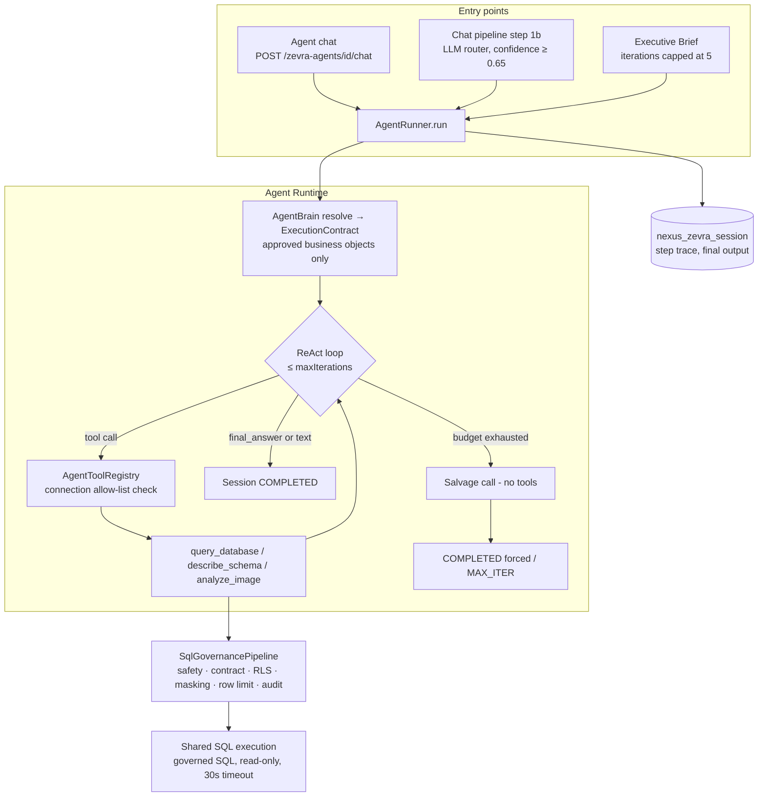
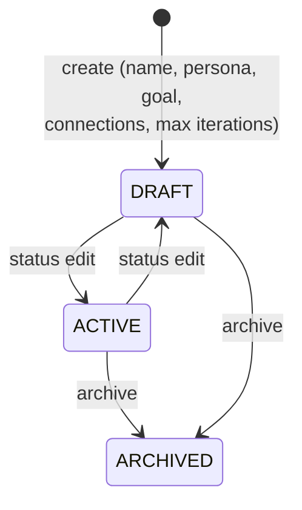
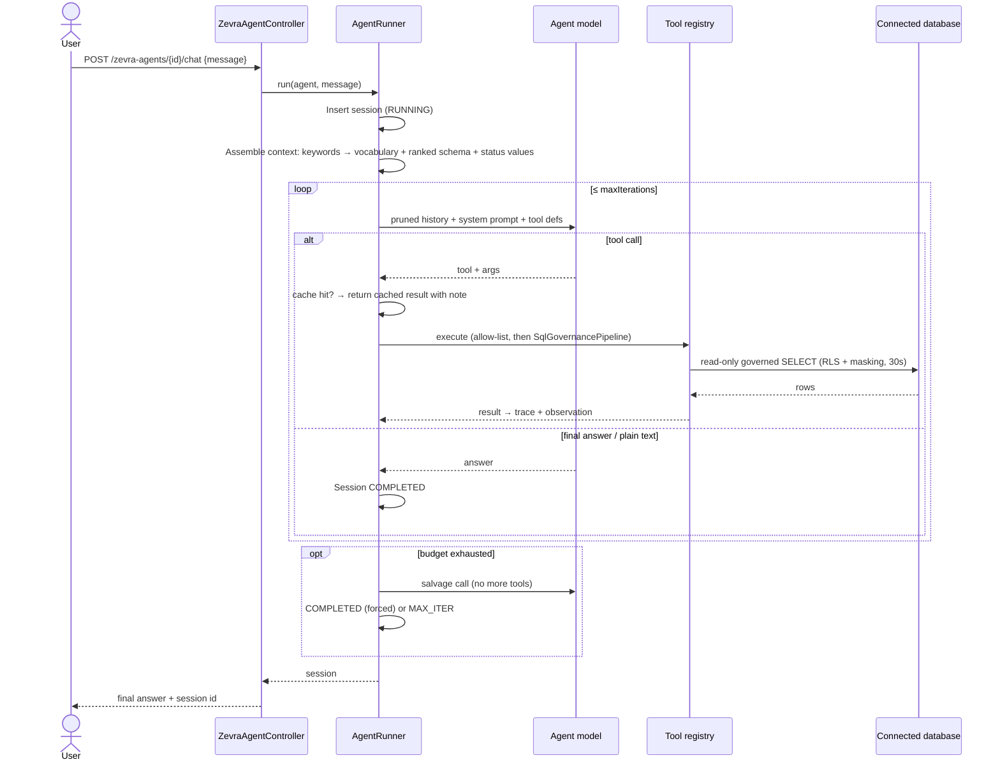

# Autonomous Agents

Autonomous Agents (shown in the product as **Zevra Agents**) are tenant-defined AI investigators. Each agent has a persona, a goal, and a set of approved database connections; given a question, it reasons in a bounded loop — querying data, inspecting schemas, analysing images — until it can state a grounded final answer, with every step recorded. Agents are the platform's reusable investigation engine: users chat with them directly, the conversational platform routes matching questions to them, and the Executive Brief runs them on a schedule.

## Platform Position

The Zevra Agent Runtime is the platform's second reasoning engine, parallel to the conversational pipeline, and the foundation other proactive capabilities already stand on.

**It owns:**

- Agent definitions (persona, goal, connections, iteration budget, status) and their lifecycle
- The ReAct execution loop: context assembly, tool dispatch, history pruning, iteration capping, salvage, and session persistence
- The built-in tool set and its connection allow-list enforcement
- Sessions — the complete per-run record of steps, tool calls, and outcomes

**It consumes:**

- The **connection registry** (agents query only their granted connections)
- The **shared SQL execution service** for queries and schema catalogs
- The **operational vocabulary** store (read directly, filtered by question keywords)
- The **AI client** (tool-calling chat model, vision model) and **usage tracking**

**What depends on it:**

- **Executive Brief** — runs each contributing agent through this runtime every morning
- **Conversational platform** — routes matching chat questions to agents before its own pipeline runs

**It explicitly does NOT own:**

- **Connections or their credentials** (connection registry), **business vocabulary** (semantic stores; the runtime only reads), **the chat pipeline** (routing into agents is the chat service's decision), **scheduling** (the brief's scheduler; the runtime has none), and **governance enforcement** — agent SQL now passes the **full shared governance pipeline** (`SqlGovernancePipeline`): SQL safety, contracts, row-level security, masking, classification, routing, row limits, and governance audit — the very same pipeline the conversational path uses (ADR-0003 A2). The runtime *invokes* governance; it does not own or implement it (see Security & Governance).

## Purpose

Zevra's conversational pipeline answers ad-hoc questions with heavyweight machinery — semantic resolution, orchestration, multi-stage planning. Many operational needs are narrower and repeat daily: *this* domain, *these* connections, *this* investigative posture. Autonomous Agents exist so a tenant can package that focus once — a claims agent, a fulfillment agent — and reuse it everywhere: direct chat, routed questions, and scheduled briefings, with the same bounded, fully traced reasoning loop underneath.

## Business Value

- **Investigation as a configured asset.** An agent captures a domain's investigative focus in data (persona, goal, connections) — built in minutes, owned by the tenant, reused by every surface.
- **Grounded, auditable answers.** Agents answer from real query results, and every session preserves each step: the tool called, the SQL run, the rows returned, the duration.
- **Bounded by construction.** Iteration caps, per-query row limits and timeouts, connection allow-lists, and a forced best-effort answer at the budget's end — the loop cannot run away.
- **One runtime, many surfaces.** The same agent answers a routed chat question and writes the morning brief; improving an agent's goal improves every surface it powers.

## User Experience

**Managing agents** (`/agents`). A card grid showing each agent's status (Draft / Active / Archived), goal, connection count, and iteration budget. Creating or editing an agent is a form: name, description, persona, goal, connections, max iterations (default 10). Archiving removes it from use; only **Active** agents are routable and brief-eligible.

**Chatting with an agent.** A direct chat surface per agent. Each message runs one full investigation session; the response is the agent's final answer, and the session (with its step-by-step trace) is retrievable afterwards. An agent with no connections refuses to chat with a clear message.

**Sessions.** Each agent's recent sessions (last 50) are listed with status, iterations used, and timing; a session's step trace shows every tool call, its inputs, output, and duration — including which calls were served from the repeat-call cache.

**Meeting agents indirectly.** Users also encounter agents without visiting the Agents page: a chat question that matches an active agent's goal or data is answered by that agent (labelled with the agent's name), and the Morning Brief's sections credit the agents that contributed.

## Key Concepts

| Concept | Meaning |
|---|---|
| **Agent** | A tenant-owned definition: persona (how it speaks), goal (what it investigates), connection allow-list, iteration budget, status (`DRAFT`/`ACTIVE`/`ARCHIVED`). |
| **Session** | One run of one message: status (`RUNNING`/`COMPLETED`/`FAILED`/`MAX_ITER`), the step trace, final output, error, iterations used. Sessions are single-shot — each message starts fresh with no memory of prior sessions. |
| **ReAct loop** | The reason–act cycle: the model either calls a tool (act) and receives its result (observe), or produces the final answer. Native model tool-calling; no separate planner. |
| **Iteration** | One model call in the loop. The budget is the agent's `maxIterations` (default 10; capped to 5 when run by the brief). |
| **Business-object grounding** | Per session, Agent Brain resolves the request against the Enterprise Map into an immutable **ExecutionContract**; the prompt is grounded only in the approved business objects (their business names, physical tables, and filter columns). The raw `information_schema` catalog is never a grounding source. See [ExecutionContract](../architecture/execution-contract.md). |
| **History pruning** | The model sees the original question plus only the last 6 tool-call/result pairs — the prompt cannot grow unbounded with iterations. |
| **Repeat-call cache** | Identical tool calls within a session return the cached result with an explicit "you already ran this" note — breaking the loops pruning can cause. |
| **Salvage** | At the iteration cap, one final call instructs the model to answer from what it has, with no further tools. Success ends `COMPLETED` (flagged as forced); failure ends `MAX_ITER`. |

## Architecture Overview

## Agent Lifecycle

- **Creation** — authenticated users create agents with a generated unique slug; the creator is recorded. Default iteration budget: 10.
- **Draft** — editable and directly chattable, but invisible to the chat router and the brief.
- **Active** — the operative state: routable from chat, eligible for the brief, chattable. Activation is a plain status edit; there is no validation gate.
- **Archived** — soft-deleted; excluded from listings by status. Sessions remain.

Every run — regardless of entry point — produces a session: `RUNNING` on insert, then exactly one terminal state: `COMPLETED` (an answer, possibly forced at the cap), `MAX_ITER` (budget exhausted, salvage failed), or `FAILED` (execution error, message preserved). A crash mid-run leaves `RUNNING` forever — the agent runtime has no reconciliation of its own.

## Reasoning Lifecycle

One session, from message to answer:

1. **Business-object grounding (deterministic).** Agent Brain resolves the request against the Enterprise Map — the authoritative source of approved business objects for the agent's connections — and produces a `ResolvedBusinessModel`; the deterministic `ExecutionContractBuilder` compiles it into an immutable **ExecutionContract** (its `SemanticView` for grounding, its `ExecutionBindings` with a precomputed `approvedAssets` surface for enforcement). The prompt pipeline (`PromptContextBuilder` → `PromptAssembler`) grounds the model in those approved business objects — business names, physical tables, filter columns — only. The raw `information_schema` catalog is never exposed as grounding. See [ExecutionContract](../architecture/execution-contract.md).
2. **System prompt.** Persona + goal, vocabulary block, schema block, and a fixed instruction: schema table names are authoritative, adapt vocabulary patterns to them, SELECT only, be factual, call `final_answer` with findings.
3. **The loop.** Each iteration sends the pruned history (original question + last 6 tool pairs) with the tool definitions. The model either **answers** — plain text or the `final_answer` tool, both terminal — or **acts**: one tool call. For `query_database`, the registry checks the connection allow-list, then routes the SQL through the shared governance pipeline (`SqlGovernancePipeline`) — safety, contracts, row-level security, masking, classification, routing, row limits — and executes the resulting **governed** SQL read-only. The rows (already RLS-filtered and column-masked), or a governance rejection surfaced as an observation, are appended, and the loop continues.
4. **Repeat handling.** An identical tool call returns the cached result prefixed with an explicit note not to run it again — the model observes its own repetition and is pushed toward the answer.
5. **Stopping.** Terminal answer → `COMPLETED`. Budget exhausted → one salvage call ("answer from what you have; state what you could not verify"; tools disabled by instruction) → `COMPLETED` flagged `forcedAtMaxIterations`, or `MAX_ITER` with an honest apology as output. Any exception → `FAILED`.

There is no separate planning model, no reflection or self-critique step, and no multi-agent coordination: reasoning quality rests on the model's native tool-calling judgment inside deterministically assembled bounds.

## Core Components

| Component | Responsibility |
|---|---|
| `AgentRunner` | The runtime: session creation, context assembly, the ReAct loop, pruning, caching, salvage, persistence |
| `AgentToolRegistry` | Tool definitions offered to the model; validation (connection allow-list) and execution of every call |
| `ZevraAgentService` | Agent CRUD, slug uniqueness, the connections-required guard before chat |
| `ZevraAgentController` | REST surface: agent CRUD, chat, session listing/retrieval |
| `ZevraAgentRouter` | LLM-based dispatcher used by the chat pipeline: matches a message against active agents' goals *and their actual table names*, with a 0.65 confidence floor and fail-open fallthrough |
| `ZevraAgentRepository` | Persistence for agents and sessions |
| `Agents.jsx` / `AgentFormModal.jsx` | Management UI: card grid, create/edit form, chat entry |

## Data & Metadata

Both tables live in the platform (`public`) schema, keyed by tenant:

- **`nexus_zevra_agent`** — one row per agent: id, tenant schema, name, slug (unique per tenant), description, persona, goal, connection keys (array), max iterations (default 10), status (`DRAFT`/`ACTIVE`/`ARCHIVED` by CHECK constraint), creator, timestamps.
- **`nexus_zevra_session`** — one row per run: agent id (FK), tenant schema, input message, status (`RUNNING`/`COMPLETED`/`FAILED`/`MAX_ITER` by CHECK constraint), the step trace as JSONB, final output, error message, iterations used, started/completed timestamps. The API lists the most recent 50 per agent.

The step trace is the session's audit record — an ordered array of typed steps: `SCHEMA_LOAD` (connections, duration), `TOOL_CALL` (tool, input args, output, duration, `cached` flag when served from the repeat cache), and `FINAL_ANSWER` (answer, `forcedAtMaxIterations` flag when salvaged).

An agent is entirely data: no agent-specific logic exists in code, and the runtime is persona-blind machinery that reads definitions and executes the same loop for every agent.

## AI Responsibilities

**Deterministic runtime** — session lifecycle and persistence; keyword extraction; vocabulary filtering and WHERE-clause reduction; schema ranking, capping, and status-value sampling; system-prompt construction; history pruning; tool validation (allow-lists) and execution; the repeat-call cache; iteration counting; the salvage trigger; terminal-state assignment.

**AI reasoning** — exactly three judgments:

1. **The loop's next move** (the agent model): which tool to call with which arguments — including authoring every SQL statement — or that enough is known to answer. This is the capability's core intelligence and its core risk surface: authored SQL now passes the full shared governance pipeline (safety, contracts, RLS, masking, row limits) and executes read-only (ADR-0003 A2), so a write, DDL, or policy violation is rejected — and rows are RLS-filtered and column-masked — before results reach the model; within those governed bounds the *content* of the query — which tables, which filters — remains the model's judgment, constrained by prompt and context.
2. **The final answer** (the agent model): synthesizing observations into findings, including the salvaged best-effort variant.
3. **Routing** (the dispatcher model, when entered from chat): whether a user's message belongs to an agent, judged against goals and live table names, with a confidence score the runtime thresholds.

The AI owns no store: definitions change only through the management API, sessions are written only by the runtime, and a model response that is neither a tool call nor an answer simply ends the loop as an answer.

## Tool Architecture

The tool set is **compiled into the platform** — a single registry class defines all tools; there is no dynamic or per-tenant tool registration mechanism.

| Tool | What it does | Validation & bounds | Recorded in trace |
|---|---|---|---|
| `query_database` | Executes model-authored SQL against a named connection | Connection must be on the agent's allow-list (rejected before execution); then the **full shared governance pipeline** (`SqlGovernancePipeline`): SQL safety, contracts, row-level security, masking, classification, routing, governance-computed row limit — the same pipeline the conversational path uses; the governed SQL runs through a **read-only** JDBC connection; 30-second timeout; every verdict recorded in governance audit. (ADR-0003 A2) | SQL args + governed result rows (RLS-filtered, masked), or the governance rejection reason |
| `describe_schema` | Returns table/column catalog for a connection | Connection allow-list | Args + catalog |
| `analyze_image` | Sends a base64 image and question to the vision model | None beyond argument presence | Args + analysis text |
| `final_answer` | Terminates the loop with the agent's findings | None — pass-through | Answer text |

**Ownership:** Zevra engineering owns tool definitions and execution; the tenant owns *access* through each agent's connection allow-list. **Invocation:** the model selects tools via native tool-calling; the runtime dispatches by name and rejects unknown tools. **Auditing:** every invocation lands in the session's step trace with inputs, outputs, and duration — but not in the platform's governance audit (see below).

## Integration with Other Capabilities

- **Conversational platform — inbound routing.** At the very top of the chat pipeline (before attachments, semantic resolution, and the orchestrator), the dispatcher model matches the message against active agents. On a confident match, the agent handles the question entirely and the run is recorded with a `ZEVRA_AGENT` decision, labelled with the agent's name; the conversational machinery — business language resolution, semantic context, the orchestrator, the governed reasoning engine — is bypassed for that question. On routing failure or agent failure, chat falls through silently to its normal pipeline. These agents are distinct from the chat pipeline's own routing agents.
- **Executive Brief — scheduled consumer.** The brief runs each contributing agent through this runtime with iterations capped at 5, then reads the session step traces to extract the SQL and rows behind each number. The brief's fidelity is bounded by this runtime's.
- **Enterprise Map — the sole source of business meaning.** Agent Brain resolves the request against approved Data Objects (the Enterprise Map) and compiles an ExecutionContract; the runtime is grounded only in those approved business objects and never reads the raw catalog. Deeper synonym/alias/semantic resolution is owned by Agent Brain and layered onto this resolution over time.
- **Connection registry & SQL execution.** Shared with the rest of the platform; the allow-list is per agent.
- **Usage tracking.** Agent-driven model calls are attributed to an `agent` usage context with the agent's name.
- **AI Memory, Workflow Automation, Alerts, Reports, ServiceNow templates — no integration.** Agents do not retrieve document memory, trigger workflows, raise alerts, or feed reports.

## Security & Governance

- **Authenticated management and chat.** All agent endpoints require an authenticated user and operate within the caller's tenant context; the creator is recorded on each agent.
- **Tenant isolation.** Agents and sessions are keyed by tenant schema; every repository query filters by it, and cross-tenant access to a session id returns not-found.
- **Connection allow-lists are the permission model.** An agent can only reach connections a human granted it; the registry rejects out-of-list calls before execution. There is no finer-grained (table- or column-level) permission.
- **Execution bounds.** Iteration budgets, 100-row cap and 30-second timeout per query, schema context capped at 8 tables per connection, pruned history.
- **Governance posture — stated plainly.** Agent-authored SQL passes the **full shared governance pipeline** — `SqlGovernancePipeline`, the *same* component the conversational reasoning path uses (ADR-0003 A2). On the agent path this enforces, in order: **SQL safety** (rejects DML, DDL, `RETURNING` writes, multi-statement SQL, `SELECT *`, CTEs), **data contracts**, **row-level security** (rows filtered to the caller's scope), **column masking** (sensitive columns hashed/redacted), **query classification**, **execution routing**, and a **governance-computed row limit**; the governed SQL then executes through a **read-only** JDBC connection as defense in depth. Every execution is written to **governance audit**, attributed to the caller identity and the agent's governance run — agent queries now appear in the same audit surfaces as conversational queries. A blocked query never reaches the database and is returned to the ReAct loop as an observation so the model can re-plan. Because both engines invoke one pipeline, governance is enforced identically on both paths. *One nuance:* governance **classification** (and therefore routing/row-limit tuning) can differ when the two paths supply different object metadata — the conversational planner may declare data objects the agent does not — but this only ever makes the conversational path *more* restrictive; the **enforcement** stages (safety, contract, RLS, masking, audit) are object-metadata-independent and identical on both paths. [Executive Brief](executive-brief.md#security-governance) runs agents *through this runtime* and so inherits this full governance posture; [Workflow Automation](workflow-automation.md#security-governance) is now the only remaining SQL execution path that does not yet use the shared pipeline.
- **Prompt-safety posture.** The user's message and live data values (query results, sampled status values) flow into the model's context unfiltered; there is no prompt-injection screening. The routed-chat path means any chat user's text can reach an agent's loop.

## Configuration

Agent-level (tenant-managed, per agent): name, description, persona, goal, connection keys, `maxIterations` (default 10), status.

Code-level constants (not configuration):

| Bound | Value |
|---|---|
| History window | Original question + last 6 tool-call/result pairs |
| Schema context | 8 tables max per connection; business tables only |
| Status-value sampling | Up to 15 distinct values, for columns named `status`, `state`, `severity`, `type`, `category`, `priority`, `stage`, `condition`, `level`, `kind` |
| Vocabulary scan | Up to 100 active terms, keyword-matched |
| Per-query bounds | 100 rows, 30-second timeout |
| Router confidence floor | 0.65 |
| Session history via API | Most recent 50 per agent |
| Brief iteration cap | 5 (overrides the agent's own budget) |

There are no `nexus.agent.*` application properties.

## Operational Flow

Execution is **synchronous in the caller's thread** — the HTTP request (or the brief's background task) waits for the whole loop. There is no run-level timeout, no cancellation, no retry, and no concurrency limit; simultaneous sessions for the same agent simply run independently.

## Current Limitations

- **Sessions have no memory.** Each message is an independent session; the "chat" carries no context between messages, and agents never remember prior investigations.
- **No run-level timeout or cancellation.** The loop is bounded by iterations, not time; a slow model or query chain holds the caller until it finishes, and nothing can stop a running session.
- **Orphaned `RUNNING` sessions.** A crash mid-run leaves the session `RUNNING` forever; the runtime has no reconciliation (the brief's 10-minute timeout protects only briefs).
- **Fixed, compiled-in tool set.** Four tools; adding one is a platform release. There is no tool registration mechanism, per-tenant tool, or per-agent tool selection — every agent gets every tool.
- **Resolution depth.** Agent Brain grounds the agent in its approved business objects (Enterprise Map), ranked by question relevance; deeper synonym/alias/semantic resolution is owned by Agent Brain and layered onto this over time. An agent with no registered Data Objects has an empty execution surface and answers data requests via `final_answer` rather than querying.
- **Unused semantic wiring.** The runner injects the semantic and knowledge-graph services but reads vocabulary via direct queries; the deeper semantic machinery (resolution, bindings, graph) is not engaged.
- **Activation has no gate.** An agent becomes routable and brief-eligible by a status edit — no validation of goal quality, connection reachability, or a test run.
- **Router adds latency and cost to every chat question.** The dispatcher model call (including live table-catalog fetches per active agent) runs on every chat message when any agent is active, even for questions no agent should handle.
- **Session history is capped** at the latest 50 per agent through the API, with no archival, search, or export surface.

## Ownership

Following the Zevra ownership model — one owner per responsibility:

| Responsibility | Owner | Notes |
|---|---|---|
| **Business Owner** | Tenant users who define agents | Own each agent's persona, goal, connections, and budget — the investigative focus is tenant data, never platform code. |
| **AI** | In-loop judgment only | Chooses tools and authors SQL within assembled bounds; synthesizes answers; scores routing matches. Owns no store, no lifecycle, no activation. |
| **Runtime** | Zevra engineering (runner + registry) | Owns the loop, context assembly, pruning, caching, caps, salvage, trace capture, and terminal states. Meaning-blind: no table, status, or domain knowledge in code. |
| **Governance** | The platform governance chain — **fully engaged on this path** | Agent SQL passes the full shared `SqlGovernancePipeline` — safety, contracts, RLS, masking, classification, routing, row limits, governance audit — the same pipeline the conversational path uses, then executes read-only (ADR-0003 A2). The runtime invokes governance; it does not implement it. Workflow Automation is the only remaining SQL path not yet on the shared pipeline. |
| **Metadata** | Tenant-scoped agent stores | `nexus_zevra_agent` and `nexus_zevra_session`, written only through the management API and the runtime respectively. Vocabulary consumed here is owned by the semantic stores. |
| **Human Stewardship** | The tenant's people | Create, edit, activate, archive; grant connections; review sessions. Nothing becomes routable or brief-eligible without a human setting it `ACTIVE`. |

## Stabilization Checklist

What must be validated before further platform capabilities depend on the Zevra Agent Runtime. Two capabilities (chat routing, Executive Brief) already depend on it — this checklist is the debt behind them. Validation work only.

**Functional behavior**

- [ ] Agent CRUD round-trip: create (slug generation and uniqueness), edit each field, archive; status transitions behave as documented.
- [ ] Chat with agents across statuses: draft chattable, archived not; the no-connections guard fires.
- [ ] Sessions persist complete, correctly ordered step traces for every terminal state (`COMPLETED`, forced-`COMPLETED`, `MAX_ITER`, `FAILED`).
- [ ] Session listing and retrieval are tenant- and agent-scoped; foreign session ids 404.

**Tool execution**

- [ ] Each tool end-to-end: `query_database` (rows returned, row cap honored, timeout honored), `describe_schema`, `analyze_image` (valid/invalid base64), `final_answer`.
- [ ] Unknown tool names and malformed arguments fail the step intelligibly, not the platform.
- [ ] Connection allow-list: out-of-list calls are rejected before any execution, and the rejection is visible in the trace.

**Multi-step reasoning**

- [ ] Representative tasks needing 1, 3, and 6+ queries complete within default budgets; measure how often real tasks hit the cap.
- [ ] Repeat-call cache: identical calls served from cache with the note, flagged in the trace, and the model progresses afterward rather than re-looping.
- [ ] Salvage quality: forced answers honestly flag what was not verified; `MAX_ITER` messaging reaches the user intact.

**Context handling**

- [ ] Pruning correctness: tool-call/result pairs are never split; the original question always survives; behavior when a task's working set exceeds 6 pairs.
- [ ] Schema ranking: questions with strong keywords surface the right tables; questions with no keyword overlap — verify what the model receives and does.
- [ ] Vocabulary filtering: matching terms appear with WHERE-logic only; stripped table names do not mislead; stale vocabulary SQL does not leak wrong filters.
- [ ] Status-value sampling: values match reality; sampling failures degrade silently as designed; columns matched by name convention but semantically different (e.g. a `type` column of high cardinality) don't poison the prompt.

**Prompt quality**

- [ ] System-prompt assembly with empty vocabulary, empty schema, both, and very long persona/goal texts.
- [ ] The "Schema table names are authoritative" instruction holds — measure how often generated SQL references non-existent tables/columns.

**Tool permissions**

- [ ] An agent granted connection A cannot reach connection B through any tool, including via router-initiated and brief-initiated runs.
- [ ] Connections revoked after agent creation take effect on the next run.

**SQL execution**

- [x] **(ADR-0003 A1 + A2 — complete)** Non-SELECT statements cannot execute through `query_database`, and the query passes the full governance chain. A1 added statement-safety (rejects DML, DDL, `UPDATE … RETURNING`, multi-statement SQL, `SELECT *`, CTEs) and read-only execution; A2 routed the agent path through the shared `SqlGovernancePipeline` (safety, contracts, RLS, masking, classification, routing, row limits, governance audit). Covered by `AgentToolRegistryTest` (unit — verdict handling, read-only, audit, allow-list), `AgentReadOnlyFlowIntegrationTest` (integration — reject → re-plan → read-only execute; one governance run per session; shared runKey), and `GovernanceParityIntegrationTest` (agent vs. conversational produce equivalent governed outcomes and audit attribution through the real chain). Database-level rejection of a SELECT that invokes a writing function remains a manual verification. The same non-SELECT verification is still open for Workflow Automation.
- [ ] SQL error handling: syntax errors, missing tables, timeouts — each observed by the model as a recoverable observation, and the loop's subsequent behavior.

**Failure recovery**

- [ ] Model-call failures mid-loop → session `FAILED` with preserved steps and error.
- [ ] Crash mid-run → quantify orphaned `RUNNING` sessions and define the operational cleanup story (none exists in the runtime).
- [ ] Chat-routing path: agent failure falls through to normal chat without user-visible damage; the abandoned run record's state is intelligible.

**Retry behavior**

- [ ] Confirm and document that no retry exists at any level (model call, tool, session); verify that callers (chat, brief) behave correctly on first-failure.

**Session lifecycle**

- [ ] `iterationsUsed` accuracy in every terminal state; timestamps correct; the 50-session listing cap and its ordering.
- [ ] Concurrent sessions for the same agent: no interference, correct attribution.

**Performance**

- [ ] Session latency distribution by iteration count; context-assembly cost (schema catalog + status sampling runs per session, per connection).
- [ ] Router overhead on every chat message (LLM call + per-agent table catalog fetches) at realistic active-agent counts.
- [ ] Token cost per session with and without pruning-induced re-queries; usage attribution correctness.

**Multi-tenancy**

- [ ] Agent and session isolation across tenants, including identical slugs.
- [ ] Runs initiated by the brief's scheduler set and clear tenant context correctly; no leakage between consecutive tenants.

**Security**

- [ ] Prompt injection: hostile text in the user message and in *data values* (a status value or row containing instructions) — measure whether the loop can be steered off its goal or into unintended queries.
- [ ] Router abuse: crafted chat messages that route to an agent the user shouldn't reach — verify routed execution honors the caller's tenant and the agent's allow-list only.
- [ ] No credentials or secrets in step traces, schema context, or errors.

**Governance**

- [x] **(ADR-0003 A2 — complete)** The governance gap is closed by routing the agent path through the shared `SqlGovernancePipeline` — the same chain conversational analytics uses. This covers agents, the brief (which runs agents through this runtime), and routed chat at once. Implemented in `SqlGovernancePipeline` + `AgentToolRegistry`; proven by `GovernanceParityIntegrationTest`.
- [x] **(ADR-0003 A2 — complete)** The audit story: every agent query is written to governance audit (`GovernanceAuditService.recordOutcome`) attributed to the caller identity and the agent's governance run (`nexus_run`), alongside the session step trace and usage records — the same audit surface a governance reviewer uses for conversational queries.

**Auditability**

- [ ] A session's trace fully reconstructs the investigation: every model decision, tool input, output, duration, cache hit, and the answer's provenance.
- [ ] Agent lifecycle changes are attributable (creator recorded; verify edits/status changes) — and routed-chat runs are traceable from the chat run record to the agent session.

## Related Documentation

Pages that should reference this capability (unwritten pages are marked *planned*):

- [Capabilities overview](index.md) — section landing
- [Executive Brief](executive-brief.md) — scheduled consumer; its stabilization explicitly gates on this runtime
- [Workflow Automation](workflow-automation.md) — sibling capability sharing the SQL governance posture
- [AI Memory](ai-memory.md) — sibling capability page
- [Conversational Analytics](conversational-analytics.md) — routes questions into agents at the top of its pipeline
- *Agent Runtime internals / Context Assembly / Model Integration* (planned, `ai/`) — the deep-dive mechanics this page summarizes
- *SQL Governance* (planned, `architecture/`) — the chain agent SQL must be reconciled with
- [Semantic Foundation](../architecture/semantic-foundation.md) — the vocabulary store agents read, and the value-domain machinery they currently bypass
- *Agents API* (planned, `api/`) — endpoint reference
- *Tenancy & Isolation* (planned, `platform/`) — tenant context in routed and scheduled runs
- *Configuration Reference* (planned, `operations/`) — code-level bounds
