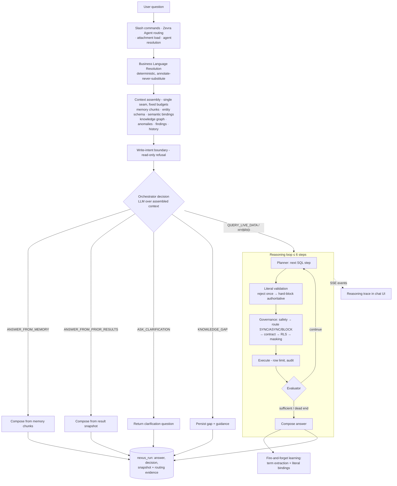

# Conversational Analytics

Conversational Analytics is Zevra's core: the chat experience and the governed question-answering pipeline beneath it. A user asks a business question in their own words; the pipeline resolves their language against tenant metadata, decides how the question should be answered, plans and executes SQL one validated step at a time through the full governance chain, and composes an answer with a visible reasoning trace. Every other Zevra capability either feeds this pipeline, consumes it, or is routed to from inside it — this page is the reference the rest of the corpus points at.

## Platform Position

Conversational Analytics is the **primary reasoning engine and the platform's governance anchor**: it is the one execution path where the Semantic Foundation's full contract — resolution, constrained planning, deterministic validation, governed execution, provenance — is actually enforced end to end.

**It owns:**

- The chat experience: conversations, runs, attachments, feedback, the reasoning trace, and SSE progress streaming
- The **orchestrator** — the decision of *how* each question is answered (live data, memory, prior results, clarification, knowledge gap)
- **Context assembly** — the single seam deciding what every model stage sees, under fixed budgets
- The **iterative reasoning loop** — bounded plan → validate → govern → execute → evaluate
- Run persistence, conversation retention, and the routing/audit evidence for every answer

**It consumes:**

- The **Semantic Foundation stores**: business language resolution, entity/vocabulary bindings, literal candidates and value domains, learned vocabulary, the knowledge graph
- **AI Memory** (top-K chunks per question), the **enterprise map** (schema context), **temporal anomaly context**, and prior operational findings
- The **governance chain**: SQL safety, query governance (routing, row limits, async), data contracts, row-level security, column masking, governance audit
- The **connection registry** and shared SQL execution; the **AI client**; **usage tracking**

**What depends on it:**

- **Scheduled Reports** — every report question is a full pipeline call; report behavior *is* this pipeline's behavior
- **Semantic learning** — the learning lifecycle feeds on this pipeline's successful runs, feedback, and validated literal bindings
- The **chat UI** and conversation history surfaces

**It explicitly does NOT own:**

- **Business meaning** (the semantic stores it reads), **the agent runtime** (it routes *to* Zevra Agents but does not run their loop), **governance policy** (contracts, RLS rules, masks are governance-owned; the pipeline invokes them), and **the model's judgment** — plans are proposals; the runtime verifies and constrains, never authors.

## Purpose

Databases answer SQL; businesses ask questions. Between the two sits everything that makes an answer *right*: which tables a concept lives in, what "overdue" means to this company, which literal values a status column may legally hold, and whether a generated query is safe, contract-compliant, and permitted for this user. Conversational Analytics exists to close that gap without trusting any single component blindly: deterministic machinery resolves and constrains, AI interprets and plans within what it was offered, and validation stands between every proposal and every database.

## Business Value

- **Questions in the tenant's own language.** Abbreviations, house jargon, and half-remembered names resolve deterministically against tenant-owned vocabulary before any model reasons — and the system learns new language from validated use.
- **Answers with receipts.** Every answer carries its reasoning trace: how terms were resolved (and from which trust tier), which SQL ran, what each step found, why the evidence was judged sufficient.
- **Governed by construction.** No generated SQL touches a database except through safety validation, contract checks, row security, masking, and audit — with rejection-and-replan, never silent rewriting.
- **Honest failure modes.** A refused write, a clarification request, a recorded knowledge gap, and an honest empty result are all first-class outcomes — preferred over plausible answers with hidden assumptions.

## User Experience

**Asking.** The chat page accepts a question, optionally with an attached file (processed into text and injected as reference data) and an agent selection. While a live-data investigation runs, an SSE stream renders the reasoning trace in real time — steps starting, executing, being rejected or blocked — before the final answer arrives with its data table.

**The answer.** Narrative answer, the supporting rows, the decision type, quick refinement suggestions, and the expandable reasoning trace: resolutions ("SBD" → its canonical entity, with tier and source), validated literal choices ("TX" → `state = 'Texas'`, AI choice validated against legal values), and each SQL step with its evaluator verdict.

**Conversations.** Multi-turn context: follow-ups see recent history, and questions about the previous answer ("show me the SQL you used") are answered from the stored result snapshot. Conversations from the last three days are listed; any can be pinned to survive retention, deleted by the owner, or reopened with full data tables restored.

**Feedback.** Thumbs up reinforces the learned term mappings that contributed to the answer; a knowledge-gap rating files a gap record for stewards.

**Slash commands.** `/knowledge` proposes new curated knowledge, `/request-source` requests a data connection, `/async` forces heavy execution onto the async path.

## Key Concepts

| Concept | Meaning |
|---|---|
| **Run** | One question → one answer: the persisted unit carrying question (verbatim), answer, decision type, status, and result snapshot. |
| **Conversation** | A sequence of runs sharing an id; the last 8 runs inform routing and the last 4 render into model context. Unpinned conversations are purged after a retention window. |
| **Decision type** | The orchestrator's routing verdict: `QUERY_LIVE_DATA`, `HYBRID_DOC_AND_DATA`, `ANSWER_FROM_MEMORY`, `ANSWER_FROM_PRIOR_RESULTS`, `ASK_CLARIFICATION`, `KNOWLEDGE_GAP` — plus `ZEVRA_AGENT` (routed out) and `READ_ONLY_BOUNDARY` (refused write intent). |
| **Resolution** | A deterministic mapping of a question term to an existing referent (entity, vocabulary term, domain value), annotated onto the question — never substituted into it — with trust-tier provenance. |
| **Literal candidates** | Persisted legal/observed values offered to the planner for unresolved literal-shaped terms; the planner chooses, the runtime validates the choice before execution. |
| **Reasoning session** | The live-data investigation: up to 6 planned steps, each executed through the governance chain and judged by an evaluator (sufficient / dead end / continue). |
| **Evidence** | The accumulated step results the planner and evaluator see, and the source of the composed answer and the run's result snapshot. |
| **Enriched question** | The question plus attached-file text — used only by the SQL planner and answer composer; routing and resolution always see the user's raw words. |

## Architecture Overview



Two principles shape the whole design. **Resolution runs once, first** — after agent scope is known, before every keyword-dependent stage — so deterministic selection behaves as if the user had spoken canonically. And **one assembler owns what every model stage sees**: each context block is question-filtered and capped (entity schema to a fixed character budget, graph to matching entities, history to recent turns), so prompt cost is bounded by configuration, never by tenant size.

## Request Lifecycle

The verbatim stage order for `POST /chat/ask`:

1. **Usage context** — the call is tagged `chat` for token attribution.
2. **Slash commands** — `/knowledge` and `/request-source` short-circuit into their own flows; `/async` strips its prefix and flags heavy steps for async execution.
3. **Zevra Agent routing** — the LLM dispatcher matches the raw question against active Zevra Agents (goals + live table names, 0.65 confidence floor). A confident match hands the *entire question* to the agent runtime; the run records `ZEVRA_AGENT` and the pipeline below never runs. Routing or agent failure falls through silently.
4. **Attachment load** — a pre-uploaded attachment's extracted text builds the *enriched question*; the raw question is kept separate and immutable for routing, resolution, and persistence.
5. **Conversation & history** — the conversation id is created or continued; the last 8 runs are loaded.
6. **Agent resolution** — the chat routing agent (domain scope holder; distinct from Zevra Agents): explicit key, the single active agent, or LLM routing over agent purposes.
7. **Run persistence** — the run is saved `RUNNING`; a client-supplied run key lets the UI subscribe to SSE events *before* the pipeline starts.
8. **Business Language Resolution** — deterministic, domain-scoped resolution of question terms to stored referents. Zero matches or any failure yields an empty result and a byte-identical downstream pipeline (fail-open by contract).
9. **Memory retrieval** — top-6 memory chunks by cosine similarity on the raw question, scoped to the agent's domains.
10. **Context gathering** — enterprise-map operational context (relevance-ranked per-table blocks), semantic context with entity/vocabulary bindings, the 5 most recent operational findings, and anomaly context.
11. **Write-intent boundary** — write-shaped questions are refused with the read-only answer (`READ_ONLY_BOUNDARY`), pointing at workflow integrations.
12. **Prior-result check** — the conversation's latest result snapshot is located.
13. **Orchestrator decision** — one LLM call over the assembled context summary returns the decision JSON; the routing rules prefer fresh data over stale, forbid clarification when literal candidates exist, and treat prior-results as answer-about-the-answer only. A failed call defaults to `ANSWER_FROM_MEMORY` — fail-open.
14. **Branch execution** — per the decision (see Architecture Overview). For live data: a reasoning session is created; the planner context is assembled (resolutions block, literal candidates block, filtered knowledge graph, budgeted entity schema, agent playbook, learned vocabulary, last 4 turns); the reasoning loop runs; the answer is composed from the evidence; validated literal bindings and successful term usage are dispatched to the governed learning lifecycle, fire-and-forget.
15. **Completion** — the run is updated `COMPLETE` with answer, decision type, and result snapshot; routing evidence (decision, agent, memory-chunk count, resolution provenance) is persisted; resolutions and validated literals join the reasoning trace; quick refinements are generated; the response returns everything the UI renders.
16. **Failure** — any uncaught exception marks the run `FAILED` with the error as the answer text and surfaces a 500. There is no automatic retry of a run.

## Core Components

| Component | Responsibility |
|---|---|
| `ChatController` | REST surface: ask, feedback, conversation list/restore/delete/pin, async-execution lookup |
| `ChatService` | The pipeline: stages 1–16 above; context assembly ownership; answer composition; the orchestrator call |
| `BusinessLanguageResolver` | Deterministic term → referent resolution with trust-tier provenance and retrieval expansion |
| `ReasoningEngine` | The bounded loop: plan, literal validation, governance chain, execution, audit, evaluation, SSE publication |
| `ReasoningPlanner` / `ReasoningEvaluator` | The two model roles inside the loop: author the single best next step; judge evidence sufficiency |
| `LiteralValidator` | Deterministic literal-existence validation against value domains: reject-with-legal-list once, hard-block repeat violations on authoritative domains, advise on sampled ones — fail-open on its own errors |
| `QueryGovernanceService` | SQL safety validation, row estimation, SYNC/ASYNC/BLOCK routing, row limits; the async execution queue (5-second poller) |
| `DataContractService` / `RowLevelSecurityService` / `ColumnMaskingService` / `GovernanceAuditService` | The governance chain proper: contracts, RLS, masking, audit records |
| `SemanticService` / `EnterpriseMapService` / `KnowledgeGraphService` | Context suppliers: bindings and vocabulary, per-table schema blocks, graph entities |
| `SemanticLearningService` / `LearningContextBuilder` | The learning lifecycle: capture from runs/feedback/literal bindings; inject learned vocabulary into planner context |
| `ReasoningEventBus` | SSE fan-out per run: step events, blocks, async handoffs, answer-ready |
| `RunRepository` / `ConversationRetentionService` | Run and evidence persistence; nightly purge of unpinned conversations past retention |
| `Chat.jsx` / `ReasoningTrace.jsx` | The chat UI and the live trace renderer |

## Data & Metadata

All stores are **schema-resident per tenant**:

- **`nexus_run`** — one row per question: conversation id, routed agent, user, verbatim question, answer, decision type, status, result snapshot (the rows behind the answer, reused for follow-ups and UI restore).
- **Run evidence** — typed records per run: `ROUTING` (decision, agent, memory-chunk count, resolution provenance) and `FEEDBACK` (ratings, comments).
- **Reasoning sessions & steps** — the live-data investigations: per-step description, SQL, status (including `LITERAL_REJECTED`, `LITERAL_BLOCKED`, `BLOCKED`, `CONTRACT_BLOCKED`), evaluator verdicts, timings.
- **Query executions** — the governance-issued execution records, including the async queue and its results.
- **Attachments** — uploaded files with extracted text and summaries.
- **Knowledge gaps** — filed by the orchestrator and by user feedback.
- **Conversation pins** — per-user pins exempting conversations from retention.

Retention: a nightly job (2:00 UTC) deletes runs and evidence in **unpinned** conversations older than the configured window (default 3 days); pinned conversations are kept forever. The conversation list shows the same window.

## AI Responsibilities

The pipeline's defining discipline is the split between what is derived and what is judged.

**Deterministic runtime** — language resolution and retrieval expansion; literal-candidate offering and existence validation; context assembly with every filter and budget; the write-intent boundary; SQL safety validation, routing, row limits; contracts, RLS, masking, audit; step and retry bounds; evidence and trace persistence; retention; SSE delivery; the learning lifecycle's thresholds and gates.

**AI reasoning** — five bounded judgments:

1. **Zevra Agent dispatch** — does this question belong to a configured agent? (Confidence-thresholded; fail-through.)
2. **Chat agent routing** — which domain scope applies, when more than one agent exists.
3. **The orchestrator decision** — how the question should be answered, chosen from a closed set over the assembled context. (Fail-open to memory.)
4. **Planning** — inside the loop, the single best next SQL step: interpretation, investigation strategy, SQL authorship, and the choice among offered literal candidates — always over what was offered, with every proposal validated afterward.
5. **Evaluation & composition** — is the evidence sufficient, and what does it mean in business terms.

Model output never becomes stored truth directly: resolutions point only at existing referents, invalid literals are rejected with the legal list (never rewritten), and learned language crosses into curated vocabulary only through the thresholds-plus-review lifecycle.

## Integration with Other Capabilities

- **Semantic Foundation — fully engaged.** This pipeline is the Foundation's runtime: resolution first, offered-set ambiguity, immutable questions, capped prompt sections, provenance in every trace, governed learning. The contracts other capability pages cite are enforced *here*.
- **AI Memory — every question.** Top-K retrieval feeds the orchestrator and memory-grounded answers; `ANSWER_FROM_MEMORY` and `HYBRID` decisions are its consumers.
- **Autonomous Agents — routed out, at the top.** The Zevra Agent dispatcher runs before everything else; matched questions leave this pipeline entirely (and its governance) for the agent runtime. This is the pipeline's largest governance exception, inherited by anything that calls `ask()`.
- **Scheduled Reports — the biggest consumer.** Reports replay their questions through this pipeline verbatim; every report section is one of these runs.
- **Temporal Intelligence / Alerts** — anomaly context is injected into orchestrator and planner prompts; alert emails deep-link back to chat. Alerts themselves fire independently.
- **Workflow Automation** — boundary only: the read-only refusal points users toward workflow integrations; no runtime integration.
- **Executive Brief** — none directly (the brief uses the agent runtime); they share only the platform's stores.
- **Knowledge Graph & Connection Registry** — graph entities join planner context (keyword-filtered); every executed step targets a registered connection.

## Security & Governance

- **Authenticated, tenant-scoped.** Every endpoint requires an authenticated user; all stores are schema-resident; conversations, feedback, and async results are owner-verified.
- **Read-only is enforced twice.** The write-intent boundary refuses write-shaped questions before planning, and the SQL safety validator (SELECT-only, no statement chaining, keyword blacklist, no `SELECT *`) gates every planned statement regardless.
- **The full governance chain, in order, every step:** safety validation → governance routing (row estimation; oversized queries go async or are blocked) → data contracts (blocking violations audited) → row-level security → column masking → execution under a row limit → governance audit record with original SQL, executed SQL, and applied policies. Rejection returns the reason (including legal alternatives) to the planner for a bounded replan — the runtime never edits SQL.
- **Deterministic literal gating.** Literals aimed at value-governed columns must exist in the governed set: one rejection with the legal list, hard-block on repeat violations against authoritative (complete) domains, advisory-only on sampled ones — enforcement strength follows metadata honesty.
- **Everything is traced.** Resolutions with trust tiers, literal choices with validation source, every step's SQL and verdict, and the routing evidence — in the response, the trace, and the stores.
- **The known exception:** Zevra Agent routing exits this governance envelope before it begins. Within this pipeline the chain is complete; the platform-level gap lives in the surfaces documented on the [Autonomous Agents](autonomous-agents.md#security-governance) page.

## Configuration

| Property | Default | Effect |
|---|---|---|
| `nexus.context.max-entity-chars` | `1500` | Character budget for the entity-schema block in every planner/orchestrator prompt |
| `nexus.retention.conversation-days` | `3` | Unpinned-conversation retention window (purged nightly at 2:00 UTC) |
| `nexus.query-governance.max-async-rows` | `10000` | Row-estimate ceiling for async execution; beyond governance rules, blocks |
| `nexus.query-governance.async-timeout-seconds` | `90` | Async execution timeout |

Code-level bounds: 6 reasoning steps per session; one literal re-prompt before hard-block; 8 history runs loaded / 4 rendered into context; 5 recent findings; top-6 memory chunks; 600-character history answer truncation; 5-second async queue poller; SSE buffers with TTL.

## Operational Flow

```mermaid
sequenceDiagram
    actor User
    participant UI as Chat UI
    participant CS as ChatService
    participant SEM as Semantic layer
    participant ORC as Orchestrator model
    participant RE as ReasoningEngine
    participant GOV as Governance chain
    participant DB as Governed database

    User->>UI: Question (+ attachment, agent)
    UI->>CS: POST /chat/ask (clientRunKey)
    UI->>CS: SSE subscribe (runKey)
    CS->>CS: Zevra Agent dispatch? (exit if matched)
    CS->>CS: Save run RUNNING
    CS->>SEM: Resolve language (deterministic, fail-open)
    CS->>CS: Assemble context (memory, schema, graph, anomalies, history)
    CS->>ORC: Decision over context
    ORC-->>CS: e.g. QUERY_LIVE_DATA
    loop ≤ 6 steps
        RE->>RE: Plan next step (model, over evidence)
        RE->>RE: Literal validation (reject once / hard-block)
        RE->>GOV: safety → route → contract → RLS → mask
        GOV->>DB: Execute (row limit)
        DB-->>RE: Rows → evidence + audit record
        RE-->>UI: SSE step events
        RE->>RE: Evaluator: sufficient?
    end
    CS->>CS: Compose answer; capture learning (fire-and-forget)
    CS->>CS: Run COMPLETE + snapshot + routing evidence
    CS-->>UI: Answer, trace, data, refinements
```

Failure semantics: every advisory layer fails open toward the baseline (resolution → empty, orchestrator → memory, literal validator → advisory, learning → skipped); every enforcement layer fails closed (safety, contracts, RLS, masking, literal hard-blocks). Blocked and dead-end steps end the loop visibly with the reason in the trace; async-routed steps return an execution key the client polls. The single catch-all marks the run `FAILED` — there is no run-level retry; retries exist only *inside* the loop as bounded replans.

## Current Limitations

- **The agent-routing exit.** The pipeline's own governance is complete, but its front door isn't: a confident Zevra Agent match bypasses resolution, orchestration, and the governance chain for that question — and every caller of `ask()` (users, reports) inherits this silently.
- **The orchestrator is a single un-validated judgment.** One model call chooses the decision type; a wrong choice (memory instead of live data, clarification instead of candidates) is executed faithfully with no deterministic cross-check, and its fail-open default (`ANSWER_FROM_MEMORY`) can mask decision-stage outages as thin answers.
- **Synchronous request-thread execution.** A live-data run (up to 6 planned steps, each with model calls and queries) holds the HTTP request; there is no run-level timeout or cancellation — only the per-query timeout and step cap bound the wait.
- **Conversation context is shallow and lossy.** Four rendered turns with 600-character answer truncation; long investigations and older context silently fall away, and follow-ups against evicted context re-derive from scratch.
- **Prior-result answers can go stale invisibly.** `ANSWER_FROM_PRIOR_RESULTS` reasons over the stored snapshot with no freshness check beyond the orchestrator's own routing discipline.
- **Write-intent detection is heuristic.** The read-only boundary is a keyword-shaped check on the question; the real guarantee rests on the SQL safety validator downstream.
- **Clarifications are single-shot.** A clarification answer is returned as a normal run; nothing links the user's follow-up to the pending clarification beyond ordinary conversation history.
- **Short default retention.** Three days for unpinned conversations — analytical history vanishes quickly unless users pin; evidence and reasoning sessions purge with the runs.
- **Attachment trust.** Attached-file content is injected into planner prompts as reference data with no content screening — prompt-injection surface for anyone who can upload.
- **Quick refinements and hypothesis text are unvalidated model output** attached to the response verbatim.
- **The `/async` path is bounded but sparse:** queued executions are pollable by key, but nothing notifies the conversation when results land.

## Ownership

Following the Zevra ownership model — one owner per responsibility:

| Responsibility | Owner | Notes |
|---|---|---|
| **Business Owner** | Tenant stewards, via the semantic stores | Own every meaning the pipeline resolves against: entities, vocabulary, value domains, curated knowledge. The pipeline reads; stewardship writes. |
| **AI** | Interpretation only | Routing judgments, the orchestrator decision, step planning and SQL authorship over offered context, evidence evaluation, answer composition. Proposals all — validated, never trusted. |
| **Runtime** | Zevra engineering (assembler + engine + chain invocation) | Owns what every model sees, every cap and budget, validation order, failure posture (advisory fail-open, enforcement fail-closed), persistence, and the trace. Meaning-blind throughout. |
| **Governance** | The governance chain — **fully engaged on this path** | Safety, routing, contracts, RLS, masking, audit gate every executed step. This pipeline is the reference posture other surfaces are measured against. |
| **Metadata** | The tenant-scoped conversational stores | Runs, evidence, sessions, executions, gaps, pins — written only by this pipeline's lifecycle. Semantic stores remain their own owners. |
| **Human Stewardship** | The tenant's people | Curate the language the pipeline resolves against, review learned mappings, triage knowledge gaps, and judge answers through feedback — the loop's human half. |

## Stabilization Checklist

What must be validated for the platform's anchor capability. Every consumer — reports today, future capabilities tomorrow — inherits exactly what is verified here. Validation work only.

**Request lifecycle & decisions**

- [ ] Stage-order verification: resolution before every keyword-dependent stage; raw question immutability end-to-end (routing, persistence, trace).
- [ ] Full decision-type matrix: each of the six orchestrator outcomes plus `ZEVRA_AGENT` and `READ_ONLY_BOUNDARY`, produced and persisted correctly.
- [ ] Orchestrator routing quality: fresh-data-over-stale discipline, the literal-candidates-forbid-clarification rule, and the fail-open default's frequency in production.
- [ ] Follow-up behavior: prior-results vs live-data boundary on real conversation patterns; snapshot restore fidelity in the UI.

**Semantic resolution & literals**

- [ ] Zero-metadata byte-identity: a tenant with no semantic stores produces the baseline pipeline exactly (the fail-open contract).
- [ ] Resolution correctness and provenance across trust tiers; ambiguity offered, never auto-broken.
- [ ] Literal gating: reject-with-legal-list once, hard-block on authoritative repeat, advisory on sampled — and the fail-open validator error path.
- [ ] Learning capture: successful runs, positive feedback reinforcement, and literal bindings enter the lifecycle without ever bypassing thresholds.

**Governance chain**

- [ ] Chain order and completeness on every executed step: safety → route → contract → RLS → mask → limit → audit; audit records reconstruct original vs executed SQL and applied policies.
- [ ] Rejection-never-rewriting: blocked steps replan with the reason; verify no path edits SQL or the question.
- [ ] Async routing: row-estimate thresholds, queue execution, timeout, ownership-verified retrieval.
- [ ] Write-intent boundary coverage versus the safety validator as the real guarantee — measure what slips past the heuristic and confirm the validator catches it.

**Context assembly**

- [ ] Every budget holds under adversarial tenant size: entity chars, graph filtering, memory count, history depth — no prompt section scales with metadata volume.
- [ ] Relevance ranking spends the budget on question-relevant tables; the no-sources and no-memory context branches route honestly.
- [ ] Attachment flow: enriched-question separation (planner/composer only), extraction fidelity, and hostile-content behavior in planner prompts.

**Reasoning loop**

- [ ] Step cap, evaluator verdicts (sufficient / dead end), and no-plan termination — all terminal states intelligible in the trace.
- [ ] Multi-step investigations on representative questions: join quality, cross-source merging, evidence sufficiency judgment.
- [ ] SSE fidelity: pre-subscription via client run key, event completeness per step, stream closure on answer and on failure.

**Conversation & persistence**

- [ ] Retention: nightly purge respects pins, deletes evidence with runs; conversation list window matches; user deletion is owner-scoped.
- [ ] Snapshot lifecycle: size behavior on large results, restore correctness, staleness exposure in prior-result answers.

**Failure recovery & retry**

- [ ] Advisory layers fail open (resolution, orchestrator, literal validator, learning) — each verified independently; enforcement layers fail closed.
- [ ] Catch-all failure: run `FAILED`, SSE closed, UI messaging; confirm no partial-answer persistence.
- [ ] Agent-dispatch fail-through leaves an intelligible abandoned run and a clean fallback answer.

**Multi-tenancy & security**

- [ ] Schema isolation across every store this pipeline writes; cross-tenant run/conversation/execution access fails closed.
- [ ] Prompt injection via question, attachment, memory chunks, and data values in evidence — measure steerability of the orchestrator and planner.
- [ ] No credentials, internal keys, or unmasked governed data in answers, traces, SSE events, or snapshots (masking applies before execution — verify snapshots store masked rows).

**Performance**

- [ ] End-to-end latency distribution by decision type; live-data tail with 6-step sessions on the request thread.
- [ ] Zevra Agent dispatch overhead on every question when agents are active.
- [ ] Token cost per decision type; usage attribution across chat, and correctness when invoked by reports.

**Auditability**

- [ ] One answer, fully reconstructed after the fact: routing evidence → resolutions and tiers → each step's SQL, policies, and verdicts → the snapshot — end to end, from stores alone.
- [ ] Feedback records join the run's evidence; knowledge gaps trace to their runs.

## Related Documentation

Pages that should reference this capability (unwritten pages are marked *planned*):

- [Capabilities overview](index.md) — section landing
- [Scheduled Reports](scheduled-reports.md) — replays its questions through this pipeline; inherits every behavior documented here
- [Autonomous Agents](autonomous-agents.md) — the routed-out runtime at this pipeline's front door
- [AI Memory](ai-memory.md) — retrieval feeds every question; memory-grounded decisions consume it
- [Alerts](alerts.md) — anomaly context enters this pipeline's prompts; alert links land here
- [Executive Brief](executive-brief.md) / [Workflow Automation](workflow-automation.md) — sibling capabilities; boundary-only relationships
- [Semantic Foundation](../architecture/semantic-foundation.md) — the constitution this pipeline implements; its contracts are enforced here
- *SQL Governance* (planned, `architecture/`) — the chain documented in action on this page
- *Request Lifecycle* (planned, `runtime/`) — the stage-by-stage runtime deep-dive this page summarizes
- *Business Language Resolution* and *Deterministic Literal Resolution* (planned, `architecture/`) — the resolution machinery consumed at stages 8 and 14
- *Chat API* (planned, `api/`) — endpoint reference for `/chat/*`
- *Tenancy & Isolation* (planned, `platform/`) — the schema-resident store model
- *Configuration Reference* (planned, `operations/`) — budgets, retention, and governance thresholds
