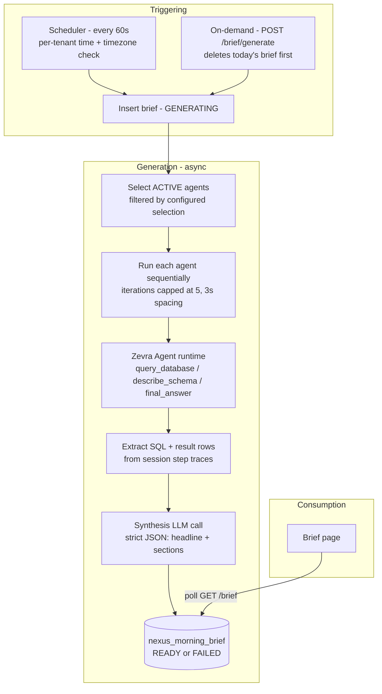
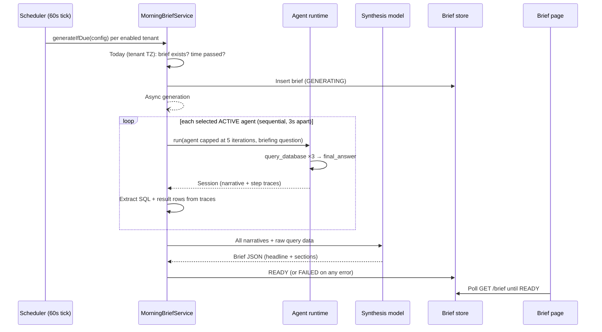

# Executive Brief

Executive Brief (shown in the product as the **Morning Brief**) is Zevra's daily operational briefing. On a per-tenant schedule — or on demand — Zevra's autonomous agents each investigate their operational domain with real SQL queries, and a synthesis step formats their findings into a single structured brief: a headline, what needs attention, an operational snapshot with metrics, a key insight, and what's working. Executives read the day's state in under three minutes without asking a single question.

## Platform Position

Executive Brief is a **consumer capability**: it sits on top of [Autonomous Agents](autonomous-agents.md) (the Zevra Agent runtime) and owns only the briefing lifecycle around them.

**It owns:**

- The per-tenant briefing schedule (time, timezone, enabled flag) and the agent selection for the brief
- The daily brief record — one per tenant per day — and its status lifecycle
- The briefing question given to each agent, and the synthesis that turns agent findings into the executive format
- The Brief page and the brief API

**It explicitly does NOT own:**

- **Agents.** Their goals, personas, connections, and lifecycle belong to the Zevra Agents capability; the brief only selects and runs them with a capped iteration budget.
- **Data access.** Queries execute through the shared SQL execution service against the tenant's connection registry — the brief adds no data-access path of its own.
- **Business meaning.** What counts as "needing attention" emerges from each agent's configured goal and the data itself; no domain rules live in brief code.
- **Delivery beyond the product.** The brief renders in the UI; no email or external delivery path exists (see Current Limitations).

## Purpose

Every capability elsewhere in Zevra answers questions the user asks. The Executive Brief inverts that: it is the platform's one *proactive* surface, existing so that the day's operational state — backlogs, anomalies, stable queues, notable totals — reaches leadership before anyone thinks to ask. It turns the tenant's configured agents from on-demand investigators into a standing morning routine.

## Business Value

- **The day starts with answers.** A scheduled brief is ready when the executive arrives, in their timezone, built from their organization's live data.
- **Grounded numbers, not model prose.** Synthesis receives the agents' actual SQL statements and result rows — not just narratives — and is instructed to use only what agents found and to treat zero counts as real findings.
- **Attention is triaged.** The format leads with what needs attention (with severities), then a metric snapshot, one insight, and what's working — a fixed reading order tuned for a three-minute read.
- **Coverage follows the tenant's own agents.** Each active agent investigates its configured goal, so brief coverage grows with the tenant's agent estate, not with platform releases.

## User Experience

**Reading.** The Brief page greets the user and shows today's brief: headline, a red-bordered *Needs Attention* section with severity-marked items, an *Operational Snapshot* metric grid, *Key Insight*, and *What's Working*. The page polls while a brief is generating and offers regeneration when one fails or is stale.

**Generating on demand.** A refresh action deletes today's brief and regenerates it immediately — useful after data changes or a failed run. Generation is asynchronous; the page shows progress until the brief is ready.

**Configuring.** Tenant configuration covers the schedule time (`HH:mm`), timezone, an enabled flag, recipient emails (stored, currently not delivered to), and which agents contribute — an empty selection means *all active agents*.

## Key Concepts

| Concept | Meaning |
|---|---|
| **Brief** | One generated briefing per tenant per day (enforced by a unique constraint): headline, sections JSON, contributing agents, status. |
| **Status lifecycle** | `GENERATING → READY` or `FAILED`. A brief stuck in `GENERATING` beyond 10 minutes is marked `FAILED` on next read. |
| **Brief day** | Determined in the tenant's configured timezone, not the server's — the day rolls over on the executive's clock. |
| **Contributing agent** | An `ACTIVE` Zevra Agent selected for the brief (or all active agents when none are selected), run with its iterations capped at 5. |
| **Briefing question** | A fixed template instantiated with each agent's own goal: run exactly three queries (state distribution, records needing attention, one more relevant metric), then report with actual numbers. |
| **Synthesis** | A single LLM formatting call that turns all agent narratives *and their raw query results* into the strict brief JSON schema. |
| **Section types** | `urgent` (items with `HIGH`/`MEDIUM` severity), `snapshot` (labeled metrics with trend direction), `insight`, `working`. |

## Architecture Overview

The pipeline is deliberately two-stage: **investigation** is delegated to the agent runtime (each agent reasons over its own connections and schema context), and **synthesis** is a single formatting call that may only arrange what the agents found. Agent failures are per-agent fail-soft — a failing agent is logged and skipped, and the brief is built from the agents that succeeded.

## Core Components

| Component | Responsibility |
|---|---|
| `MorningBriefScheduler` | Every 60 seconds, loads all enabled tenant configs and asks the service to generate any brief that is due |
| `MorningBriefService` | The whole lifecycle: due-check in tenant timezone, agent selection and capped runs, query-result extraction, synthesis, persistence, stuck-brief reconciliation |
| `MorningBriefRepository` | Persistence for briefs and per-tenant config (upsert) |
| `MorningBriefController` | REST surface: today's brief, on-demand generation, config get/save |
| `AgentRunner` / `AgentToolRegistry` | The Zevra Agents runtime the brief invokes — ReAct loop with `query_database`, `describe_schema`, `analyze_image`, `final_answer` tools |
| `Brief.jsx` | The Brief page: greeting, section renderers, generation polling |

## Data & Metadata

Both tables live in the platform (`public`) schema, keyed by tenant:

- **`nexus_morning_brief`** — one row per tenant per day (unique on tenant + date): status (`GENERATING`/`READY`/`FAILED`), headline, sections as JSONB, the contributing agent names, generation and creation timestamps. Regeneration deletes today's row first; prior days' rows remain in the table but are not exposed through the API.
- **`nexus_morning_brief_config`** — one row per tenant (cascade-deleted with the tenant): schedule time, timezone, enabled flag, comma-separated recipient emails, and the selected agent ids (empty = all active).

The sections JSON is stored exactly as synthesized and parsed on the way out; its shape is the synthesis contract (`urgent`/`snapshot`/`insight`/`working` sections with items, metrics, and content).

## AI Responsibilities

Deterministic runtime and AI reasoning divide cleanly:

**Deterministic runtime** — scheduling and the due-check (timezone math, one-per-day constraint), agent selection and iteration capping, sequential run orchestration, extraction of SQL statements and result rows from agent step traces, JSON parsing and persistence, status lifecycle including the 10-minute stuck-generation timeout, and the fallback brief when no agent produced data.

**AI reasoning** — exactly two roles:

1. **Agent investigation.** Each contributing agent's LLM decides which three queries satisfy the briefing template for *its* goal, over the schema context it is given, through the agent runtime's tools. The template constrains the shape (state distribution, needs-attention filter, one further metric) but never names tables or columns — no business meaning is hard-coded.
2. **Synthesis formatting.** One LLM call receives every agent's narrative plus its raw query data and produces the brief JSON under strict instructions: numbers over adjectives, lead with the most important finding, zero counts are data, never invent numbers, omit the urgent section only when genuinely nothing needs attention.

The AI writes no store directly: synthesis output is parsed and persisted by the runtime, and a malformed synthesis response fails the brief visibly rather than storing something partial.

## Integration with Other Capabilities

- **Zevra Agents (autonomous agents) — the core dependency.** The brief runs the tenant's own agents through the shared agent runtime and reads their persisted sessions' step traces. Agent configuration (goal, persona, connections, status) entirely determines brief coverage. Note these are the autonomous `ZevraAgent`s, distinct from the chat pipeline's routing agents.
- **Connections registry.** Agents query through the tenant's approved connections; each agent is restricted to its own connection allow-list.
- **Usage tracking.** Brief-driven AI calls are tagged with a `brief` usage context per agent, so token cost attribution separates briefs from chat and other surfaces.
- **Alerts, Reports, Workflow Automation, AI Memory, conversational platform — no integration.** The brief neither reads alert rules, scheduled reports, workflows, nor document memory, and it does not touch the chat pipeline. The scheduled-report service shares the same scheduler *pattern* but no code path. Alert email delivery exists in the Alerts capability only; the brief does not use it.

## Security & Governance

- **Authenticated API.** All brief endpoints require an authenticated user and operate on the caller's tenant context; there is no public surface.
- **Tenant isolation.** Brief and config rows are keyed by tenant schema (config rows cascade-delete with the tenant); scheduled generation sets the tenant context for the duration of each tenant's run and clears it afterward.
- **Connection allow-lists enforced in code.** An agent may only query connections it is explicitly granted; violations are rejected before execution.
- **Execution bounds.** Agent iterations are capped at 5 for brief runs regardless of the agent's own setting; each query is row-capped at 100 with the shared 30-second timeout; agents run sequentially with fixed 3-second spacing.
- **Governance posture — stated plainly:** the brief runs its agents *through the agent runtime*, so its queries inherit the **full shared governance pipeline** (`SqlGovernancePipeline`) that runtime now uses — SQL safety, contracts, row-level security, masking, classification, routing, row limits, and governance audit, the same chain conversational analytics uses (ADR-0003 A2). Brief queries are governed exactly as agent and conversational queries are; rows are RLS-filtered and column-masked before they reach the brief. The remaining ungoverned SQL path on the platform is [Workflow Automation](workflow-automation.md#security-governance), which does not yet use the shared pipeline.
- **Audit surface.** The brief row records what was published and which agents contributed; the underlying agent sessions persist each run's full step traces (tool calls, SQL, results); and — since A2 — each agent query is written to the platform's **governance audit**, attributed to the caller identity and the agent's governance run.

## Configuration

Per-tenant configuration (API-managed, stored in `nexus_morning_brief_config`):

| Setting | Default | Effect |
|---|---|---|
| `schedule_time` | `07:00` | Daily generation time (`HH:mm`) in the tenant's timezone |
| `timezone` | `UTC` | Governs both the schedule check and the brief's "day"; invalid values fall back to UTC |
| `enabled` | `true` | Disabled configs are skipped by the scheduler; on-demand generation still works |
| `email_to` | — | Comma-separated recipients — stored but not currently delivered to |
| `brief_agent_ids` | empty | Agents contributing to the brief; empty means all `ACTIVE` agents |

Code-level constants (not configuration): 60-second scheduler cadence; 5-iteration cap per agent run; 3-second spacing between agents; 10-minute stuck-`GENERATING` timeout; 100-row cap and 30-second timeout per query.

## Operational Flow

Failure semantics: a failing agent is skipped and the brief proceeds with the rest; if *no* agent produces data, a fixed fallback brief says so. Any error in synthesis, parsing, or persistence marks the brief `FAILED`, which the UI surfaces with a retry. A brief left in `GENERATING` by a mid-run restart is marked `FAILED` when next read, after the 10-minute timeout. A `FAILED` brief blocks the scheduler for the rest of the day — recovery is manual regeneration.

## Current Limitations

- **Configured email recipients are never emailed.** `email_to` is stored and editable, but no delivery path exists for briefs; the only consumption surface is the UI.
- **No brief history through the API.** Only today's brief is retrievable; earlier briefs remain as rows but have no read surface.
- **Failed scheduled runs do not retry.** The scheduler skips any tenant that already has a brief row for today — including a `FAILED` one — so an unattended failure means no brief that day unless someone regenerates manually.
- **Sequential generation with fixed pauses.** Agents run one at a time with 3-second spacing; brief latency grows linearly with the number of contributing agents.
- **Unmanaged async execution.** Generation runs on the JVM's common pool, invisible to the platform's async executor configuration; a restart abandons in-flight runs (recovered only by the lazy 10-minute timeout on next read).
- **Synthesis output is trusted structurally.** Parsed sections are stored as-is with no schema validation beyond JSON parsing; a structurally odd (but parseable) synthesis result is published verbatim.
- **Three-query template regardless of domain.** Every agent is asked for exactly three queries; domains needing more (or fewer) probes to be honestly summarized are not accommodated.
- **Invalid schedule configs fail silently.** A bad timezone or time string causes the tenant to be skipped with only a server-side log; nothing is surfaced to the tenant.
- **Regeneration deletes before it succeeds.** On-demand regeneration removes today's brief immediately, so a failed regeneration leaves the tenant with no brief where one existed minutes earlier.

## Ownership

Following the Zevra ownership model — one owner per responsibility:

| Responsibility | Owner | Notes |
|---|---|---|
| **Business Owner** | The tenant's leadership | Owns the schedule, timezone, agent selection, and — through the agents' configured goals — what the brief pays attention to. Brief coverage is tenant configuration, not platform code. |
| **AI** | Agent investigation + synthesis formatting only | Agents choose the queries that satisfy the briefing template for their goals; synthesis arranges findings into the fixed format. Neither owns a store, the schedule, or publication. |
| **Runtime** | Zevra engineering (scheduler + service) | Owns the due-check, orchestration, caps (iterations, rows, spacing, timeout), extraction, persistence, and the status lifecycle. Meaning-blind: the briefing template names no tables, columns, or statuses. |
| **Governance** | The platform governance chain — **fully engaged (inherited)** | Brief queries run through the agent runtime, which routes SQL through the shared `SqlGovernancePipeline` (safety, contracts, RLS, masking, classification, routing, row limits, audit) — the same chain conversational analytics uses (ADR-0003 A2). The brief inherits governance without code of its own. Workflow Automation is the only remaining ungoverned SQL path. |
| **Metadata** | Tenant-scoped brief stores | `nexus_morning_brief` and `nexus_morning_brief_config`, written only through the brief lifecycle and config API. |
| **Human Stewardship** | The tenant's people | Enable or disable the brief, choose contributing agents, regenerate on demand — and own the agents themselves, since only human-activated agents can contribute. |

## Stabilization Checklist

What should be validated before additional platform capabilities depend on Executive Brief. Validation work only — no enhancements.

**Functional behavior**

- [ ] Scheduled generation fires once per tenant per day at (or after) the configured time, in the configured timezone, and never twice.
- [ ] On-demand generation and regeneration produce a complete brief and correctly replace today's existing one.
- [ ] Agent selection: configured ids restrict contributors; empty selection uses exactly the `ACTIVE` agents; `DRAFT`/inactive agents never run.
- [ ] Section rendering: all four section types display correctly, including severity markers and metric trend directions.
- [ ] Config round-trip: every field saves, returns, and takes effect on the next cycle.

**Edge cases**

- [ ] Tenant with zero active agents — the fallback brief appears, status `READY`.
- [ ] All agents fail — distinguish this outcome from "no agents" and verify what the executive sees.
- [ ] Timezone edge: schedule at `00:00`, day rollover across DST changes, and an executive reading in the evening of a western timezone.
- [ ] Invalid timezone or `HH:mm` string in config — tenant skipped; verify nothing else breaks and the failure is discoverable.
- [ ] Agent returning narrative but no query data, and vice versa — both should still contribute.
- [ ] Concurrent on-demand generation and scheduler tick for the same tenant — verify the unique constraint prevents duplicates and the loser fails cleanly.

**AI reasoning quality**

- [ ] Agents follow the three-query template: state distribution, needs-attention filter with real status values, one further metric — sampled across domains.
- [ ] Synthesis fidelity: every number in the published brief traces to an agent's actual query result; "never invent numbers" holds under adversarially thin agent output.
- [ ] Zero-count handling: empty queues reported as clear, not omitted or dramatized.
- [ ] Urgent-section discipline: omitted only when nothing needs attention; severities defensible from the data.

**Scheduling**

- [ ] Scheduler behavior when the app was down over a tenant's scheduled time (generates on next tick) and when generation fails (no retry that day — confirm and document operational expectations).
- [ ] Scheduler cadence under many enabled tenants: one tick iterates all tenants sequentially — measure drift at realistic tenant counts.

**Report accuracy / knowledge grounding**

- [ ] Published metrics match direct queries of the same data at generation time, across each contributing agent's domain.
- [ ] Extraction correctness: SQL and result rows pulled from step traces match what the agent actually executed.
- [ ] Headline selection: the "most important finding" leads, verified against sampled briefs by a human reviewer.

**Data freshness**

- [ ] The brief reflects data as of generation time — verify no caching layer serves stale agent results, and that regeneration reflects intervening data changes.
- [ ] Timestamp honesty: `generated_at` matches when the data was queried, within the run's duration.

**Multi-tenant behavior**

- [ ] Brief and config isolation across tenants; a generation error in one tenant never affects another tenant's tick.
- [ ] Tenant context is correctly set and cleared around each tenant's scheduled run — no leakage between consecutive tenants in one tick.
- [ ] Tenant deletion cascades config and orphans no scheduled work.

**Security**

- [ ] All brief endpoints reject unauthenticated calls; users only ever see their own tenant's brief.
- [ ] Connection allow-list enforcement: an agent granted no connections contributes nothing and errors cleanly.
- [x] **(ADR-0003 A1 + A2 — inherited)** Non-SELECT statements cannot execute through the agent query tool: the agent runtime routes SQL through the shared `SqlGovernancePipeline` (safety + read-only execution), which the brief inherits by running agents through that runtime.
- [ ] No connection credentials or secrets appear in step traces, brief sections, or errors.

**Governance**

- [x] **(ADR-0003 A2 — inherited)** The governance gap on agent SQL is closed at the agent runtime (shared `SqlGovernancePipeline`); the brief inherits full governance (safety, contracts, RLS, masking, classification, routing, row limits, audit) with no code of its own.
- [x] **(ADR-0003 A2 — inherited)** Brief-driven queries appear in the platform's governance audit, attributed to the caller identity and the agent's governance run — the same audit surface as conversational queries.

**Performance**

- [ ] End-to-end generation time as a function of agent count (sequential runs + 3s spacing + synthesis); acceptable bounds for the largest expected agent estates.
- [ ] Common-pool usage under simultaneous multi-tenant generation — thread starvation risk at the scheduler tick.
- [ ] Brief table growth over time given rows are never pruned or exposed.

**Auditability**

- [ ] A published brief can be fully reconstructed after the fact: contributing agents, their sessions, the SQL and results behind each number.
- [ ] Config changes (who enabled, who changed the schedule or agent selection) — verify what is attributable today and document the gaps.
- [ ] Usage attribution: brief-tagged AI usage correctly separates brief cost from other surfaces.

## Related Documentation

Pages that should eventually reference this capability (unwritten pages are marked *planned*):

- [Capabilities overview](index.md) — section landing
- [Workflow Automation](workflow-automation.md) — the one remaining SQL path not yet on the shared governance pipeline
- [AI Memory](ai-memory.md) — sibling capability page
- [Autonomous Agents](autonomous-agents.md) — the agent runtime this capability is built on; its stabilization gates this one
- [Alerts](alerts.md) — the platform's other proactive surface, and the only place email delivery exists today
- [Scheduled Reports](scheduled-reports.md) — the sibling scheduled surface whose pattern the brief scheduler mirrors
- *SQL Governance* (planned, `architecture/`) — the chain agent queries must be reconciled with
- [Semantic Foundation](../architecture/semantic-foundation.md) — the ownership and trust contracts cited in the Ownership section
- *Brief API* (planned, `api/`) — endpoint reference
- *Tenancy & Isolation* (planned, `platform/`) — tenant context handling in scheduled, unattended work
- *Configuration Reference* (planned, `operations/`) — code-level bounds and scheduler cadence
