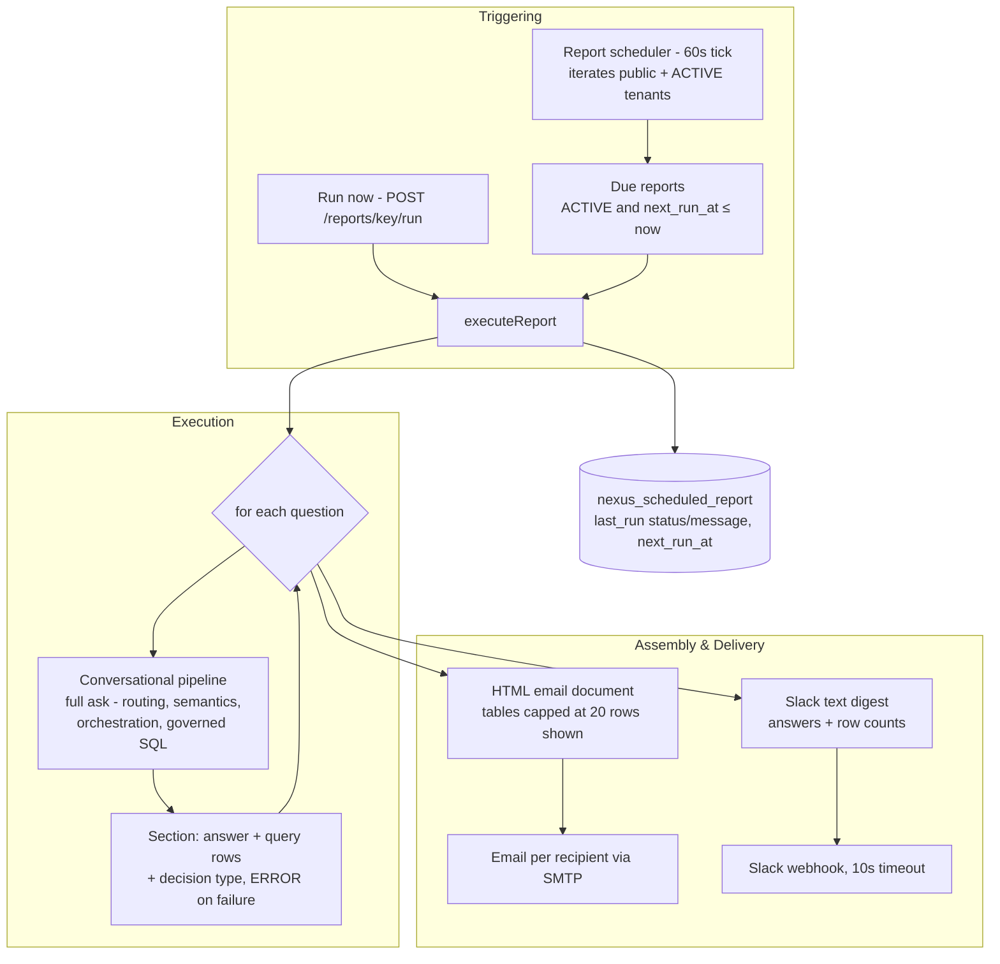

# Scheduled Reports

Scheduled Reports are Zevra's recurring question digests. A tenant pins a named set of natural-language questions — the same questions they would type into chat — to a daily, weekly, or monthly schedule; at each run, Zevra asks every question through its conversational pipeline and delivers the answers, with their supporting data tables, as a formatted email and/or a Slack summary. A report is not a query template or a dashboard export: it is a standing conversation, replayed on a clock.

## Platform Position

Scheduled Reports are a **thin scheduling and delivery shell around the conversational pipeline** — and that makes them architecturally unique among Zevra's proactive surfaces: they are the only one whose data access runs through the platform's governed question path.

**It owns:**

- Report definitions: the question list, the schedule (cadence, time, day, timezone), the channel, and recipients
- The report scheduler (its own 60-second tick), due computation, and the run-status record
- Report assembly and delivery: the HTML email document, the Slack digest, and channel fan-out

**It consumes:**

- **The conversational pipeline** — every question is a full `ask()` call: routing, semantic resolution, orchestration, governed reasoning, and answer composition. Reports have no execution engine of their own.
- **SMTP configuration** and tenant-supplied Slack webhooks (the same platform email identity Alerts use — but not the same delivery code)
- The tenant registry, to iterate schemas on each tick

**What depends on it:**

- Nothing today. No capability reads report definitions or outcomes; recipients' inboxes are the only consumer.

**It explicitly does NOT own:**

- **Question answering.** How a question becomes an answer — including which SQL runs, under what governance — belongs entirely to the conversational platform; reports inherit its behavior verbatim, including its agent routing (see Security & Governance).
- **Report artifacts.** There is no file generation, no export format, no stored report document — the email body *is* the report (see Current Limitations).
- **Notification infrastructure.** Email and Slack sending is implemented locally in this capability; it shares configuration with Alerts, not code, and writes nothing to the in-app notification bell.

## Purpose

Chat answers a question once, for the person who asked. Many operational questions are not one-off: the Monday-morning backlog check, the first-of-month volume summary, the daily exceptions list — the same questions, on a rhythm, for an audience that includes people who never open Zevra. Scheduled Reports exist so a set of questions can be asked *by the platform, on schedule, for everyone on the distribution list* — with exactly the answers chat would have given.

## Business Value

- **A report is authored in plain language.** No query builder, no template language: the questions are the definition, and improving a question improves the report.
- **Answers carry the platform's full intelligence.** Because questions run through the conversational pipeline, reports benefit from semantic resolution, tenant vocabulary, multi-step reasoning, and governed execution — automatically, as those improve.
- **Reaches people outside the product.** Formatted email with answer narratives and data tables, or a Slack digest with findings and row counts — the audience never needs a Zevra login.
- **Honest about partial failure.** A question that fails appears in the delivered report *as a failed section* with its error, and the run is recorded `PARTIAL` — recipients see what worked and what didn't, not a silently thinner report.

## User Experience

**Defining a report** (Reports page). Name, description, the list of questions, an optional agent hint (the chat routing hint, not a Zevra Agent), the schedule — `DAILY`, `WEEKLY` (with day of week), or `MONTHLY` (day 1–28) at a time in a chosen timezone — the channel (`EMAIL`, `SLACK`, `BOTH`), and recipients or webhook. Reports are created `ACTIVE`, can be `PAUSED`, and deletion archives them.

**Running on demand.** A **Run now** action executes the full report immediately — as the caller, not the creator — and returns the run outcome (status, sections, errors). This is both the preview and the delivery-configuration test.

**Receiving a report.** The email is a branded document: header with report name and schedule, then one section per question — the question, the composed answer, and a data table showing up to 20 rows (with a "Showing 20 of N" footer beyond that). The Slack version is a text digest: each question with its answer and a row-count note, plus an "Open in Zevra" button.

**Monitoring.** Each report shows its last run time, status (`SUCCESS` / `PARTIAL` / `FAILED`), last error message, and next scheduled run.

## Key Concepts

| Concept | Meaning |
|---|---|
| **Report** | A tenant-owned definition: named question list (JSON array of strings), optional agent hint, schedule, channel, recipients, status (`ACTIVE`/`PAUSED`/`ARCHIVED`). |
| **Question** | A plain-language string, asked verbatim through the conversational pipeline at each run. There are no parameters, variables, or date placeholders — questions are static text. |
| **Section** | One question's outcome in one run: the question, the pipeline's answer, its query rows, and the pipeline's decision type (or `ERROR`). |
| **Run** | One execution of all questions plus delivery. Outcome: `SUCCESS` (all questions answered), `PARTIAL` (some failed; delivered anyway), `FAILED` (the run itself threw). Only the *latest* run's outcome is stored. |
| **Schedule** | Cadence + `HH:mm` + timezone, with day-of-week for weekly and a 1–28 day-of-month (clamped to short months) for monthly. `next_run_at` is precomputed and re-derived after every run. |
| **Run-as identity** | Scheduled runs ask questions as the report's **creator** (or `system` when absent); manual runs as the caller. The pipeline records runs and usage under that identity. |

## Architecture Overview



The capability has **no execution engine of its own** — the conversational pipeline is the engine. What the report layer adds is a clock, a loop, a document, and a distribution list. This is also why reports were given their own scheduler rather than reusing the temporal stack's: baselines measure a stored SQL statement hourly; reports replay conversations at user-chosen wall-clock times — the same 60-second/tenant-iteration *pattern* as the Executive Brief, implemented separately.

## Lifecycle / Execution Flow

**Report lifecycle.** Created `ACTIVE` with `next_run_at` precomputed in the report's timezone; edited in place (the next run is recomputed only when schedule fields change); `PAUSED` stops scheduling while keeping the definition; deletion sets `ARCHIVED` (soft — the row survives, hidden from listings and the scheduler).

**Run flow**, per due report:

1. **Question loop.** Each question becomes a fresh chat request (new conversation key each time, the report's agent hint attached) asked as the run identity. The pipeline does whatever it would do for a typed question — including routing to a Zevra Agent, asking for clarification, or recording a knowledge gap — and the section captures the answer text, query rows, and decision type. A thrown error becomes an `ERROR` section with the message; the loop continues.
2. **Assembly.** All sections are rendered twice: the HTML email (answers plus row-capped tables, generated timestamp in the report's timezone) and the Slack text digest.
3. **Delivery.** Per the channel: email to each recipient sequentially, and/or one Slack webhook post. Failures are logged; nothing is retried and nothing is persisted about delivery outcomes.
4. **Bookkeeping.** The report row's `last_run_at`, `last_run_status` (`SUCCESS`/`PARTIAL`), `last_run_message` (joined question errors), and the next `next_run_at` are written. A run-level exception instead records `FAILED` with the exception message — and still advances the schedule.

If the application was down past a due time, the report runs on the first tick after restart (`next_run_at <= now`); it does not run multiple times to catch up.

## Core Components

| Component | Responsibility |
|---|---|
| `ScheduledReportService` | The scheduler (60s tick, tenant iteration), the run loop (question → pipeline → section), delivery fan-out, run bookkeeping, and CRUD |
| `ReportScheduleHelper` | Next-run computation in the report's timezone (daily/weekly/monthly with month-length clamping) and the human-readable schedule description |
| `ReportHtmlComposer` | The HTML email document (branded layout, per-section answer + table capped at 20 displayed rows) and the Slack text digest |
| `ScheduledReportRepository` | Upsert-style persistence, due-report query (`ACTIVE` + `next_run_at <= now`), soft-delete |
| `ScheduledReportController` | REST surface: report CRUD and run-now (`/reports`, `/reports/{key}/run`) |
| `ChatService` | The actual execution engine — consumed, not owned |
| `Reports.jsx` | The management UI |

## Data & Metadata

One table, **schema-resident per tenant** (no tenant column; isolation is the per-request/per-tick schema context):

- **`nexus_scheduled_report`** — the definition and its latest outcome in a single row: name, description, questions (JSON text), agent hint, schedule fields (type/time/day-of-week/day-of-month/timezone, CHECK-constrained), channel (`EMAIL`/`SLACK`/`BOTH`), Slack webhook (plain text), email recipients (comma-separated), status (`ACTIVE`/`PAUSED`/`ARCHIVED`), `last_run_at` / `last_run_status` / `last_run_message`, `next_run_at` (partial-indexed for the due query), creator, timestamps.

There is **no run-history table and no artifact store**: each run overwrites the last-run fields, and the delivered document exists only in recipients' inboxes and Slack channels. The de-facto history is a side effect: because every question runs through the chat pipeline, each creates a run record in the conversational store (under a fresh conversation, attributed to the run identity) — reconstructable, but never designed as report history.

## AI Responsibilities

The report layer itself makes **no AI calls**. Its runtime is entirely deterministic: scheduling arithmetic, the question loop, HTML/Slack rendering, delivery, and bookkeeping.

All AI reasoning happens *inside* the consumed conversational pipeline, exactly as for a typed question: orchestrator routing, interpretation, SQL planning, and answer composition — with all of that pipeline's contracts and caps. Report questions are tagged with a `report` usage context, so their model spend is attributed distinctly from chat, agents, and briefs.

The practical consequence: **report quality is chat quality.** A question that confuses the orchestrator in chat confuses it in the report — but on a schedule, to an email audience, with nobody present to rephrase.

## Integration with Other Capabilities

- **Conversational platform — the engine.** Every question is a full pipeline run under the report's run-as identity, with the report's agent hint as the routing hint. Everything the pipeline can decide — query live data, answer from memory, ask for clarification, record a knowledge gap — can appear as a section.
- **Autonomous Agents — inherited, silently.** Chat's top-of-pipeline agent routing applies to report questions: a question matching an active Zevra Agent is answered by that agent (its decision type recorded on the section), which means individual sections can be produced by the *ungoverned* agent runtime rather than the governed pipeline. Nothing in the delivered report distinguishes the two.
- **AI Memory — inherited.** Memory retrieval runs for every question as part of the pipeline; a report question may be answered from the tenant's document knowledge base.
- **Alerts — configuration, not code.** Reports reuse the SMTP identity and (notably) the *alerts'* `app-url` property for links, but implement their own email and Slack sending; the alert delivery service is not invoked, and report deliveries never appear in the notification bell.
- **Executive Brief — pattern sibling.** The same scheduler shape (60-second tick, public + active tenant iteration) implemented independently; no shared code, no shared output.
- **Temporal Intelligence / Workflow Automation — no integration.** Reports do not read baselines or anomalies and cannot trigger or be triggered by workflows.

## Security & Governance

- **Authenticated management.** Report CRUD and run-now require an authenticated user in their tenant context; the creator is recorded.
- **Tenant isolation by schema.** The report table is per-tenant-schema; the scheduler sets and clears tenant context per schema, so due queries, pipeline runs, and bookkeeping all land in the right tenant.
- **The governed path — mostly.** Uniquely among Zevra's proactive surfaces, report data access flows through the conversational pipeline: SQL is planned, validated, and executed under the platform's governance chain (safety, contracts, row security, masking, audit). The exception is inherited: when chat's agent routing hands a question to a Zevra Agent, that section's SQL takes the agent runtime's ungoverned path instead. Reports therefore have the *strongest* governance posture of the proactive surfaces — but not an absolute one, and per section rather than per report.
- **Standing impersonation.** Scheduled runs execute the pipeline as the report creator's identity, indefinitely — surviving role changes and departure (a creator-less report runs as `system`). Whatever the pipeline lets that identity see, the report distributes.
- **Outbound egress.** Answer narratives and up to 20 rows of governed query data per section leave the platform to tenant-configured recipients and plain-text-stored webhooks; nothing validates recipient appropriateness, and deliveries are not recorded anywhere durable.
- **No governance audit of the report layer itself.** Definition changes, runs, and deliveries live in the report row and application logs; the per-question pipeline runs carry their own audit, disconnected from the report that caused them.

## Configuration

Scheduled Reports have **no dedicated configuration properties** — they borrow two:

| Property | Default | Effect |
|---|---|---|
| `nexus.alerts.app-url` | `https://zevra-ui.vercel.app` | Base URL for "Open in Zevra" links in emails and Slack — the alerts capability's property, reused |
| `spring.mail.username` (SMTP_USERNAME) | — | The From identity; when unset, email delivery is silently skipped with a log warning |

Report-level configuration: questions, agent hint, schedule (`DAILY` / `WEEKLY` + day / `MONTHLY` + day 1–28, `HH:mm`, timezone; defaults `WEEKLY` at `08:00` UTC), channel (default `EMAIL`), webhook, recipients, status.

Code-level constants: 60-second scheduler tick; 20 displayed rows per table; 10-second Slack timeouts; timezone and time-parse fallbacks (UTC, 08:00).

## Operational Flow

```mermaid
sequenceDiagram
    participant SCH as Report scheduler (60s tick)
    participant SVC as ScheduledReportService
    participant CHAT as Conversational pipeline
    participant CMP as ReportHtmlComposer
    participant OUT as Email / Slack

    SCH->>SCH: For each schema (public + ACTIVE tenants): set tenant context
    SCH->>SVC: executeReport(each due report, run-as = creator)
    loop each question
        SVC->>CHAT: ask(question, agent hint) as run identity
        CHAT-->>SVC: answer + query rows + decision type
        Note over SVC: failure → ERROR section, continue
    end
    SVC->>CMP: compose HTML + Slack digest
    alt channel EMAIL / BOTH
        SVC->>OUT: send per recipient (sequential)
    end
    alt channel SLACK / BOTH
        SVC->>OUT: webhook post (10s timeout)
    end
    SVC->>SVC: last_run = SUCCESS | PARTIAL; advance next_run_at
    SCH->>SCH: clear tenant context, next schema
```

Failure semantics: question failures degrade to delivered `ERROR` sections (`PARTIAL` run); delivery failures are logged and lost — a `SUCCESS` status means the questions ran, not that anyone received the report; a run-level exception records `FAILED` *after* any deliveries already attempted, and every outcome advances `next_run_at` — there is no retry at any level, only the next cadence. Execution is synchronous on the single scheduler thread: each question is a complete conversational pipeline run (model calls, possibly multi-step reasoning), so a many-question report — or several due reports across tenants — occupies the thread for minutes, delaying every other tenant's due reports.

## Current Limitations

- **No run history and no artifacts.** Only the latest run's status/message survive, overwritten each run; the delivered document is unrecoverable from the platform. The per-question chat run records exist but were never designed as, or linked to, report history.
- **No export formats.** No PDF, CSV, or attachments — the HTML email body is the report, and tables show at most 20 rows regardless of what the question returned.
- **Delivery is unverifiable.** Nothing persists whether an email or Slack post succeeded; `SUCCESS` reflects question execution only. (The same log-only outbound posture as Alerts, without even the in-app record Alerts always write.)
- **Standing creator impersonation.** Scheduled runs act as the creator's identity forever; there is no service identity, no re-consent, and no handling for departed creators beyond a `system` fallback when the field is null.
- **Conversational failure modes ship to recipients.** A pipeline clarification request ("Could you provide more context…") or knowledge-gap response is delivered verbatim as a report section — the pipeline assumes a human who can respond; the report has none.
- **Agent-routing leakage.** Sections silently produced by the Zevra Agent runtime bypass the governance chain the rest of the report enjoys; the delivered document does not distinguish them.
- **Static questions.** No parameters, date ranges, or variables — "yesterday's exceptions" means whatever the pipeline decides it means at run time.
- **One failing email recipient aborts the rest** — the recipient loop shares one try-block (the same flaw as Alerts, independently duplicated).
- **No retry anywhere;** a failed run waits for the next cadence, and a `FAILED` outcome still advances the schedule.
- **Single-thread, synchronous execution.** Question count × pipeline latency × due reports × tenants, all on one 60-second-tick thread; no overlap, no parallelism, no run-level timeout.
- **Duplicated delivery code.** Email and Slack sending re-implement the alert layer's logic (including its JSON-escaping approach) rather than sharing it; fixes must land twice. The unused import of the alert delivery service records the road not taken.
- **Borrowed configuration.** Links depend on the *alerts'* app-url property with a hardcoded environment-specific default.

## Ownership

Following the Zevra ownership model — one owner per responsibility:

| Responsibility | Owner | Notes |
|---|---|---|
| **Business Owner** | Tenant users who author reports | Own the questions, the cadence, the audience, and the channel. The report *is* its questions — entirely tenant data, in the tenant's own language. |
| **AI** | None in this layer | All AI reasoning belongs to the consumed conversational pipeline and follows its ownership; the report layer only schedules, loops, renders, and sends. |
| **Runtime** | Zevra engineering (scheduler + composer + delivery) | Owns the tick, due computation, the question loop and its fail-soft, rendering caps, delivery fan-out, and run bookkeeping. Meaning-blind: no question, metric, or business rule lives in code. |
| **Governance** | The conversational governance chain — **engaged, with an inherited exception** | Report SQL is governed because chat's is; sections routed to Zevra Agents inherit that runtime's documented gap instead. The report layer adds no governance of its own — including none over egress. |
| **Metadata** | The tenant-scoped report store | `nexus_scheduled_report`, written only through the report API and the run bookkeeping. |
| **Human Stewardship** | The tenant's people | Author and tune questions, pause or archive reports, manage recipients, run on demand, and monitor last-run outcomes. |

## Stabilization Checklist

What must be validated before future capabilities depend on Scheduled Reports. Implementation-driven validation only — no enhancements.

**Functional behavior**

- [ ] Create → schedule → run → deliver, end-to-end for each cadence (daily, weekly with each day, monthly including day > month length) and each channel (`EMAIL`, `SLACK`, `BOTH`).
- [ ] Report CRUD round-trip; `PAUSED` stops scheduling immediately; archive hides from listings and the scheduler; question-list edits take effect on the next run.
- [ ] Run-now executes as the caller, returns accurate status/sections/errors, and delivers on the configured channels.
- [ ] Section fidelity: answers, data tables (including the 20-row cap and footer), and decision types match what the pipeline returned.

**Scheduling**

- [ ] `next_run_at` correctness across timezones, DST transitions, month-end clamping (day 28–31 months), and the recompute-only-on-schedule-change edit rule.
- [ ] Downtime catch-up: exactly one run after restart past a due time, never a backlog replay.
- [ ] No double-execution when a run spans multiple ticks, and behavior when a report's run time exceeds its own cadence.

**Pipeline integration**

- [ ] Decision-type coverage: verify what recipients see when the pipeline returns a clarification request, a knowledge-gap response, a read-only boundary message, or a memory-grounded answer — and decide which are acceptable report content.
- [ ] Agent routing: identify how often report questions route to Zevra Agents in practice, and verify section decision types make the path visible to an auditor.
- [ ] Agent-hint handling: valid, invalid, and deleted agent keys.
- [ ] Question failures produce `ERROR` sections and `PARTIAL` runs without suppressing delivery.

**Run-as identity & security**

- [ ] Scheduled runs execute under the creator's identity: verify what that identity gates in the pipeline (agent scope, data visibility) and test creator-deleted and creator-null (`system`) behavior end-to-end.
- [ ] Endpoint authorization on all report routes; cross-tenant access fails closed.
- [ ] Egress review: confirm governed/masked data remains masked in delivered emails and Slack posts; no credentials or internal identifiers leak into rendered documents.
- [ ] HTML rendering with hostile content in questions and answers (escaping in the composer); Slack payload escaping with quotes/newlines in answers.

**Delivery & email**

- [ ] Multi-recipient email including the first-failure-aborts-rest flaw; SMTP unset (silent skip) and misconfigured (containment).
- [ ] Slack: non-200 responses and timeouts contained; digest renders for long answers and many sections.
- [ ] Verify links resolve per environment given the borrowed, hardcoded app-url default.

**Failure recovery & retry**

- [ ] Confirm no retry at any level; document operational expectations per loss mode (question, assembly, email, Slack, run-level).
- [ ] Run-level exception: `FAILED` recorded, schedule advanced, and any partial deliveries already sent are understood.
- [ ] Restart mid-run: verify state (last-run fields, next_run_at, partially delivered output) is intelligible afterward.

**Multi-tenant behavior**

- [ ] Report isolation across schemas; tenant context set/cleared correctly per schema in the tick; one tenant's failing report never affects another's.
- [ ] New tenant schemas have the report table before first use (startup migrator).

**Performance**

- [ ] Run duration versus question count — each question is a full pipeline run with model calls; establish acceptable question-count bounds.
- [ ] Scheduler-thread contention: multiple due reports across tenants at popular times (e.g. Monday 08:00) — measure delay tail.
- [ ] Email size with many sections and wide tables.

**Governance**

- [ ] Formal statement of the report governance posture: governed pipeline execution with the agent-routing exception — verify per-section auditability of which path produced each answer.
- [ ] Egress governance: decide and record that webhook URLs and recipient lists are tenant-trusted configuration for governed data.

**Auditability**

- [ ] Trace a delivered report after the fact: from the report row's last-run fields to the per-question chat run records — verify the linkage is actually reconstructable (conversation keys, timestamps, run-as identity).
- [ ] Definition-change attribution: creator recorded; verify edits, pauses, and archives are attributable or document that they are not.
- [ ] Establish whether logs suffice as delivery evidence, given nothing else records outbound outcomes.

## Related Documentation

Pages that should reference this capability (unwritten pages are marked *planned*):

- [Capabilities overview](index.md) — section landing
- [Alerts](alerts.md) — sibling outbound surface: shared SMTP identity and app-url property, independently duplicated delivery code, same log-only egress posture
- [Executive Brief](executive-brief.md) — sibling scheduled surface; same scheduler pattern, different engine (agent runtime vs conversational pipeline)
- [Autonomous Agents](autonomous-agents.md) — the runtime that can silently produce report sections via chat's agent routing
- [AI Memory](ai-memory.md) — memory retrieval participates in every report question via the pipeline
- [Workflow Automation](workflow-automation.md) — sibling capability page; no integration
- [Conversational Analytics](conversational-analytics.md) — the engine this capability schedules; its contracts define report behavior
- *SQL Governance* (planned, `architecture/`) — the chain report SQL (mostly) engages, uniquely among proactive surfaces
- *Reports API* (planned, `api/`) — endpoint reference for `/reports`
- *Tenancy & Isolation* (planned, `platform/`) — schema-resident stores and scheduled multi-tenant iteration
- *Configuration Reference* (planned, `operations/`) — SMTP, the borrowed app-url property, and code-level constants
