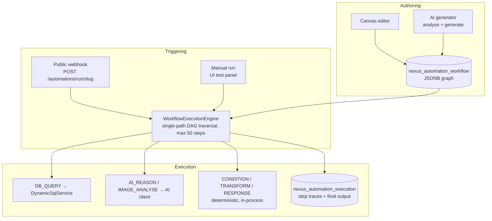

# Workflow Automation

Workflow Automation (shown in the product as **Automations**) is Zevra's visual workflow builder and execution engine. Tenants compose workflows as node-and-edge graphs — query a database, reason with AI, analyse an image, branch on a condition, reshape data, respond — and trigger them from external systems via webhook or manually from the UI. Workflows can be drawn by hand on a canvas or generated end-to-end by AI from a plain-language requirement.

## Platform Position

Workflow Automation is a **parallel execution surface**, not part of the conversational question pipeline. It shares the platform's building blocks — the tenant's approved connection registry, the SQL execution service, the AI client, and tenant isolation — but a workflow run does not pass through agent routing, semantic resolution, the orchestrator, or the conversational governance chain. Chat and automations meet only at the boundary: when a chat user asks Zevra to modify data, the read-only boundary response points them toward workflow integrations as the sanctioned path for operational flows.

This position matters for consumers: capabilities that build on automations inherit the automation runtime's contracts (traces, tenant scoping, bounded execution), **not** the conversational pipeline's contracts (semantic resolution, literal validation, the SQL governance chain). The gap between the two is documented honestly in [Security & Governance](#security-governance) and [Current Limitations](#current-limitations).

## Purpose

Business operations often need small, repeatable, system-to-system flows — "when a fulfillment event arrives, look up the order, assess it, and return a decision" — that are too structured for conversation and too small for integration projects. Workflow Automation exists so a tenant can define such flows as inspectable graphs, trigger them from outside Zevra, watch every step of every run, and use AI judgment *inside* the flow where a rule is not expressible as a condition.

## Business Value

- **Operational flows without integration code.** A webhook endpoint, a database lookup, an AI assessment, and a structured response are assembled on a canvas, not written in a service.
- **AI judgment as a step, not a leap of faith.** AI reasoning and image analysis are individual, inspectable nodes whose inputs and outputs are recorded per run — usable where deterministic conditions end.
- **From requirement to runnable draft in minutes.** The AI generator analyses a plain-language requirement against the tenant's real connections and table catalogs, and produces a complete draft workflow using only tables and columns that actually exist.
- **Every run is replayable evidence.** Executions store the trigger payload, each step's resolved inputs, output, executed SQL, duration, and error — the full story of what happened and why.

## User Experience

**Automations list** (`/automations`). Cards for each workflow with status (Draft / Active / Archived), trigger type, last-execution outcome, and a run button. From here users create a blank workflow, open the AI generator, or enter the editor.

**Visual editor** (`AutomationEditor`). A React Flow canvas with a seven-node palette. Selecting a node opens its configuration panel (label, SQL and connection for queries, prompts for AI nodes, operator and operands for conditions, field mappings for transforms and responses). A test panel runs the workflow in place with a sample JSON payload and shows the resulting step traces. Saving persists the graph; nothing executes on save.

**AI generation** (`GenerateModal`). A two-step wizard: the user states a requirement in plain language; Zevra analyses it against the tenant's connections and real table names and proposes a summary, suggested connections/tables, and steps; on confirmation it generates the full graph as a new **draft** workflow (or regenerates the graph of an existing one). Drafts are reviewed and edited on the canvas before activation.

**Triggering.** Active workflows are invoked by external systems via `POST /automations/run/{slug}`. Any workflow can also be run manually from the UI. Execution is synchronous: the caller receives the execution id and final status when the run completes.

## Key Concepts

| Concept | Meaning |
|---|---|
| **Workflow** | A named, slugged, tenant-owned graph of nodes and edges, stored as JSONB. Status: `DRAFT`, `ACTIVE`, or `ARCHIVED`. Only `ACTIVE` workflows are webhook-triggerable. |
| **Slug** | The workflow's URL-safe trigger key (lowercase letters, digits, hyphens), unique per tenant. The webhook path is public; the slug functions as the shared secret. |
| **Node** | One step, of exactly one of seven types: `TRIGGER`, `DB_QUERY`, `AI_REASON`, `IMAGE_ANALYSE`, `CONDITION`, `TRANSFORM`, `RESPONSE`. |
| **Edge** | Directed connection between nodes. `CONDITION` nodes have two outgoing edges (`true`/`false` handles); all other nodes have one successor. |
| **Variable expression** | `{{path}}` templates resolved at each step against the execution context: `{{trigger.field}}` for payload values, `{{nodes.<id>[0].column}}` for query rows, `{{nodes.<id>.field}}` for map outputs. |
| **Execution** | One run of a workflow: trigger payload, per-step traces, final output, status (`RUNNING`, `SUCCESS`, `FAILED`; `TIMEOUT` exists in the schema but is never set by the engine). |
| **Step trace** | The record of one node's run: resolved inputs, output, executed SQL (for queries), error, and duration in milliseconds. |

## Architecture Overview



The engine deserializes the stored graph, starts at the `TRIGGER` node, and walks a **single path**: each node's executor runs, its output is written into the execution context, and traversal follows the node's outgoing edge (choosing the `true`/`false` edge after a condition). Traversal ends at a `RESPONSE` node, at a node with no outgoing edge, at the 50-step cap, or at the first failed step. There is no parallel branch execution.

## Core Components

| Component | Responsibility |
|---|---|
| `AutomationController` | REST surface: workflow CRUD, manual run, execution history, the public webhook, and AI generation endpoints |
| `AutomationService` | Workflow lifecycle, slug validation, execution record management around engine runs |
| `WorkflowExecutionEngine` | Graph deserialization, topological single-path traversal, step dispatch, trace assembly, the 50-node cap |
| `StepExecutor` implementations | One per node type; Spring beans resolved by node-type string |
| `VariableResolver` | Resolves `{{path}}` expressions (dot paths, array indexing) against the execution context |
| `AutomationGeneratorService` | Two-step AI generation: requirement analysis grounded in real connection catalogs, then full graph generation |
| `AutomationRepository` | JSONB persistence for workflows and executions, always filtered by tenant schema |
| `Automations.jsx` / `AutomationEditor.jsx` / `GenerateModal.jsx` | List page, React Flow canvas with per-node config panels and test panel, generation wizard |
| `DemoConnectionSeeder` + demo migrations | Seed a `local-db` connection and two demo workflows so the capability is explorable out of the box |

## Data & Metadata

- **`nexus_automation_workflow`** — one row per workflow: id, tenant schema, name, description, slug (unique per tenant), status, trigger type (`WEBHOOK` or `MANUAL`), the graph as JSONB, creator, timestamps.
- **`nexus_automation_execution`** — one row per run: workflow id (cascade-deleted with the workflow), tenant schema, trigger payload (JSONB), status, step traces (JSONB array), final output (JSONB), error message, started/completed timestamps. The API returns the most recent 50 executions per workflow.

The graph JSON mirrors the React Flow data model (nodes with `id`, `type`, `data`, `position`; edges with `source`, `target`, `sourceHandle`), so the canvas round-trips it without transformation. The workflow graph is tenant-owned data — no workflow logic lives in code, and the engine is graph-agnostic machinery.

Rows are doubly scoped: every query filters on the `tenant_schema` column, and authenticated requests additionally run on a connection whose `search_path` is set to the tenant's schema.

## AI Responsibilities

AI participates in exactly three places, each bounded:

- **Workflow generation (design time).** The analysis step reads the tenant's real connections and table/column catalogs and proposes a plan; the generation step produces a complete graph constrained by a strict node-type contract and instructed to use only the provided table and column names. The output is always a **draft** — a proposal for human review, never an active workflow.
- **`AI_REASON` nodes (run time).** A configured prompt (with resolved variables) goes to the chat model; output is plain text or parsed JSON per the node's `outputFormat`. If JSON parsing fails, the raw text is wrapped rather than failing the step.
- **`IMAGE_ANALYSE` nodes (run time).** A question plus a base64 image reference goes to the vision model; output is the analysis text.

Everything else — traversal, conditions, transforms, SQL execution, response assembly — is deterministic. The AI never decides which node runs next: branching is owned by `CONDITION` nodes evaluating explicit operators.

## Integration with Other Capabilities

- **Connections registry.** `DB_QUERY` nodes execute against the same `nexus_connection` entries that power conversational queries — connection management is shared, not duplicated.
- **Shared AI client.** `AI_REASON`, `IMAGE_ANALYSE`, and the generator use the platform's Azure OpenAI client and deployments.
- **Conversational platform.** No runtime integration: chat cannot trigger workflows, and workflows cannot invoke the chat pipeline. Chat's read-only boundary message directs users who ask for data modifications toward workflow integrations.
- **Semantic layer.** Not consumed. Workflow SQL and AI prompts are authored literally; entity bindings, vocabulary, resolution, and value domains play no role in workflow execution.
- **Demo data.** Startup seeding provides a local demo connection and two seeded demo workflows for exploration.

## Security & Governance

- **Tenant isolation.** All workflow and execution reads/writes are filtered by tenant schema; authenticated requests also run with the tenant's `search_path`. Executions are queryable only within their tenant.
- **Authenticated management.** CRUD, manual runs, execution history, and generation all require an authenticated user; the creator is recorded on each workflow.
- **Public webhook, slug-secrecy protection.** `POST /automations/run/{slug}` is deliberately unauthenticated (external systems call it). Protection is the unguessability of the slug plus the `X-Nexus-Tenant` header used to resolve the workspace. Only `ACTIVE` workflows resolve by slug.
- **Execution bounds.** Runs are capped at 50 steps; database steps carry a 30-second query timeout and a per-node row cap (default 100).
- **Governance gap — stated plainly:** workflow `DB_QUERY` SQL executes through the shared SQL execution service **without** the shared governance pipeline (`SqlGovernancePipeline`: safety validation, contract checks, row security, masking, classification, routing, row limits, governance audit). As of ADR-0003 A2, Autonomous Agents and the Executive Brief now route through that pipeline, and Conversational Analytics always has — so **Workflow Automation is the only remaining SQL execution path on the platform that does not yet use the shared governance pipeline.** Variable values — including values arriving in unauthenticated webhook payloads — are interpolated into the SQL text before execution. The platform's read-only guarantee is not enforced by an explicit validator on this path. Until this is closed or formally accepted, treat workflow SQL as trusted-author input and webhook payloads as untrusted input reaching it.

## Configuration

Workflow Automation has **no dedicated configuration properties**. Its operative bounds are code-level constants and schema constraints:

| Bound | Value | Where |
|---|---|---|
| Maximum steps per execution | 50 | Execution engine constant |
| Default row cap per `DB_QUERY` | 100 (overridable per node via `maxRows`) | Node config |
| Query timeout | 30 seconds | Shared SQL execution service |
| Execution history returned | Most recent 50 per workflow | Repository query |
| Slug format | `[a-z0-9][a-z0-9-]*`, unique per tenant | Service validation + unique index |
| Trigger types | `WEBHOOK`, `MANUAL` | Database CHECK constraint |
| Workflow statuses | `DRAFT`, `ACTIVE`, `ARCHIVED` | Database CHECK constraint |

## Operational Flow

```mermaid
sequenceDiagram
    participant EXT as External system
    participant API as AutomationController
    participant SVC as AutomationService
    participant ENG as WorkflowExecutionEngine
    participant DB as Tenant data (via connection)
    participant AI as AI models

    EXT->>API: POST /automations/run/{slug} + payload (X-Nexus-Tenant)
    API->>SVC: triggerBySlug (ACTIVE workflows only)
    SVC->>SVC: Insert execution (RUNNING)
    SVC->>ENG: execute(graph, payload)
    loop single path, ≤ 50 steps
        ENG->>ENG: Resolve {{variables}} for node config
        alt DB_QUERY
            ENG->>DB: Resolved SQL (30s timeout, row cap)
        else AI_REASON / IMAGE_ANALYSE
            ENG->>AI: Resolved prompt / image
        else CONDITION / TRANSFORM / RESPONSE
            ENG->>ENG: Deterministic evaluation
        end
        ENG->>ENG: Record step trace; stop on failure or RESPONSE
    end
    ENG-->>SVC: Status + traces + final output
    SVC->>SVC: Complete execution (SUCCESS / FAILED)
    SVC-->>EXT: executionId, status, workflowId
```

Failure semantics: the first failing step ends the run as `FAILED` with that step's error preserved in its trace; earlier traces are kept. There are **no retries** at any level — a failed run is re-attempted only by triggering again. Because execution is synchronous and in-process, a crash mid-run leaves the execution row in `RUNNING` permanently; nothing reconciles it.

## Current Limitations

- **No scheduling.** Trigger types are webhook and manual only. Nothing runs workflows on a timer, and the schema's CHECK constraint admits no other type.
- **No retries or resumption.** No step-level retry, no run-level retry, no resumption of a partially completed run.
- **Synchronous, in-process execution.** The webhook caller waits for the full run; long AI or query steps hold the HTTP request. A process restart orphans `RUNNING` executions forever, and the schema's `TIMEOUT` status is never assigned.
- **Outside the shared governance pipeline — now the only such path.** Workflow SQL bypasses safety validation, contracts, row security, masking, and governance audit (see Security & Governance). Since ADR-0003 A2 routed the agent runtime through the shared `SqlGovernancePipeline`, Workflow Automation is the sole remaining SQL execution path not yet on that pipeline. Variable interpolation into SQL text means webhook payloads can influence executed SQL.
- **Single-path traversal.** One successor per node (two for conditions, one taken). No parallelism, no joins, no loops; a condition branch with no edge simply ends the run as `SUCCESS`.
- **No graph validation at save or activation.** Structural problems (missing `TRIGGER`, unreachable nodes, missing condition edges, unknown node types) surface at run time, not at authoring time. Activation is a status field edit with no gate.
- **No workflow versioning.** Editing overwrites the single stored graph; executions do not record which graph version produced them, so past traces may not correspond to the current graph.
- **Type-coercing conditions.** Comparisons are string-based (`eq` is case-insensitive string comparison) and numeric operators coerce unparseable values to `0` — silent misclassification is possible.
- **Unresolvable variables resolve to null/empty** rather than failing the step, so typos in `{{paths}}` produce empty values downstream instead of errors.
- **Webhook tenancy relies on an unauthenticated header.** The `X-Nexus-Tenant` header selects the workspace for a public call; slug secrecy is the only secret.
- **Execution history is capped** at the latest 50 runs per workflow through the API, with no archival or export surface.

## Ownership

Following the Zevra ownership model — one owner per responsibility:

| Responsibility | Owner | Notes |
|---|---|---|
| **Business Owner** | Tenant users who author workflows | Own what each workflow means and does: its graph, SQL, prompts, conditions, and response shape. Workflow logic is tenant data, never platform code. |
| **AI** | Generation proposals and in-flow judgments only | Proposes draft graphs at design time; executes `AI_REASON`/`IMAGE_ANALYSE` judgments at run time over resolved inputs. Owns no store, no routing, no activation. |
| **Runtime** | Zevra engineering (engine + executors) | Owns traversal, variable resolution, step dispatch, bounds (step cap, timeouts, row caps), trace capture, and failure semantics. Meaning-blind: reads graphs, never authors them. |
| **Governance** | The platform governance chain — **not engaged; the last remaining gap** | Workflow SQL does not pass the shared `SqlGovernancePipeline` today. With Autonomous Agents and the Executive Brief routed through it in ADR-0003 A2 (and Conversational Analytics always on it), this is now the platform's only ungoverned SQL path. Until it is closed, effective execution governance is limited to the runtime bounds above. A known, documented gap, not a design intent. |
| **Metadata** | Tenant-scoped automation stores | Workflow definitions and execution records are tenant-owned rows (`nexus_automation_workflow`, `nexus_automation_execution`), written only through the automation lifecycle. |
| **Human Stewardship** | The tenant's people | Final authority over every workflow: review AI-generated drafts, edit, activate, archive. Nothing becomes triggerable without a human setting it `ACTIVE`. |

## Stabilization Checklist

What must be verified before other capabilities depend on Workflow Automation. Validation work only — no feature proposals.

**Functional scenarios**

- [ ] Author → save → activate → webhook-trigger → inspect traces, for each of the seven node types individually and in combination.
- [ ] AI generation end-to-end: analysis suggests only real connections/tables; generated graphs deserialize, save, and execute; regeneration replaces the graph while preserving name, slug, and status.
- [ ] Variable resolution across all documented forms: `{{trigger.*}}`, `{{nodes.<id>[n].col}}`, `{{nodes.<id>.field}}`, mixed literal-plus-placeholder strings.
- [ ] `CONDITION` routing follows the correct `true`/`false` edge for every operator.
- [ ] `RESPONSE` with configured fields vs. empty fields (pass-through of last output).
- [ ] Archived workflows stop resolving by slug immediately; drafts are never webhook-triggerable.

**Edge cases**

- [ ] Graphs with no `TRIGGER`, no `RESPONSE`, unreachable nodes, unknown node types, condition nodes missing one or both handled edges.
- [ ] Cyclic graphs — confirm the 50-step cap terminates them and the resulting status is intelligible.
- [ ] Unresolvable variable paths (typos, out-of-range indexes) — document that they yield null/empty and confirm downstream behavior is acceptable.
- [ ] Empty and oversized trigger payloads; payload fields colliding with reserved context keys (`trigger`, `nodes.*`, `__lastOutput`).
- [ ] Numeric conditions on non-numeric values (silent `0` coercion) and case-sensitivity expectations on `eq`.
- [ ] Slug collisions at creation and via the generator's auto-suffixing under concurrency.

**Retry behavior**

- [ ] Confirm and document that no retry exists at step or run level; verify that re-triggering after failure is safe for the flows tenants actually build (no partial side effects assumed).

**Failure recovery**

- [ ] Process restart mid-run: execution rows stuck in `RUNNING` — quantify, and define how operators detect and clean them.
- [ ] AI-node failures (model errors, malformed JSON output) and DB-node failures (bad SQL, connection down, timeout): trace quality and terminal status in each case.
- [ ] Engine-level failures (unparseable stored graph) — verify the execution record still completes with a useful error.

**Scheduling**

- [ ] Confirm no scheduled execution path exists (CHECK constraint, no scheduler) so no consumer assumes timer-based triggering.
- [ ] Verify webhook and manual triggering behave identically for the same graph and payload.

**AI behavior**

- [ ] Generated workflows: rate of structurally invalid graphs; SQL referencing nonexistent tables/columns despite grounding; injection-prone SQL templates in generated `DB_QUERY` nodes.
- [ ] `AI_REASON` JSON mode: frequency of unparseable output (falls back to `{"raw": …}`) and whether downstream nodes tolerate that shape.
- [ ] Prompt-injection resistance: trigger payload text flowing into `AI_REASON`/`IMAGE_ANALYSE` prompts via variables.

**Multi-tenant behavior**

- [ ] Workflow and execution isolation across tenants, including identical slugs in different tenants.
- [ ] Webhook tenancy: behavior with missing, unknown, and wrong `X-Nexus-Tenant` headers — including which schema's tables are consulted when the caller is unauthenticated, and whether a slug+header mismatch can ever cross workspaces.
- [ ] Connection-key scoping: verify a workflow cannot reference another tenant's connection keys.

**Security**

- [ ] SQL injection through webhook payload values interpolated into `DB_QUERY` templates — this is the highest-priority validation in the capability.
- [ ] Verify whether non-SELECT statements can execute through the workflow SQL path (including statements that return rows, e.g. `UPDATE … RETURNING`), against the platform's read-only guarantee.
- [ ] Slug guessability/enumeration on the public endpoint; response behavior for unknown slugs (information leakage).
- [ ] Authorization on management endpoints: who can create, edit, activate, archive, and read executions.
- [ ] Secrets handling: confirm connection credentials never appear in step traces, executed-SQL records, or errors.

**Performance**

- [ ] Synchronous webhook latency for realistic graphs (AI nodes dominate); concurrent trigger volume before request-thread exhaustion.
- [ ] Execution-table growth under production trigger rates, given no retention or archival.
- [ ] Behavior at the row cap and query timeout under large result sets.

**Auditability**

- [ ] Step traces are sufficient to reconstruct any run after the fact (resolved inputs, executed SQL, outputs, durations, errors).
- [ ] Workflow lifecycle changes (create, edit, activate, archive) are attributable — creator is recorded; verify whether edits and status changes are.
- [ ] Webhook invocations: verify what is recorded about the caller (beyond the payload itself).

**Governance**

- [ ] Formal disposition of the governance gap: either route workflow SQL through the governance chain or record an accepted, bounded exception — before any capability treats automation output as governed data.
- [ ] Verify workflow executions appear (or explicitly do not appear) in the platform's governance audit surfaces, and document which.

## Related Documentation

Pages that should reference this capability (unwritten pages are marked *planned*):

- [Capabilities overview](index.md) — section landing
- [AI Memory](ai-memory.md) — sibling capability; both feed on tenant-owned stores consumed by AI
- [Conversational Analytics](conversational-analytics.md) — its read-only boundary hands off to workflow integrations
- *SQL Governance* (planned, `architecture/`) — the chain this capability's SQL path must be reconciled with
- [Semantic Foundation](../architecture/semantic-foundation.md) — the ownership and validation contracts cited in the Ownership section
- *Automations API* (planned, `api/`) — endpoint reference including the public webhook contract
- *Request Lifecycle* (planned, `runtime/`) — the conversational pipeline, for contrast with this parallel path
- *Tenancy & Isolation* (planned, `platform/`) — schema scoping and the webhook tenant-resolution model
- *Configuration Reference* (planned, `operations/`) — code-level bounds and their operational implications
